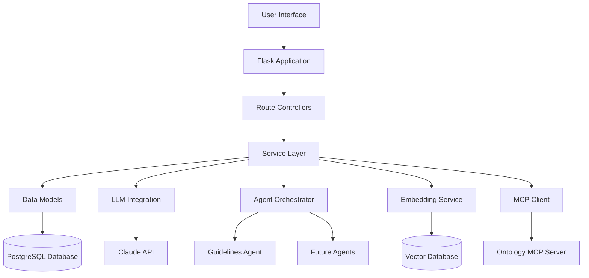

# ProEthica Application Guide

## 1. Introduction

ProEthica is an ethical decision-making simulator that evaluates professional decisions within customizable worlds using role-based guidelines and intelligent agents. The platform creates immersive scenarios in ontology-defined worlds where specialized agents evaluate decisions using professional guidelines, contextual reasoning, and knowledge from integrated document sources.

## 2. System Architecture

ProEthica is built with a modern, modular architecture:

- **Backend**: Flask, SQLAlchemy, PostgreSQL
- **AI Components**: LangChain, LangGraph, Claude integration
- **Extension**: Model Context Protocol (MCP) for extensibility
- **Document Processing**: Vector embeddings for semantic search

![System Architecture]

## 3. Key Components

### 3.1 Worlds

Worlds represent the foundational context for scenarios, containing:

- **Ontology Source**: Defines the domain-specific entities and relationships
- **Cases**: Real-world examples that provide precedent
- **Rulesets**: Guidelines and ethical frameworks
- **Metadata**: Additional world-specific information

### 3.2 Scenarios

Scenarios are specific situations within a world that contain:

- **Characters**: Individuals with roles and attributes
- **Resources**: Items or assets available in the scenario
- **Events**: Timeline of occurrences
- **Actions**: Possible actions including decision points
- **Metadata**: Additional scenario-specific information

### 3.3 Characters

Characters represent individuals in scenarios with:

- **Name**: Character identifier
- **Role**: Professional role (e.g., doctor, engineer)
- **Attributes**: Character-specific traits
- **Conditions**: Medical or other conditions affecting the character

### 3.4 Events and Actions

The timeline consists of:

- **Events**: Occurrences that happen in the scenario
- **Actions**: Activities performed by characters
- **Decision Points**: Special actions requiring ethical evaluation

### 3.5 Documents

The system processes various document types:

- **Guidelines**: Professional ethical standards
- **Case Studies**: Real-world examples
- **Academic Papers**: Research and theoretical frameworks
- **Vector Embeddings**: For semantic search and retrieval

### 3.6 Agent Architecture

The multi-agent system includes:

- **Agent Orchestrator**: Coordinates between specialized agents
- **Guidelines Agent**: Evaluates decisions against professional guidelines
- **Future Agents**: Ontology Agent, Cases Agent, etc.

## 4. Step-by-Step Usage Guide

### 4.1 Getting Started

1. **Login/Register**: Access the system with your credentials
2. **Select or Create a World**: Choose an existing world or create a new one
3. **Explore or Create Scenarios**: Browse existing scenarios or create new ones

### 4.2 Creating a New World

1. Navigate to "Worlds" and click "Create New World"
2. Provide a name and description
3. Select an ontology source
4. Add cases and rulesets
5. Save the world

### 4.3 Creating a New Scenario

1. Navigate to "Scenarios" and click "Create New Scenario"
2. Select a world
3. Provide a name and description
4. Add characters, resources, and events
5. Define decision points
6. Save the scenario

### 4.4 Running a Simulation

1. Select a scenario
2. Click "Start Simulation"
3. Follow the timeline of events
4. Make decisions at decision points
5. Review ethical evaluations
6. Complete the simulation

### 4.5 Document Management

1. Navigate to a world
2. Upload documents (guidelines, cases, papers)
3. The system processes documents asynchronously
4. Documents become available for agent reference

## 5. Key Features

- **Event-based Simulation Engine**
  * Timeline-driven scenarios
  * Decision points with ethical evaluation
  * Character and resource management

- **Ethical Reasoning Framework**
  * Guidelines-based evaluation
  * Case-based reasoning
  * Analogical reasoning

- **Multi-Agent Architecture**
  * Specialized agents for different aspects of evaluation
  * Agent orchestration for comprehensive analysis
  * Synthesis of multiple perspectives

- **Document Processing**
  * Asynchronous document processing
  * Vector embeddings for semantic search
  * Support for various document formats (PDF, Word, text, HTML)

- **Ontology Integration**
  * Domain-specific entity definitions
  * Relationship modeling
  * Model Context Protocol for extensibility

- **Zotero Integration**
  * Academic reference management
  * Citation support
  * Research integration

- **Customizable Worlds**
  * Domain-specific ontologies
  * Professional guidelines
  * Case libraries

- **Decision Evaluation**
  * Ethical scoring
  * Strengths and weaknesses analysis
  * Recommendations based on guidelines

## 6. Technical Implementation Details

### 6.1 Simulation Controller

The `SimulationController` manages the simulation flow:

- Initializes simulation state
- Processes timeline items
- Handles decision points
- Coordinates with the Agent Orchestrator
- Maintains simulation state persistence

### 6.2 Agent Orchestrator

The `AgentOrchestrator` coordinates specialized agents:

- Distributes decision analysis tasks
- Collects agent evaluations
- Synthesizes comprehensive responses
- Provides status updates

### 6.3 Document Processing

The document processing pipeline:

1. Document upload/URL submission
2. Text extraction
3. Chunking for processing
4. Vector embedding generation
5. Storage in vector database
6. Availability for semantic search

### 6.4 Decision Evaluation

The decision evaluation process:

1. Decision point identification
2. Option generation/selection
3. Guidelines analysis
4. Ethical scoring
5. Recommendation synthesis
6. Presentation of results

## 7. Integration Points

### 7.1 LLM Integration

- Claude API integration for natural language processing
- LangChain for structured prompting
- LangGraph for agent workflows

### 7.2 MCP Integration

- Ontology access through MCP servers
- External tool integration
- Extensibility framework

### 7.3 Zotero Integration

- API connection for reference management
- Citation retrieval
- Academic source integration

## 8. Conclusion

ProEthica provides a comprehensive platform for ethical decision-making simulation across various professional domains. By combining ontology-defined worlds, professional guidelines, and intelligent agent evaluation, the system offers nuanced ethical analysis for complex scenarios.

The platform's flexibility allows for application in various domains including:

- Medical ethics
- Engineering ethics
- Legal ethics
- Military ethics
- Business ethics
- And more

Through its modular architecture and extensible design, ProEthica can adapt to new domains and incorporate additional evaluation methodologies as needed.
