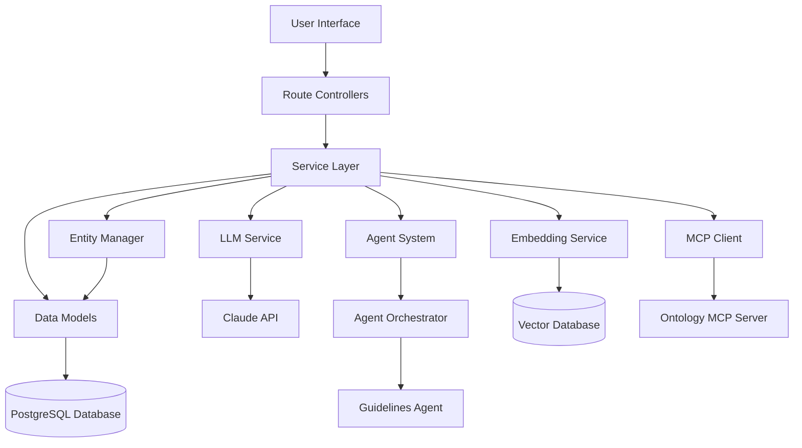
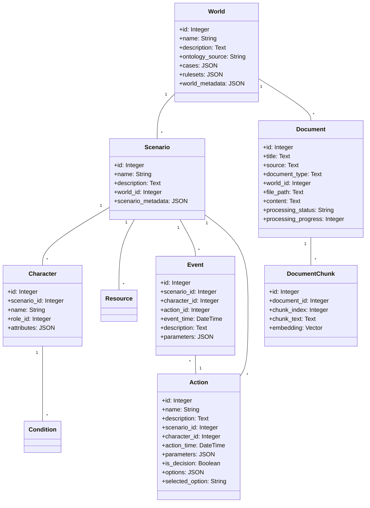
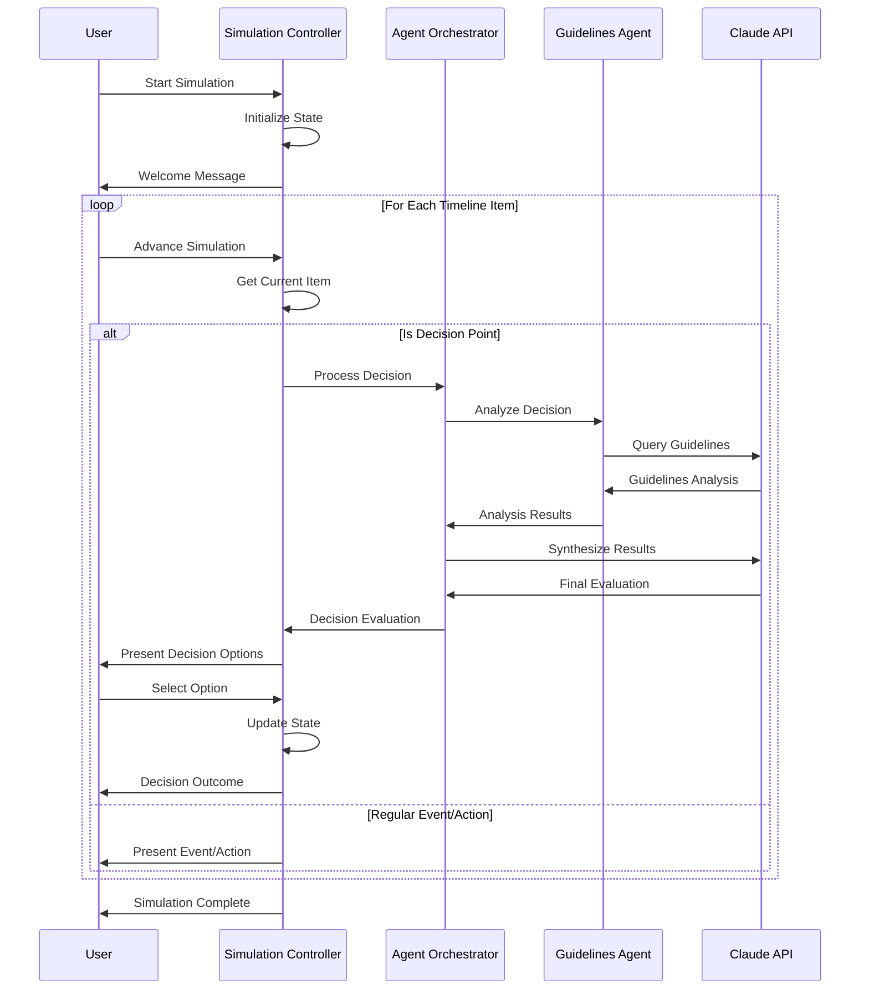
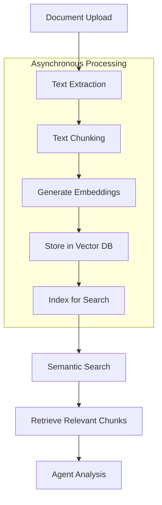
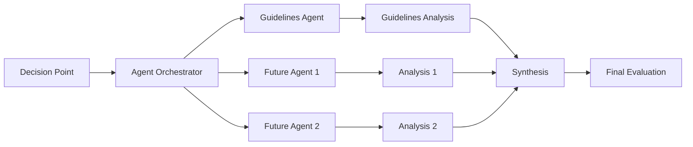
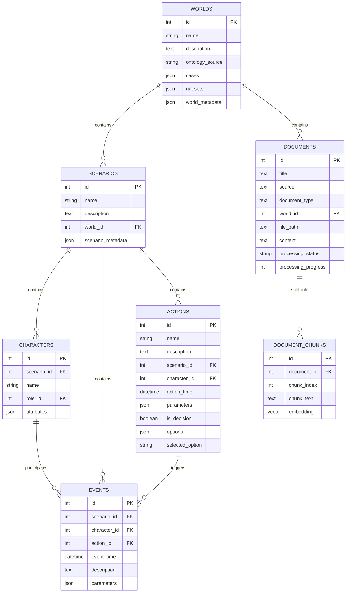
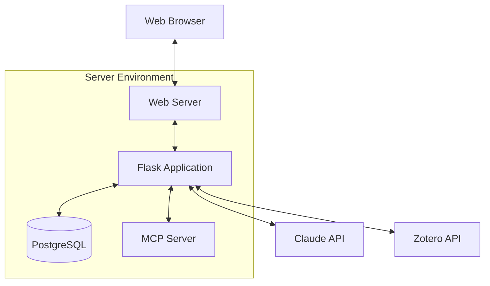

# ProEthica Technical Overview

## System Architecture

ProEthica implements a layered architecture with clear separation of concerns:



## Data Models

### Core Domain Models



## Key Processes

### 1. Simulation Flow



### 2. Document Processing Pipeline



### 3. Agent Orchestration



## Technical Components

### 1. Simulation Controller

The `SimulationController` manages the simulation state and flow:

- **State Management**: Tracks current position in timeline, character states, and decisions
- **Timeline Processing**: Handles events and actions sequentially
- **Decision Handling**: Processes decision points with agent evaluation
- **Claude Integration**: Uses Claude for natural language generation
- **State Persistence**: Stores simulation state for resumption

### 2. Agent Orchestrator

The `AgentOrchestrator` coordinates specialized agents:

- **Task Distribution**: Assigns analysis tasks to appropriate agents
- **Result Collection**: Gathers analyses from multiple agents
- **Synthesis**: Combines agent outputs into comprehensive evaluation
- **Status Tracking**: Provides progress updates during processing

### 3. Embedding Service

The `EmbeddingService` handles document processing:

- **Text Extraction**: Processes various document formats
- **Chunking**: Splits documents into manageable segments
- **Embedding Generation**: Creates vector representations
- **Similarity Search**: Finds relevant document chunks
- **PGVector Integration**: Uses PostgreSQL vector extension

### 4. Entity Manager

The `EntityManager` utility provides a centralized system for managing scenario entities:

- **Character Management**: Creates and updates characters with roles and conditions
- **Resource Management**: Handles resource creation with appropriate types
- **Timeline Creation**: Builds events and actions with proper relationships
- **Scenario Creation**: Creates complete scenarios from structured data
- **Ontology Integration**: Populates entity types from ontology files

The Entity Manager simplifies entity creation through high-level functions:

```python
# Creating a new scenario with all entities
scenario_id = create_ethical_scenario(
    world_name="Engineering Ethics",
    scenario_name="Bridge Safety Dilemma",
    scenario_description="A structural engineer discovers potential safety issues...",
    characters={...},
    resources=[...],
    timeline={...}
)

# Creating or updating individual entities
character = create_or_update_character(scenario_id, "Jane Smith", "Attorney", ...)
resource = create_or_update_resource(scenario_id, "Legal Brief", "Document", ...)
event = create_timeline_event(scenario_id, "Client meeting", ...)
action = create_timeline_action(scenario_id, "Ethical Decision", ..., is_decision=True)
```

The utility also includes a consolidated script (`scripts/populate_entities.py`) for command-line operations:

```bash
# Populate entity types from ontology
python scripts/populate_entities.py --world "Engineering Ethics" --ontology

# Add test timeline items to a scenario
python scripts/populate_entities.py --scenario 1 --test-timeline
```

### 5. MCP Integration

The Model Context Protocol integration provides:

- **Ontology Access**: Retrieves domain-specific entity definitions
- **External Tool Integration**: Connects to specialized tools
- **Extensibility**: Allows adding new capabilities

## Database Schema



## API Endpoints

### World Management
- `GET /worlds` - List all worlds
- `GET /worlds/<id>` - Get world details
- `POST /worlds` - Create a new world
- `PUT /worlds/<id>` - Update a world
- `DELETE /worlds/<id>` - Delete a world

### Scenario Management
- `GET /scenarios` - List all scenarios
- `GET /scenarios/<id>` - Get scenario details
- `POST /scenarios` - Create a new scenario
- `PUT /scenarios/<id>` - Update a scenario
- `DELETE /scenarios/<id>` - Delete a scenario

### Simulation
- `POST /simulation/start/<scenario_id>` - Start a simulation
- `POST /simulation/advance/<session_id>` - Advance to next step
- `POST /simulation/decide/<session_id>` - Make a decision
- `GET /simulation/state/<session_id>` - Get simulation state

### Document Management
- `POST /documents/upload` - Upload a document
- `GET /documents/<id>` - Get document details
- `GET /documents/search` - Search documents

## Technology Stack

- **Backend Framework**: Flask
- **Database**: PostgreSQL with pgvector extension
- **ORM**: SQLAlchemy
- **Authentication**: Flask-Login
- **LLM Integration**: Anthropic Claude API
- **Agent Framework**: LangChain, LangGraph
- **Vector Embeddings**: all-MiniLM-L6-v2 (384-dimensional)
- **Extension Protocol**: Model Context Protocol (MCP)
- **Document Processing**: Various libraries for text extraction
- **Frontend**: Bootstrap, JavaScript

## Deployment Architecture


