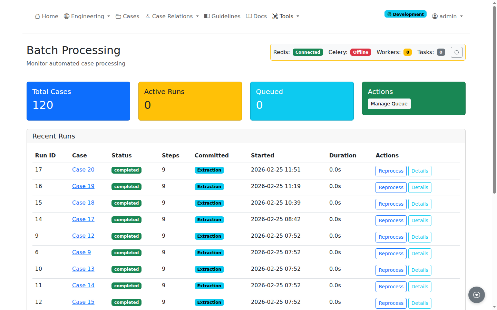

# Pipeline Management

The pipeline dashboard provides batch processing controls and status monitoring for extraction operations.

## Pipeline Dashboard

Navigate to **Tools** > **Pipeline Dashboard** or direct URL: `/pipeline/dashboard`

### Dashboard Overview

The dashboard displays:

| Section | Content |
|---------|---------|
| **Queue Status** | Pending, running, completed job counts |
| **Recent Jobs** | Last 20 extraction jobs with status |
| **Case Selection** | Cases available for batch processing |
| **Controls** | Start, pause, cancel batch operations |

## Queue Management

Navigate to **Tools** > **Queue Management** or direct URL: `/pipeline/queue`

### Queue Operations

| Action | Description |
|--------|-------------|
| **Start Batch** | Begin processing selected cases |
| **Pause** | Suspend current processing |
| **Resume** | Continue paused processing |
| **Cancel** | Stop and clear queue |

### Job Status

| Status | Meaning |
|--------|---------|
| **Pending** | Queued for processing |
| **Running** | Currently extracting |
| **Completed** | Successfully finished |
| **Failed** | Error during extraction |
| **Cancelled** | Manually stopped |

## Batch Processing

### Starting a Batch

1. Navigate to Pipeline Dashboard
2. Select cases for processing
3. Choose extraction steps to run
4. Click **Start Batch**

### Monitoring Progress

The dashboard updates in real-time showing:

- Current case being processed
- Step completion within each case
- Overall batch progress percentage
- Estimated time remaining

### Error Handling

Failed jobs display:

- Error message and stack trace
- Case and step where failure occurred
- Retry option for transient failures

## Celery Integration

Pipeline processing uses Celery for background task management.

### Worker Status

The dashboard shows Celery worker status:

| Indicator | Meaning |
|-----------|---------|
| **Green** | Workers active and healthy |
| **Yellow** | Workers busy, queue growing |
| **Red** | No workers available |

### Configuration

See [Settings](settings.md#pipeline-settings) for Celery configuration options.

## Related Pages

- [Administration Guide](index.md) - Admin overview
- [Running Extractions](../analysis/running-extractions.md) - Single case extraction
- [Settings](settings.md) - Pipeline configuration
