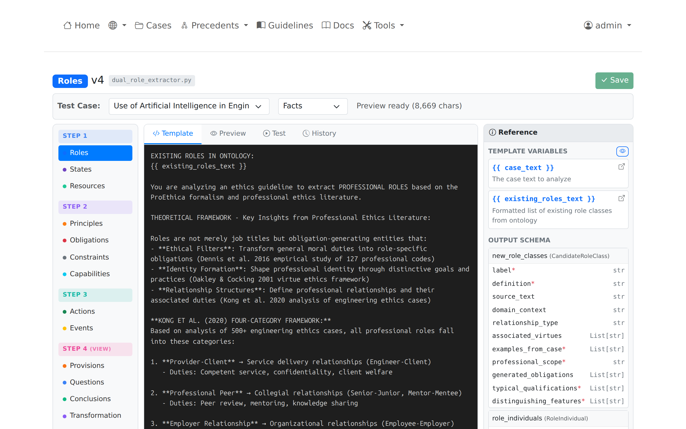

# Prompt Editor

The Prompt Editor provides a web interface for editing extraction prompt templates used in Steps 1-3 of the pipeline. Each of the nine concepts has an editable template stored in the database.

## Accessing the Prompt Editor

Navigate to **Tools** > **Prompt Editor** or direct URL: `/tools/prompts`

!!! note "Admin Access Required"
    The Prompt Editor is visible only to authenticated admin users.

## Pipeline Structure

Templates are organized by pipeline step and concept type:

| Step | Name | Concepts |
|------|------|----------|
| Step 1 | Contextual Framework | Roles (R), States (S), Resources (Rs) |
| Step 2 | Normative Requirements | Principles (P), Obligations (O), Constraints (Cs), Capabilities (Ca) |
| Step 3 | Temporal Dynamics | Actions (A), Events (E) |


*Sidebar navigation showing the three pipeline steps and their concepts*

## Template Editor

### Selecting a Template

1. Click a concept in the left sidebar (e.g., "Roles" under Step 1)
2. The template editor loads for that concept
3. Domain selector allows switching between domain-specific templates

### Editor Interface


*Template editor showing the Jinja2 template with variable placeholders*

The editor displays:

| Section | Description |
|---------|-------------|
| **Template Header** | Concept name, step, domain selector |
| **Template Text** | Editable Jinja2 template content |
| **Variable List** | Available template variables |
| **Action Buttons** | Save, Preview, Test, History |

### Template Syntax

Templates use Jinja2 syntax with variable placeholders:

```jinja
Extract {{ concept_type }} from the following case text.

Case Text:
{{ case_text }}

Existing {{ concept_type }} in the ontology:
{{ existing_entities_text }}

{{ mcp_context }}
```

### Common Variables

| Variable | Source | Description |
|----------|--------|-------------|
| `{{ case_text }}` | Document section | Text from Facts or Discussion section |
| `{{ existing_entities_text }}` | OntServe MCP | Existing entities for deduplication |
| `{{ mcp_context }}` | OntServe MCP | Additional ontology context |
| `{{ concept_type }}` | Template config | Current concept being extracted |

## Preview Function

The Preview function renders a template with actual case data without calling the LLM.

### Using Preview

1. Select a case from the dropdown
2. Choose section type (Facts or Discussion)
3. Click **Preview**


*Preview panel showing the fully rendered prompt with case context*

### Preview Output

The preview shows:

- Fully rendered prompt text
- Character count
- Variables that were resolved
- Case title and section type

Preview validates that variables resolve correctly before running extraction.

## Test Extraction

Test Extraction executes the template against the LLM and displays results.

### Running a Test

1. Select a case and section type
2. Click **Test Extraction**
3. Wait for LLM response (10-30 seconds)


*Test results showing extracted entities from LLM response*

### Test Output

| Section | Content |
|---------|---------|
| **Rendered Prompt** | The prompt sent to the LLM |
| **Raw Response** | Raw JSON from the LLM |
| **Parsed Entities** | Structured entity data |
| **Execution Time** | Duration in milliseconds |
| **Model** | LLM model used |

Test results are not saved to the database. Use the standard extraction pipeline to persist results.

## Variable Inspector

The Variable Inspector shows how each template variable resolves for a given case.

### Accessing Variable Inspector

1. Select a case and section type
2. Click **Inspect Variables**

### Inspector Output

For each variable:

| Field | Description |
|-------|-------------|
| **Name** | Variable name (e.g., `case_text`) |
| **Type** | Python type (string, list, dict) |
| **Length** | Character count |
| **Preview** | First 500 characters |
| **Full Value** | Expandable full content |

This helps debug template issues when variables do not render as expected.

## Version History

The Prompt Editor maintains version history for all template changes.

### Viewing History

1. Click **Version History** on any template
2. View list of previous versions with timestamps
3. Compare current template against previous versions

### Version Information

| Field | Description |
|-------|-------------|
| **Version Number** | Sequential version identifier |
| **Changed At** | Timestamp of change |
| **Changed By** | User or system that made the change |
| **Description** | Change description (if provided) |

### Restoring Previous Versions

1. Click **Version History**
2. Select the version to restore
3. Click **Restore This Version**
4. Current template updates, new version created

Restore operations create a new version entry preserving the full history.

## Saving Changes

### Save Workflow

1. Edit the template text
2. Optionally add a change description
3. Click **Save**

Saving creates a new version and increments the version number.

### Validation

The editor validates:

- Jinja2 syntax correctness
- Required variable presence
- Template renders without errors

Invalid templates cannot be saved.

## Best Practices

### Template Design

- Keep instructions clear and specific
- Include examples of expected output format
- Reference existing entities to avoid duplicates
- Specify JSON output structure explicitly

### Testing Changes

1. Use Preview first to check variable resolution
2. Run Test Extraction on a known case
3. Compare results against expected entities
4. Save only after validating output quality

### Version Management

- Add descriptive change notes when saving
- Review history before major changes
- Restore previous version if quality degrades

## Database Storage

Templates are stored in PostgreSQL:

| Table | Purpose |
|-------|---------|
| `extraction_prompt_templates` | Active templates |
| `extraction_prompt_template_versions` | Version history |

### Template Fields

| Field | Description |
|-------|-------------|
| `step_number` | Pipeline step (1, 2, or 3) |
| `concept_type` | Concept name (roles, principles, etc.) |
| `domain` | Domain (engineering, medical, etc.) |
| `template_text` | Jinja2 template content |
| `version` | Current version number |
| `is_active` | Whether template is active |

## API Endpoints

| Endpoint | Method | Purpose |
|----------|--------|---------|
| `/api/prompts/templates` | GET | List all templates |
| `/api/prompts/template/<id>` | GET | Get template by ID |
| `/api/prompts/template/<id>` | PUT | Update template |
| `/api/prompts/template/<id>/preview` | POST | Preview rendering |
| `/api/prompts/template/<id>/test-run` | POST | Execute test extraction |
| `/api/prompts/template/<id>/versions` | GET | Get version history |
| `/api/prompts/template/<id>/revert/<ver>` | POST | Restore version |

## Related Pages

- [Administration Guide](index.md) - Admin overview
- [Running Extractions](../analysis/running-extractions.md) - Using templates in extraction
- [Nine-Component Framework](../concepts/nine-components.md) - Concept definitions
