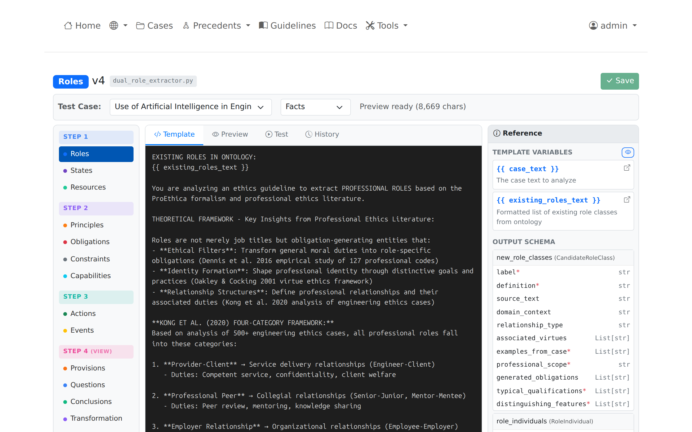
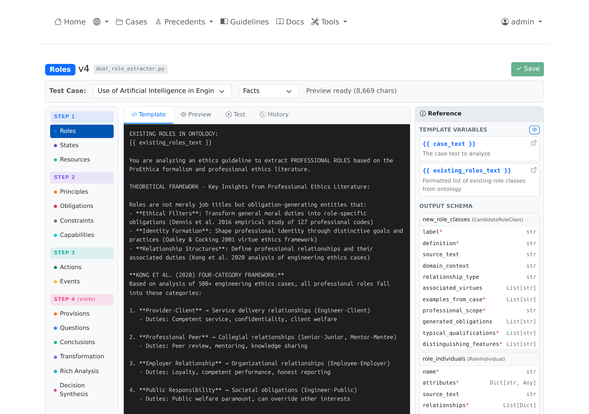
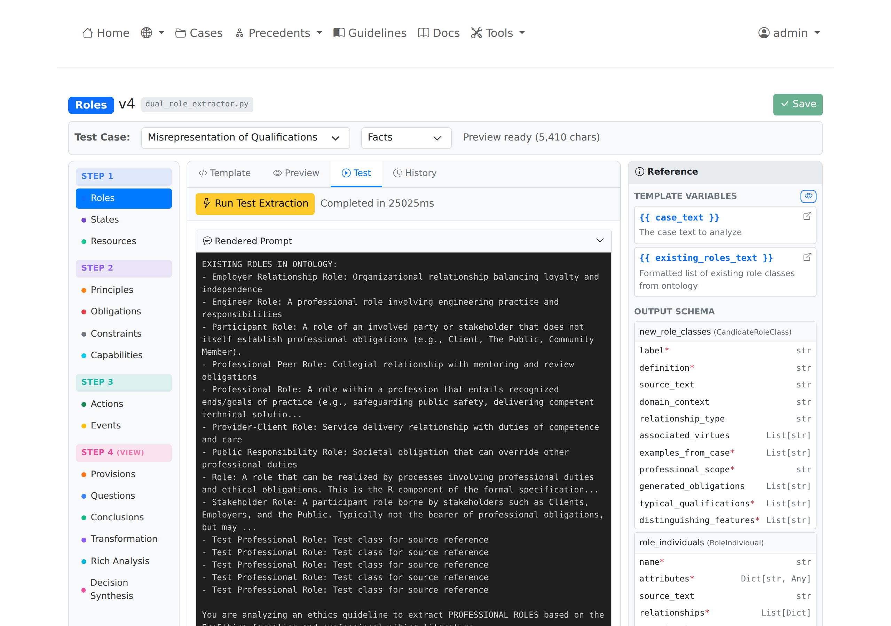

# Prompt Editor

The Prompt Editor provides a web interface for editing extraction prompt templates used in Steps 1-3 of the pipeline. Each of the nine components has an editable template stored in the database.

## Accessing the Prompt Editor

Navigate to **Tools** > **Prompt Editor** or direct URL: `/tools/prompts`

!!! note "Admin Access Required"
    The Prompt Editor is visible only to authenticated admin users.

## Pipeline Structure

Templates are organized by pipeline step and concept type:

| Step | Name | Concepts |
|------|------|----------|
| Step 1 | Contextual Framework | Roles (R), States (S), Resources (Rs) |
| Step 2 | Normative Requirements | Principles (P), Obligations (O), Constraints (Cs), Capabilities (Ca) |
| Step 3 | Temporal Dynamics | Actions (A), Events (E) |


*Sidebar navigation showing the three pipeline steps and their concepts*

## Processing Pipeline

A template is one input to a multi-stage process. When an extraction runs, the template is assembled into a full prompt, sent to the model, validated and filtered, and written as draft entities to a staging table. The ontology served by OntServe is produced later by a separate commit step, not by extraction itself. These stages determine what the **Preview**, **Test Extraction**, and **Variable Inspector** functions display, and where extracted entities go before they reach OntServe.

Roles extraction is the reference implementation: it is the only concept whose prompt currently injects ontology-derived schema slots. The other concepts follow the same overall flow without those slots.

### Stage Summary

| Phase | Action | Result |
|-------|--------|--------|
| **Prompt assembly** | Load the existing-class inventory from OntServe, the pass-specific template, the case variables, and the ontology-derived slots, then render | A user prompt and a separate system prompt |
| **Model call** | Send the prompt to the model as a streaming request | Raw JSON text |
| **Parsing and validation** | Normalize the response and validate it against the concept schema | Two typed lists: candidate classes and individuals |
| **Filtering and matching** | Remove precedent contamination, match classes to existing ontology classes, link individuals, drop misclassified items | Filtered, ontology-matched entities |
| **Draft staging** | Record the prompt and response, then write draft rows | Unpublished rows in `temporary_rdf_storage` |
| **Ontology commit** | A separate, later step serializes Turtle and syncs to OntServe | Durable case ontology |

### Prompt Assembly

Prompt assembly draws on four sources. When the extractor starts, it loads a snapshot of existing classes for the concept from OntServe over the MCP connection. This snapshot is fetched once and serves three later purposes: the existing-entity inventory shown in the prompt, the matching of new candidates against the ontology, and the harvesting of definitions for matched classes. The extractor then loads the active database template for the requested pass, Facts or Discussion.

Case variables are resolved next: the section text, the formatted existing-entity inventory, and, for the Discussion pass, the classes and actors carried forward from the Facts pass. The fourth source is the set of ontology-derived slots. For roles these are read live at injection time from the core ontology and its SHACL shapes, and supply the role definition, the role schema, the disjointness directives, the role category vocabulary, and the pass directive. The same builder feeds both live extraction and the editor **Preview**, so the preview matches what extraction sends. A slot builder raises an error if its source file is unreadable rather than rendering an empty value.

Rendering uses Jinja2. The template body and the system prompt are rendered separately. A code-built JSON wrapper instruction is then appended to the body. This wrapper is kept in code rather than in the editable template so that the required response keys always match the concept configuration.

### Model Call

The assembled prompt is sent to the model as a single user message, with the rendered system prompt as a separate system message. The default model is Claude Sonnet 4.6, configurable per concept and overridable by environment variable. The request streams the response and asks for JSON output through the in-prompt instruction rather than through tool calls or a response schema. If the response is cut off at the token limit, a repair step closes the truncated JSON before parsing.

### Parsing and Validation

The raw response is reshaped into two arrays, candidate classes and individuals, accommodating a bare list or a legacy single-key response. Each item is normalized before validation: field aliases are reconciled, invented fields are remapped or dropped, and default values are supplied. The normalized items are validated against the concept schema. If whole-result validation fails, the extractor validates each item individually and skips any that remain invalid rather than failing the run.

### Filtering, Matching, and Linking

Several passes refine the validated entities. A contamination filter removes entities drawn from cited precedent cases rather than the case under analysis, identified by a citation marker in the label, by supporting quotes that sit only in precedent context, or by an actor letter absent from the present case. Candidate classes are then matched against the OntServe snapshot by exact normalized label; a matched class records the existing URI at high confidence, and a class that matched only a sibling extraction with no ontology URI is reset to unmatched. A disjointness gate rejects any match whose resolved category conflicts with the category of the concept, which prevents a later reasoner inconsistency. Definitions are harvested from the ontology for matched classes, individuals are linked to their classes and inherit a class match where one exists, and a final filter drops items that were emitted as individuals but are class-level types. The contamination filter and the type filter are best-effort: a failure in either is logged and does not break extraction.

### Draft Staging

On completion the extractor records the exact prompt and the raw model response to the `extraction_prompts` table, which is the source for the **Test Extraction** display and for audit. The validated models are converted to a plain dictionary structure. No RDF or Turtle is produced at this point, despite the name of the conversion step. The structured entities are written as draft rows to the `temporary_rdf_storage` table, one row per class and per individual, in a JSON column, with the Turtle column left empty. Existing unpublished rows for the same section are replaced first, and same-label rows are merged. These rows are marked unpublished, which is the state the **Entity Review** screen reads.

### Ontology Commit

Extraction stops at the draft stage. The durable ontology is produced by a separate commit step that runs when case entities are committed, either through review or through automatic commit. That step gathers the unpublished rows, serializes case-specific Turtle, marks the rows published, and syncs the result to OntServe, writing classes to the shared intermediate ontology and individuals to the per-case ontology. Turtle is first produced at this point, and the defeasibility and dependency edge materialization and the conformance check run here. An extraction run on its own does not change the ontology served by OntServe.

## Template Editor

### Selecting a Template

1. Click a concept in the left sidebar (e.g., "Roles" under Step 1)
2. The template editor loads for that concept
3. Domain selector allows switching between domain-specific templates

### Editor Interface


*Template editor showing the Jinja2 template with variable placeholders*

The editor displays:

| Section | Description |
|---------|-------------|
| **Template Header** | Concept name, step, domain selector |
| **Template Text** | Editable Jinja2 template content |
| **Variable List** | Available template variables |
| **Action Buttons** | Save, Preview, Test, History |

### Template Syntax

Templates use Jinja2 syntax with variable placeholders. The Roles template (Step 1) opens with its variable slots and then continues with fixed instruction text. The opening slots are:

```jinja
{{ role_definition }}

EXISTING ROLES IN ONTOLOGY:
{{ existing_roles_text }}

{{ pass_directive }}

{{ role_directives }}

CASE TEXT:
{{ case_text }}

{{ role_schema }}

{{ role_category_vocab }}
```

The remainder of the template is fixed instruction text: the match-decision rules, the JSON output format, and the class and individual schemas.

### Template Variables

The Roles template resolves the variables below. The first two appear in every concept template, with the concept name substituted in the existing-entity variable. The remaining five are supplied by the ontology-slot builder and are currently specific to the Roles template.

| Variable | Source | Description |
|----------|--------|-------------|
| `{{ case_text }}` | Document section | Text from the Facts or Discussion section |
| `{{ existing_roles_text }}` | OntServe MCP snapshot | Inventory of existing role classes with reuse guidance, used for deduplication. Each concept uses `existing_<concept>_text`; `existing_entities_text` is an alias of the same value. |
| `{{ pass_directive }}` | Pass configuration | Instruction specific to the Facts or Discussion pass |
| `{{ role_definition }}` | Core ontology | Definition of the core Role class, read from `proethica-core.ttl` |
| `{{ role_schema }}` | SHACL shapes | Expected class and individual fields, parsed from `core-shapes.ttl` |
| `{{ role_directives }}` | Core ontology | Disjointness directives derived from the disjoint-class axioms |
| `{{ role_category_vocab }}` | Core ontology | Controlled vocabulary of role categories |

## Preview Function

The Preview function renders a template with actual case data without calling the LLM.

### Using Preview

1. Select a case from the dropdown
2. Choose section type (Facts or Discussion)
3. Click **Preview**


*Preview panel showing the fully rendered prompt with case context*

### Preview Output

The preview shows:

- Fully rendered prompt text
- Character count
- Variables that were resolved
- Case title and section type

Preview validates that variables resolve correctly before running extraction.

## Test Extraction

Test Extraction executes the template against the LLM and displays results.

### Running a Test

1. Select a case and section type
2. Click **Test Extraction**
3. Wait for LLM response (10-30 seconds)


*Test results showing extracted entities from LLM response*

### Test Output

| Section | Content |
|---------|---------|
| **Rendered Prompt** | The prompt sent to the LLM |
| **Raw Response** | Raw JSON from the LLM |
| **Parsed Entities** | Structured entity data |
| **Execution Time** | Duration in milliseconds |
| **Model** | LLM model used |

Test results are not saved to the database. Use the standard extraction pipeline to persist results.

## Variable Inspector

The Variable Inspector shows how each template variable resolves for a given case.

### Accessing Variable Inspector

1. Select a case and section type
2. Click **Inspect Variables**

### Inspector Output

For each variable:

| Field | Description |
|-------|-------------|
| **Name** | Variable name (e.g., `case_text`) |
| **Type** | Python type (string, list, dict) |
| **Length** | Character count |
| **Preview** | First 500 characters |
| **Full Value** | Expandable full content |

This helps debug template issues when variables do not render as expected.

## Version History

The Prompt Editor maintains version history for all template changes.

### Viewing History

1. Click **Version History** on any template
2. View list of previous versions with timestamps
3. Compare current template against previous versions

### Version Information

| Field | Description |
|-------|-------------|
| **Version Number** | Sequential version identifier |
| **Changed At** | Timestamp of change |
| **Changed By** | User or system that made the change |
| **Description** | Change description (if provided) |

### Restoring Previous Versions

1. Click **Version History**
2. Select the version to restore
3. Click **Restore This Version**
4. Current template updates, new version created

Restore operations create a new version entry preserving the full history.

## Saving Changes

### Save Workflow

1. Edit the template text
2. Optionally add a change description
3. Click **Save**

Saving creates a new version and increments the version number.

### Validation

The editor validates:

- Jinja2 syntax correctness
- Required variable presence
- Template renders without errors

Invalid templates cannot be saved.

## Best Practices

### Template Design

- Keep instructions clear and specific
- Include examples of expected output format
- Reference existing entities to avoid duplicates
- Specify JSON output structure explicitly

### Testing Changes

1. Use Preview first to check variable resolution
2. Run Test Extraction on a known case
3. Compare results against expected entities
4. Save only after validating output quality

### Version Management

- Add descriptive change notes when saving
- Review history before major changes
- Restore previous version if quality degrades

## Database Storage

Templates are stored in PostgreSQL:

| Table | Purpose |
|-------|---------|
| `extraction_prompt_templates` | Active templates |
| `extraction_prompt_template_versions` | Version history |

### Template Fields

| Field | Description |
|-------|-------------|
| `step_number` | Pipeline step (1, 2, or 3) |
| `concept_type` | Concept name (roles, principles, etc.) |
| `domain` | Domain (engineering, medical, etc.) |
| `template_text` | Jinja2 template content |
| `version` | Current version number |
| `is_active` | Whether template is active |

## API Endpoints

| Endpoint | Method | Purpose |
|----------|--------|---------|
| `/api/prompts/templates` | GET | List all templates |
| `/api/prompts/template/<id>` | GET | Get template by ID |
| `/api/prompts/template/<id>` | PUT | Update template |
| `/api/prompts/template/<id>/preview` | POST | Preview rendering |
| `/api/prompts/template/<id>/test-run` | POST | Execute test extraction |
| `/api/prompts/template/<id>/versions` | GET | Get version history |
| `/api/prompts/template/<id>/revert/<ver>` | POST | Restore version |

## Related Pages

- [Administration Guide](index.md) - Admin overview
- [Running Extractions](../analysis/running-extractions.md) - Using templates in extraction
- [Nine-Component Framework](../concepts/nine-components.md) - Concept definitions
