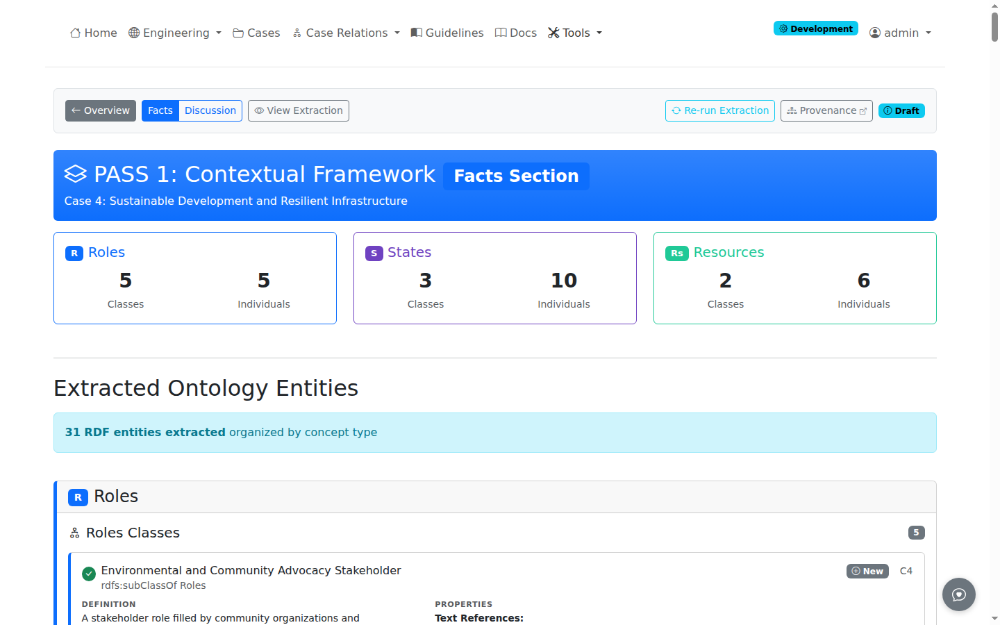

# Running Extractions

Steps 1-3 perform concept extraction using ontology-validated definitions via MCP queries to OntServe. All extractions use SSE streaming for real-time progress display. This guide covers running the extraction pipeline on cases.

!!! note "Login Required"
    Running extractions requires authentication. Unauthenticated users can view completed extractions but cannot run new ones.

## Overview

Steps 1-3 extract the nine base concepts. Steps 1-2 extract separately from the Facts and Discussion sections. Step 3 performs a unified extraction from the full case text using LangGraph orchestration.

| Step | Name | Concepts | Extraction Mode |
|------|------|----------|----------------|
| Step 1 | Contextual Framework | Roles, States, Resources | Pass 1 (Facts), Pass 2 (Discussion) |
| Step 2 | Normative Requirements | Principles, Obligations, Constraints, Capabilities | Pass 1 (Facts), Pass 2 (Discussion) |
| Step 3 | Temporal Dynamics | Actions, Events, causal chains, temporal relations | Unified (full case text) |

After Steps 1-3, the pipeline continues with Reconcile (entity deduplication), OntServe commit, Step 4 (whole-case synthesis), a second OntServe commit, and QC audit. Step 5 presents the fully analyzed case as an interactive scenario; it is read-only and does not require authentication. See [Pipeline Terminology](../concepts/terminology.md) for definitions and [Interactive Scenario](../viewing/interactive-scenario.md) for Step 5.

## Starting Extraction

### Access the Pipeline

Navigate to any case detail page and click the **Pipeline** button in the top action bar, or access the per-case pipeline dashboard directly at `/cases/<id>/pipeline`. The pipeline status bar with numbered step buttons is visible to authenticated users.

Steps must be processed in sequence. Completed steps display as green; incomplete steps show the step number. Click any available step to begin extraction.

## Step 1: Contextual Framework

### Pass 1 (Facts)

1. Click the **Step 1** button on the case page
2. The extraction page displays the Facts section text
3. Click **Full Contextual Framework Pass** to extract all three concept types. Roles extract first, then States and Resources run in parallel.

The full pass extracts all three concept types in sequence.

Expected entity counts:

| Concept | Description | Typical Count |
|---------|-------------|---------------|
| **Roles** | Professional positions | 3-6 entities |
| **States** | Situational conditions | 10-20 entities |
| **Resources** | Referenced standards | 15-30 entities |

### Pass 2 (Discussion)

After completing Pass 1 (Facts), click **Discussion Section** to run the same extraction against the Discussion section text.

## Step 2: Normative Requirements

### Pass 1 (Facts)

1. Click the **Step 2** button on the case page
2. Click **Full Normative Requirements Pass** to extract all four concept types. Principles extract first, then Obligations, then Constraints and Capabilities run in parallel.

Unlike Step 1, Step 2 does not have individual per-concept buttons.

Expected entity counts:

| Concept | Description | Typical Count |
|---------|-------------|---------------|
| **Principles** | Abstract ethical standards | 15-25 entities |
| **Obligations** | Concrete duties | 15-25 entities |
| **Constraints** | Prohibitions and limits | 15-20 entities |
| **Capabilities** | Permissions and options | 15-25 entities |

### Pass 2 (Discussion)

Click **Discussion Section** after completing Pass 1 (Facts) to extract from the Discussion section.

## Step 3: Temporal Dynamics

Step 3 uses LangGraph orchestration to extract from the full case text (Facts and Discussion combined) in a single unified pass, unlike Steps 1-2 which use separate passes per section.

1. Click the **Step 3** button on the case page
2. Click **Extract Temporal Dynamics** to run the unified extraction

The extraction produces five output types displayed as separate progress cards:

| Output | Description | Typical Count |
|--------|-------------|---------------|
| **Actions** | Professional responses and decisions | 5-12 entities |
| **Events** | Precipitating occurrences | 3-8 entities |
| **Causal Chains** | NESS test causal analysis | 3-6 chains |
| **Allen Relations** | OWL-Time temporal ordering | 10-20 relations |
| **Timeline** | Chronological event/action sequence | 1 timeline |

## Reconcile

After Steps 1-3, entity deduplication merges overlapping entities across sections and passes. In manual mode, reconcile is triggered from the pipeline sidebar. In pipeline mode, reconcile runs automatically.

## Step 4: Whole-Case Synthesis

Step 4 analyzes the full case text together with entities from Steps 1-3. It produces 8 additional entity types across multiple phases. See [Pipeline Terminology](../concepts/terminology.md) for phase details.

Step 4 is accessed from the pipeline sidebar after reconcile completes.

## Extraction Options

### Re-run Extraction

Each step page includes a **Re-run Extraction** button to clear existing entities and run again if results need improvement.

### Progress Tracking

During extraction, SSE streaming displays real-time progress with per-concept cards showing spinners, entity counts, and completion status.

## Extraction Metrics

After each step:

| Metric | Description |
|--------|-------------|
| **Total Entities** | Count of extracted entities |
| **By Type** | Breakdown by concept type |
| **New Classes** | Entities requiring new ontology classes |
| **Existing Matches** | Entities matching ontology |

## Example: Case 24-2

For NSPE Case 24-2 (AI in Engineering Practice):

**Step 1 Results**:

- Roles (4): Engineer, Client, Employer, State Board
- States (16): Engineer lacks AI competence, Project uses AI tools
- Resources (29): NSPE Code II.1.a, State licensing requirements

**Step 2 Results**:

- Principles (18): Hold paramount public safety, Practice competence
- Obligations (18): Verify AI-generated designs, Disclose limitations
- Constraints (18): Cannot certify beyond competence
- Capabilities (20): Can hire specialists, Can request extensions

**Step 3 Results**:

- Actions (7): Uses AI without verification, Certifies design
- Events (3): Client requests AI design, Board receives complaint

## Troubleshooting

### Extraction Timeout

Long cases may timeout:

1. Check LLM API status
2. Retry extraction
3. Contact administrator if persistent

### Missing OntServe Connection

If "Available Classes" shows empty:

1. Verify OntServe MCP is running
2. Check connection status in header
3. Restart OntServe if needed

### Duplicate Entities

LLM may extract duplicates:

1. Review carefully during entity review
2. Delete duplicates manually
3. Use **Re-run** to re-extract if needed

## Related Pages

- [Entity Review](entity-review.md) - Validating and editing entities
- [Pipeline Automation](pipeline-automation.md) - Batch processing
- [Nine-Component Framework](../concepts/nine-components.md) - Understanding components
