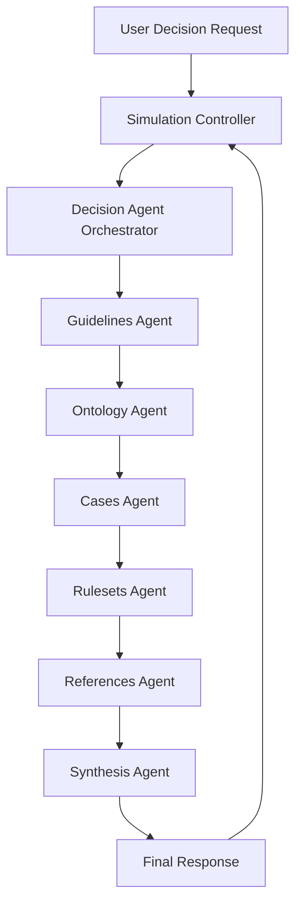

Engineering Ethics (US)# Agent-Based Simulation Architecture Plan

## Overview

This document outlines a plan to enhance the LLM (Claude) integration with structured data in scenario simulations. The goal is to improve how the system accesses and utilizes:

1. Ontologies (through entities in the world)
2. Guidelines
3. Cases
4. Rulesets
5. References

These resources should be consulted in a specific order when responding to decisions, starting with guidelines.

## Current Architecture Analysis

The current system has several key components:

- **SimulationController**: Coordinates the simulation flow and interacts with Claude
- **ClaudeService**: Handles communication with Claude API
- **EmbeddingService**: Manages vector embeddings and similarity search
- **MCPClient**: Accesses guidelines and ontology entities
- **Document/DocumentChunk models**: Store documents with vector embeddings

Currently, the system primarily uses Claude directly with some context provided through the system prompt. The `ClaudeService` gets guidelines for a world, but there isn't a structured approach to consulting all the different resources in a specific order.

## Proposed Architecture

We recommend implementing a multi-agent architecture using LangChain/LangGraph that follows this pattern:



Each agent would:
1. Have a specific focus on one type of resource
2. Query the vector database for relevant information
3. Analyze the decision in the context of that resource
4. Pass its analysis to the next agent in the chain

## Phased Implementation Plan

### Phase 1: Basic LangChain Integration & Guidelines Agent
**Estimated time: 1-2 days**

1. **Install required dependencies**
   ```bash
   pip install langchain langchain-anthropic
   ```

2. **Create a basic GuidelinesAgent**
   - Create file: `app/services/agents/guidelines_agent.py`
   - Implement basic vector search for guidelines
   - Connect to Claude via LangChain

3. **Create a simple test script**
   - Create file: `scripts/test_guidelines_agent.py`
   - This will let you test the agent with sample scenarios

**Checkpoint 1:** Run the test script to verify the GuidelinesAgent can:
- Retrieve relevant guidelines from the vector database
- Generate analysis based on those guidelines

```bash
python scripts/test_guidelines_agent.py
```

### Phase 2: Basic Agent Orchestrator & Ontology Agent
**Estimated time: 1-2 days**

1. **Create the OntologyAgent**
   - Create file: `app/services/agents/ontology_agent.py`
   - Implement MCP client integration for ontology entities

2. **Create a basic AgentOrchestrator**
   - Create file: `app/services/agent_orchestrator.py`
   - Implement sequential processing of Guidelines → Ontology

3. **Create a test script for the orchestrator**
   - Create file: `scripts/test_agent_orchestrator.py`

**Checkpoint 2:** Run the test script to verify:
- The orchestrator can coordinate between agents
- The ontology agent can access entity data
- The combined analysis is more comprehensive

```bash
python scripts/test_agent_orchestrator.py
```

### Phase 3: Simulation Controller Integration
**Estimated time: 1-2 days**

1. **Modify SimulationController**
   - Update `app/services/simulation_controller.py`
   - Add a toggle flag to use either direct Claude or the agent orchestrator
   ```python
   def __init__(self, scenario_id, use_agent_orchestrator=False):
       # existing code...
       self.use_agent_orchestrator = use_agent_orchestrator
   ```

2. **Update the _process_item_with_claude method**
   - Add conditional logic to use the orchestrator for decisions

3. **Add a test route for comparison**
   - Update `app/routes/simulation.py` to add a test endpoint
   ```python
   @simulation_bp.route('/api/test_agents/<int:scenario_id>/<int:decision_id>', methods=['GET'])
   def test_agents(scenario_id, decision_id):
       # Get scenario and decision
       # Run both direct Claude and agent orchestrator
       # Return comparison results
   ```

**Checkpoint 3:** Run the application and use the test endpoint to compare:
- Direct Claude responses
- Agent orchestrator responses for the same decision

```bash
python run.py
# Then visit http://localhost:5000/simulation/api/test_agents/{scenario_id}/{decision_id}
```

### Phase 4: Add Cases & Rulesets Agents
**Estimated time: 2-3 days**

1. **Create the CasesAgent**
   - Create file: `app/services/agents/cases_agent.py`
   - Implement vector search for similar cases

2. **Create the RulesetAgent**
   - Create file: `app/services/agents/ruleset_agent.py`
   - Implement ruleset application logic

3. **Update the AgentOrchestrator**
   - Add the new agents to the processing pipeline
   - Ensure proper data passing between agents

4. **Create test scripts for the new agents**
   - Create files: `scripts/test_cases_agent.py` and `scripts/test_ruleset_agent.py`

**Checkpoint 4:** Run the test scripts and the application to verify:
- Cases are being properly retrieved and analyzed
- Rulesets are being correctly applied
- The orchestrator integrates all analyses

```bash
python scripts/test_cases_agent.py
python scripts/test_ruleset_agent.py
python run.py
```

### Phase 5: Add References Agent & Synthesis Agent
**Estimated time: 2 days**

1. **Create the ReferencesAgent**
   - Create file: `app/services/agents/references_agent.py`
   - Implement Zotero integration for academic references

2. **Create the SynthesisAgent**
   - Create file: `app/services/agents/synthesis_agent.py`
   - Implement logic to combine all agent analyses

3. **Update the AgentOrchestrator**
   - Complete the agent pipeline
   - Add weighting mechanism for different resource types

4. **Create test scripts**
   - Create files: `scripts/test_references_agent.py` and `scripts/test_synthesis_agent.py`

**Checkpoint 5:** Run the full application with all agents:
```bash
python run.py
```
- Test a complete scenario simulation
- Verify all resource types are being consulted
- Check that the synthesis produces coherent responses

### Phase 6: UI Updates & Transparency Features
**Estimated time: 2-3 days**

1. **Update the simulation template**
   - Modify `app/templates/simulate_scenario.html`
   - Add UI elements to show which resources were consulted

2. **Add resource analysis display**
   - Create collapsible sections for each resource type
   - Show reasoning from different perspectives

3. **Update the simulation API endpoints**
   - Modify `app/routes/simulation.py`
   - Return detailed resource analyses

**Checkpoint 6:** Run the application and test the UI:
```bash
python run.py
```
- Verify the UI shows resource consultation
- Check that users can see reasoning from different perspectives
- Ensure the experience is intuitive

### Phase 7: Performance Optimization & Refinement
**Estimated time: 2-3 days**

1. **Implement caching for agent results**
   - Add Redis or in-memory caching
   - Cache vector search results

2. **Add parallel processing option**
   - Allow agents to run in parallel when appropriate
   - Implement async versions of agent methods

3. **Refine prompts and analysis logic**
   - Tune prompts based on testing results
   - Adjust weighting of different resource types

4. **Create comprehensive tests**
   - Create file: `tests/test_agent_system.py`

**Final Checkpoint:** Run performance tests and full scenario simulations:
```bash
python -m pytest tests/test_agent_system.py
python run.py
```
- Verify response times are acceptable
- Check that resource usage is reasonable
- Ensure the quality of responses is high

## Technical Implementation Details

### Agent Orchestrator

```python
class AgentOrchestrator:
    def __init__(self, embedding_service, mcp_client, world_id):
        self.embedding_service = embedding_service
        self.mcp_client = mcp_client
        self.world_id = world_id
        self.agents = self._initialize_agents()
        
    def _initialize_agents(self):
        return {
            "guidelines": GuidelinesAgent(self.embedding_service, self.mcp_client, self.world_id),
            "ontology": OntologyAgent(self.embedding_service, self.mcp_client, self.world_id),
            "cases": CasesAgent(self.embedding_service, self.mcp_client, self.world_id),
            "rulesets": RulesetAgent(self.embedding_service, self.mcp_client, self.world_id),
            "references": ReferencesAgent(self.embedding_service, self.mcp_client, self.world_id),
            "synthesis": SynthesisAgent()
        }
    
    def process_decision(self, scenario_data, decision_text, options):
        # Process in specific order
        results = {}
        
        # Start with guidelines (highest priority)
        results["guidelines"] = self.agents["guidelines"].analyze(scenario_data, decision_text, options)
        
        # Then ontology
        results["ontology"] = self.agents["ontology"].analyze(scenario_data, decision_text, options, 
                                                             previous_results=results)
        
        # Continue with other agents in priority order
        results["cases"] = self.agents["cases"].analyze(scenario_data, decision_text, options,
                                                      previous_results=results)
        
        results["rulesets"] = self.agents["rulesets"].analyze(scenario_data, decision_text, options,
                                                            previous_results=results)
        
        results["references"] = self.agents["references"].analyze(scenario_data, decision_text, options,
                                                                previous_results=results)
        
        # Finally, synthesize all results
        final_response = self.agents["synthesis"].synthesize(results, scenario_data, decision_text, options)
        
        return {
            "response": final_response,
            "resource_analyses": results
        }
```

### Example Agent Implementation

```python
class GuidelinesAgent:
    def __init__(self, embedding_service, mcp_client, world_id):
        self.embedding_service = embedding_service
        self.mcp_client = mcp_client
        self.world_id = world_id
        
    def analyze(self, scenario_data, decision_text, options, previous_results=None):
        # Construct query for relevant guidelines
        query = self._construct_query(scenario_data, decision_text, options)
        
        # Retrieve relevant guidelines using vector similarity
        relevant_guidelines = self.embedding_service.search_similar_chunks(
            query=query,
            k=5,
            world_id=self.world_id,
            document_type='guideline'
        )
        
        # Format guidelines for LLM input
        guidelines_text = self._format_guidelines(relevant_guidelines)
        
        # Use LangChain to analyze the decision in context of guidelines
        from langchain.chains import LLMChain
        from langchain.prompts import PromptTemplate
        
        template = """
        You are analyzing an ethical decision based on relevant guidelines.
        
        SCENARIO: {scenario}
        
        DECISION POINT: {decision}
        
        OPTIONS:
        {options}
        
        RELEVANT GUIDELINES:
        {guidelines}
        
        Analyze how each option aligns with the guidelines. Focus only on the guidelines perspective.
        For each option, provide:
        1. Alignment score (1-10)
        2. Reasoning based on specific guidelines
        3. Key guideline principles that apply
        
        YOUR ANALYSIS:
        """
        
        prompt = PromptTemplate(
            input_variables=["scenario", "decision", "options", "guidelines"],
            template=template
        )
        
        # Use Claude or another LLM through LangChain
        from langchain.llms import Anthropic
        llm = Anthropic(model="claude-3-opus-20240229")
        
        chain = LLMChain(llm=llm, prompt=prompt)
        
        analysis = chain.run(
            scenario=scenario_data.get('description', ''),
            decision=decision_text,
            options="\n".join([f"{i+1}. {opt}" for i, opt in enumerate(options)]),
            guidelines=guidelines_text
        )
        
        return {
            "analysis": analysis,
            "relevant_guidelines": relevant_guidelines,
            "raw_guidelines_text": guidelines_text
        }
        
    def _construct_query(self, scenario_data, decision_text, options):
        # Construct a query that will find the most relevant guidelines
        query = f"Decision: {decision_text}\n\n"
        query += f"Scenario: {scenario_data.get('name', '')}\n"
        query += f"Description: {scenario_data.get('description', '')}\n\n"
        query += "Options:\n"
        for i, option in enumerate(options):
            query += f"{i+1}. {option}\n"
        return query
        
    def _format_guidelines(self, guidelines_chunks):
        # Format the guidelines chunks for LLM input
        formatted = []
        for i, chunk in enumerate(guidelines_chunks):
            formatted.append(f"GUIDELINE {i+1}: {chunk['chunk_text']}")
        return "\n\n".join(formatted)
```

## Testing Throughout Development

For each phase, we recommend creating both:

1. **Unit tests** for individual components
2. **Integration tests** for how components work together
3. **Manual test scenarios** with specific decisions to evaluate

This will help catch issues early and ensure each component is working as expected before moving to the next phase.

## Suggested Test Scenario Format

For each checkpoint, use a consistent test scenario format:

```python
test_scenario = {
    "name": "Medical Triage Decision",
    "description": "Multiple casualties with limited resources",
    "decision": "Which patient should receive the last dose of medication?",
    "options": [
        "Patient A: 35-year-old with severe injuries but good chance of survival with treatment",
        "Patient B: 72-year-old with moderate injuries and complex medical history",
        "Patient C: 8-year-old with moderate injuries"
    ],
    "world_id": 1  # ID of the world with relevant guidelines, ontology, etc.
}
