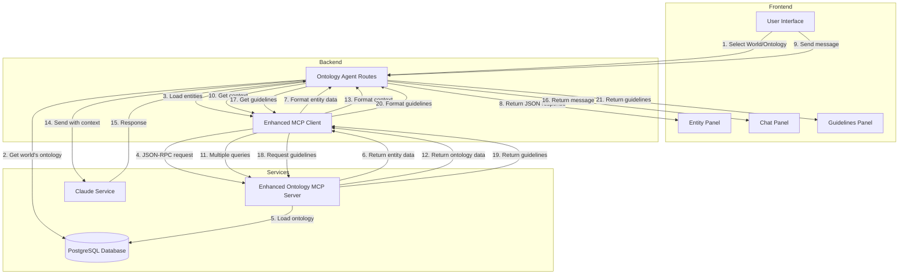
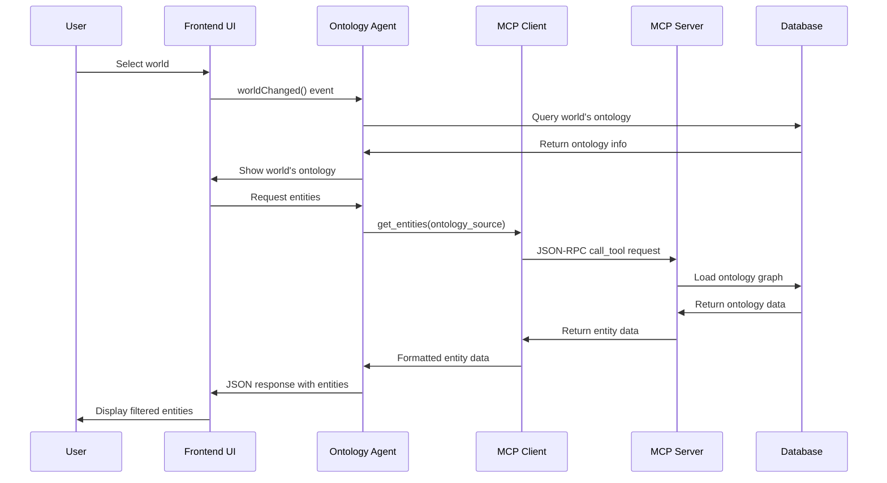
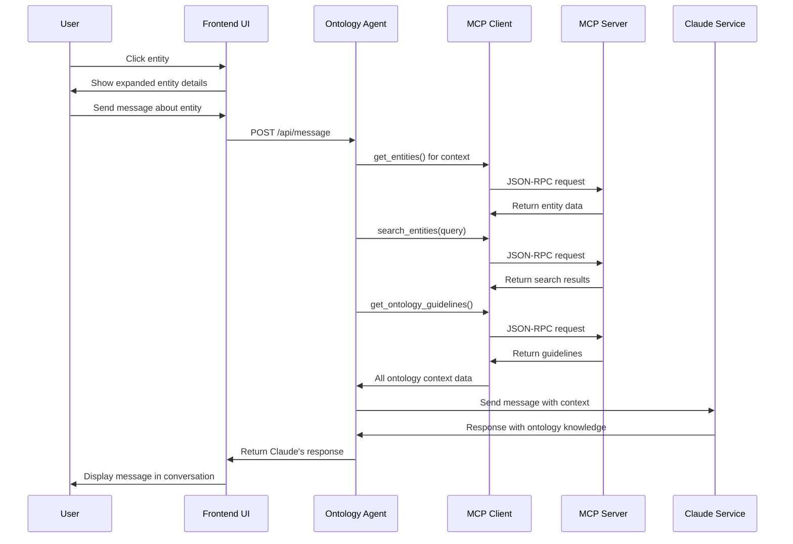
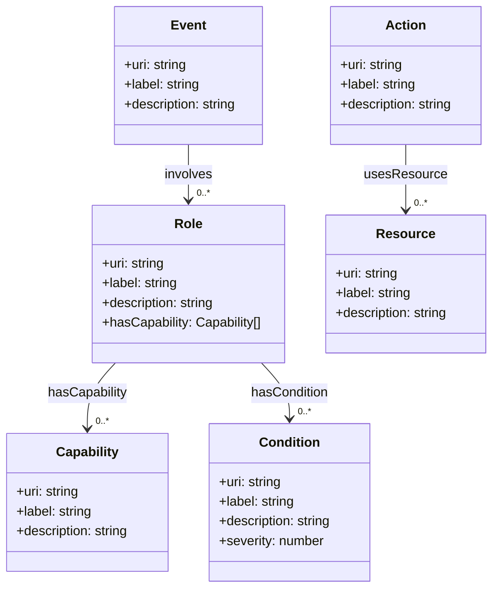
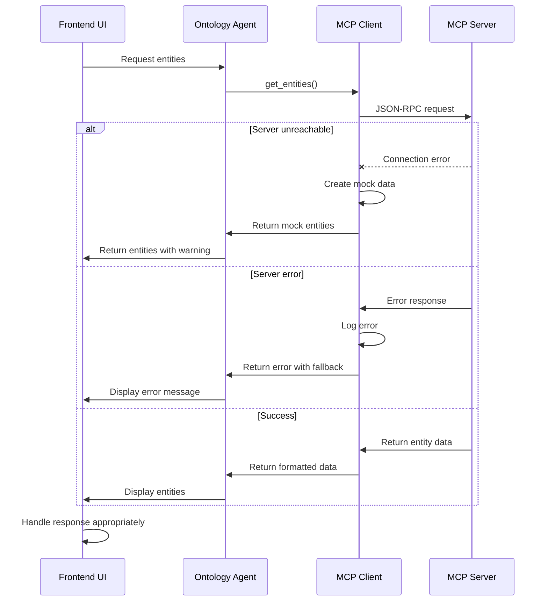

# Ontology Agent Data Flow Diagram

This document provides a visual representation of how data flows between components in the ontology agent system.

## Component Architecture



## Key Sequence Flows

### World Selection and Entity Loading



### Entity Interaction and Message Flow



## Ontology Entity Structure



## Error Handling Flow



## Temporal Functionality Flow

```mermaid
sequenceDiagram
    participant User
    participant UI as Frontend UI
    participant Agent as Ontology Agent
    participant Client as MCP Client
    participant Server as MCP Server
    participant Temporal as Temporal Context Service
    
    User->>UI: Ask about event timeline
    UI->>Agent: Send message
    Agent->>Client: Normal context collection
    
    Agent->>Client: Could integrate temporal queries
    Client->>Server: Request to /api/timeline/{scenario_id}
    Server->>Temporal: Build timeline
    Temporal->>Server: Return timeline data
    Server->>Client: Return timeline context
    
    Client->>Agent: Timeline + standard context
    Agent->>UI: Enhanced temporal response
    UI->>User: Display response with timeline context
