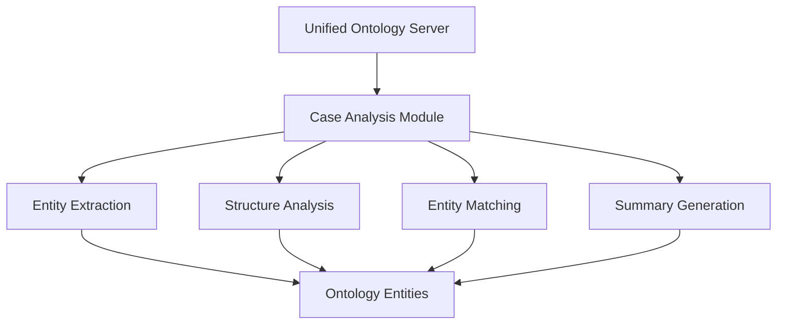

# Case Analysis Using Ontology

This document describes how to use the ontology system to analyze engineering ethics cases.

## Introduction

The ontology enhancement branch adds specialized functionality for analyzing cases using the engineering ethics ontology. This allows for:

- Entity extraction from case text
- Case structure analysis
- Matching case elements to ontology entities
- Generating ontology-based case summaries

## Architecture

The case analysis functionality is implemented as a dedicated module within the Unified Ontology MCP Server:



## Tools

### extract_entities

This tool extracts ontology entities from provided text.

**Parameters:**
- `text`: The text to analyze
- `ontology_source`: Source identifier for the ontology
- `entity_types`: (Optional) List of entity types to extract

**Example:**
```json
{
  "text": "The engineer faced an ethical dilemma regarding safety vs costs.",
  "ontology_source": "engineering",
  "entity_types": ["class", "individual"]
}
```

**Response:**
```json
{
  "entities": [
    {
      "id": "http://proethica.org/ontology/Engineer",
      "label": "Engineer",
      "type": "class",
      "start": 4,
      "end": 12,
      "text": "engineer"
    },
    {
      "id": "http://proethica.org/ontology/EthicalDilemma",
      "label": "Ethical Dilemma",
      "type": "class",
      "start": 22,
      "end": 37,
      "text": "ethical dilemma"
    },
    {
      "id": "http://proethica.org/ontology/Safety",
      "label": "Safety",
      "type": "class",
      "start": 48,
      "end": 54,
      "text": "safety"
    }
  ],
  "count": 3,
  "text_length": 61
}
```

### analyze_case_structure

This tool analyzes a case's structure using ontology concepts.

**Parameters:**
- `case_id`: ID of the case to analyze
- `ontology_source`: Source identifier for the ontology

**Example:**
```json
{
  "case_id": 42,
  "ontology_source": "engineering"
}
```

**Response:**
```json
{
  "case_id": 42,
  "title": "Dam Safety Case",
  "entities": [...],
  "entities_by_type": {
    "class": [...],
    "individual": [...]
  },
  "ethical_concepts": [...],
  "entity_count": 15
}
```

### match_entities

This tool matches case elements to ontology entities with enhanced details.

**Parameters:**
- `case_id`: ID of the case
- `ontology_source`: Source identifier for the ontology
- `entity_type`: (Optional) Type of entity to match

**Example:**
```json
{
  "case_id": 42,
  "ontology_source": "engineering",
  "entity_type": "individual"
}
```

**Response:**
```json
{
  "case_id": 42,
  "matched_entities": [
    {
      "id": "http://proethica.org/ontology/Engineer123",
      "label": "John Smith",
      "type": "individual",
      "description": "Lead engineer on the dam project",
      "relationships": [
        {
          "predicate": "http://proethica.org/ontology/hasRole",
          "predicate_label": "Has Role",
          "object": "http://proethica.org/ontology/LeadEngineer",
          "object_label": "Lead Engineer"
        }
      ]
    }
  ],
  "count": 1,
  "entity_type": "individual"
}
```

### generate_summary

This tool generates an ontology-based summary of a case.

**Parameters:**
- `case_id`: ID of the case
- `ontology_source`: Source identifier for the ontology

**Example:**
```json
{
  "case_id": 42,
  "ontology_source": "engineering"
}
```

**Response:**
```json
{
  "case_id": 42,
  "title": "Dam Safety Case",
  "summary_sections": [
    {
      "title": "Case Overview",
      "content": "This case involves a dam safety incident where..."
    },
    {
      "title": "Class Entities",
      "content": "The case involves Engineer, Safety, and Ethical Dilemma."
    },
    {
      "title": "Individual Entities",
      "content": "The case involves John Smith and Metro Dam Project."
    },
    {
      "title": "Ethical Analysis",
      "content": "This case involves ethical concepts related to: Professional Responsibility, Public Safety."
    }
  ],
  "full_summary": "# Case Overview\nThis case involves a dam safety incident where...\n\n# Class Entities\nThe case involves Engineer, Safety, and Ethical Dilemma.\n\n# Individual Entities\nThe case involves John Smith and Metro Dam Project.\n\n# Ethical Analysis\nThis case involves ethical concepts related to: Professional Responsibility, Public Safety.",
  "entity_count": 5
}
```

## Integration with Application

### Using with Flask Application

To use case analysis from a Flask application:

```python
from app import app
from mcp.unified_ontology_server import UnifiedOntologyServer

# Create server instance
server = UnifiedOntologyServer()

# Get case analysis module
case_module = server.modules.get("case_analysis")

# Analyze a case
with app.app_context():
    result = case_module.analyze_case_structure({
        "case_id": 42,
        "ontology_source": "engineering"
    })
    
    print(result)
```

### Using via MCP Server

To use case analysis via the MCP server API:

```python
import requests
import json

# Call tool
response = requests.post(
    "http://localhost:5001/jsonrpc",
    json={
        "jsonrpc": "2.0",
        "id": 1,
        "method": "call_tool",
        "params": {
            "name": "extract_entities",
            "arguments": {
                "text": "The engineer faced an ethical dilemma.",
                "ontology_source": "engineering"
            }
        }
    }
)

# Parse result
result = response.json()
content_text = result["result"]["content"][0]["text"]
entities = json.loads(content_text)

print(f"Found {entities['count']} entities")
```

## Use Cases

### NSPE Case Analysis

The case analysis tools are particularly useful for analyzing NSPE (National Society of Professional Engineers) case studies:

1. Load an NSPE case into the database
2. Extract ontology entities from the case text
3. Match these entities to the engineering ethics ontology
4. Generate an ontology-based summary highlighting key ethical concepts
5. Use the analysis to inform ethical reasoning about the case

### Ethical Decision-Making Support

The case analysis can support ethical decision-making by:

1. Identifying ethical concepts and principles relevant to a given scenario
2. Mapping relationships between stakeholders, actions, and consequences
3. Highlighting similar past cases through ontological similarity
4. Providing structured analysis that can be used in discussions or reports

## Tips and Best Practices

1. **Choose the Right Ontology**: Ensure you're using an appropriate ontology source for the case domain (e.g., engineering ethics vs medical ethics)

2. **Handle Ambiguity**: The entity extraction uses simple pattern matching, so consider post-processing results to disambiguate terms that might have multiple meanings

3. **Enhance Summaries**: The generated summaries are basic starting points - consider enhancing them with domain-specific rules or integrating with an LLM for more nuanced analysis

4. **Performance Considerations**: For large cases, extracting entities can be relatively expensive - consider caching results where appropriate
