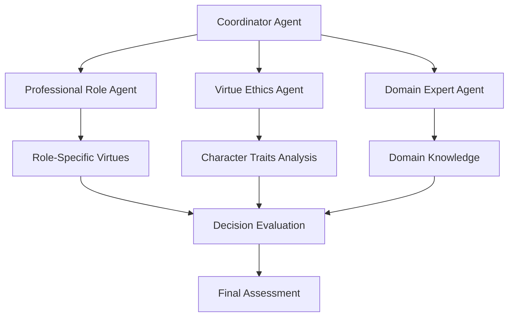
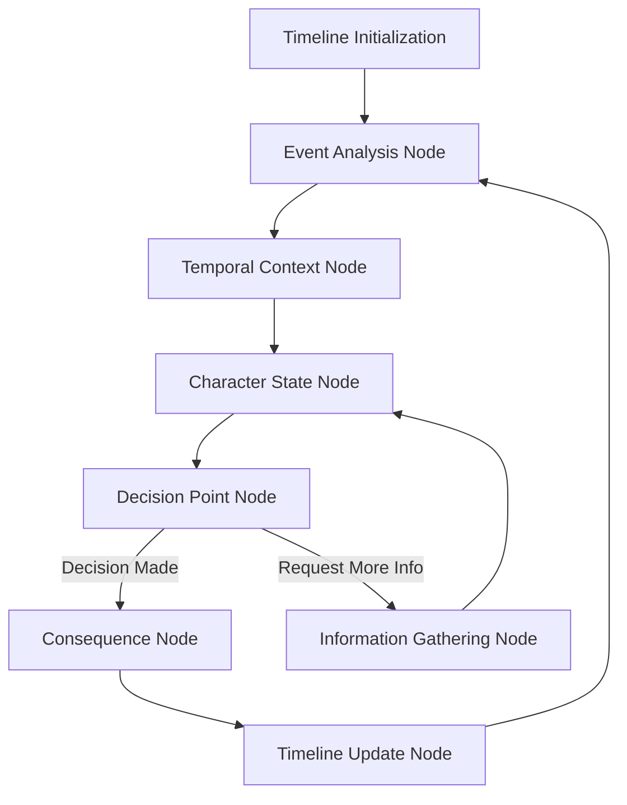
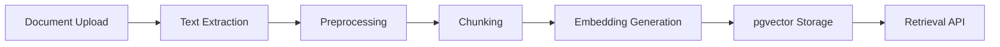

# Future Development Plans

This document outlines the comprehensive plans for enhancing the ProEthica system with advanced AI capabilities and improved architecture.

## Project Overview

ProEthica is an AI Ethical Decision-Making Simulator that simulates event-based scenarios (like military medical triage, engineering ethics, and legal ethics) to train and evaluate ethical decision-making agents. The system combines rule-based reasoning with case-based and analogical reasoning from domain-specific ethical guidelines.

The application is built with:
- **Backend**: Flask, SQLAlchemy, PostgreSQL
- **AI Components**: Integration with LangChain and LangGraph
- **Extension**: Model Context Protocol (MCP) for ontology data
- **Reference Management**: Zotero integration for academic references

## Enhancement Goals

The following significant enhancements are planned for the application:

1. **Advanced LangChain and LangGraph Integration**:
   - Multi-agent architecture focused on virtue ethics and professional roles
   - Temporal workflow for scenario simulation
   - Better memory and state management
   - More robust evaluation framework

2. **Document Embedding System**:
   - Processing pipeline for uploaded documents
   - Open-source embedding model (Sentence-Transformers)
   - PostgreSQL with pgvector for storage
   - Retrieval system for semantic search

3. **API Call Optimization**:
   - Strategies to minimize Anthropic API calls
   - Caching and batching mechanisms
   - Hybrid approach using open-source models where possible

## High-Level Architecture

```
┌─────────────────────────────────────────────────────────────────┐
│                        Web Application                           │
│                                                                  │
│  ┌─────────────┐    ┌─────────────┐    ┌─────────────────────┐  │
│  │ Scenario    │    │ World       │    │ Document            │  │
│  │ Management  │    │ Management  │    │ Management          │  │
│  └─────────────┘    └─────────────┘    └─────────────────────┘  │
└───────────────────────────┬─────────────────────────────────────┘
                            │
┌───────────────────────────▼─────────────────────────────────────┐
│                      Core Services                               │
│                                                                  │
│  ┌─────────────┐    ┌─────────────┐    ┌─────────────────────┐  │
│  │ MCP Client  │    │ Zotero      │    │ Document Processing │  │
│  │             │    │ Client      │    │ Pipeline            │  │
│  └─────────────┘    └─────────────┘    └─────────────────────┘  │
└───────────────────────────┬─────────────────────────────────────┘
                            │
┌───────────────────────────▼─────────────────────────────────────┐
│                      AI Components                               │
│                                                                  │
│  ┌─────────────────────────────┐    ┌─────────────────────────┐ │
│  │      LangChain Layer        │    │    LangGraph Layer      │ │
│  │                             │    │                         │ │
│  │  ┌─────────┐  ┌─────────┐   │    │  ┌─────────┐            │ │
│  │  │ Virtue  │  │ Domain  │   │    │  │Temporal │            │ │
│  │  │ Agents  │  │ Tools   │   │    │  │Workflow │            │ │
│  │  └─────────┘  └─────────┘   │    │  └─────────┘            │ │
│  │                             │    │                         │ │
│  │  ┌─────────┐  ┌─────────┐   │    │  ┌─────────┐            │ │
│  │  │ Memory  │  │Retrieval│   │    │  │ State   │            │ │
│  │  │ Systems │  │ System  │   │    │  │ Manager │            │ │
│  │  └─────────┘  └─────────┘   │    │  └─────────┘            │ │
│  └─────────────────────────────┘    └─────────────────────────┘ │
└───────────────────────────┬─────────────────────────────────────┘
                            │
┌───────────────────────────▼─────────────────────────────────────┐
│                      Data Layer                                  │
│                                                                  │
│  ┌─────────────┐    ┌─────────────┐    ┌─────────────────────┐  │
│  │ PostgreSQL  │    │ pgvector    │    │ External Services   │  │
│  │ Database    │    │ Extension   │    │ (MCP, Zotero)       │  │
│  └─────────────┘    └─────────────┘    └─────────────────────┘  │
└─────────────────────────────────────────────────────────────────┘
```

## Detailed Enhancement Plans

### 1. Multi-Agent Ethical Reasoning System (Virtue Ethics Focus)

#### Agent Architecture



1. **Professional Role Agent**:
   - Focus on role-specific virtues (e.g., attorney virtues: integrity, confidentiality, loyalty)
   - Evaluate actions against professional standards and codes of conduct
   - Use ontology data from MCP to access role definitions and expectations

2. **Virtue Ethics Agent**:
   - Analyze character traits and intentions behind actions
   - Evaluate whether actions demonstrate virtuous character
   - Consider how decisions reflect on the character's moral development

3. **Domain Expert Agent**:
   - Provide domain-specific knowledge (legal, engineering, military)
   - Contextualize decisions within domain practices
   - Reference relevant cases and precedents

4. **Coordinator Agent**:
   - Synthesize perspectives from other agents
   - Manage deliberation process
   - Generate final assessment

#### API Call Optimization

- Implement caching for similar ethical queries
- Batch related questions in single API calls
- Use structured output formats to maximize information per call
- Pre-compute common ethical assessments

### 2. Temporal LangGraph Workflow

#### Enhanced Timeline Processing



1. **Temporal Context Node**:
   - Track event sequences and causal relationships
   - Maintain timeline state with past, present, and potential future events
   - Analyze temporal patterns in ethical decision-making

2. **Character State Node**:
   - Track character knowledge, beliefs, and emotional states over time
   - Update character states based on events and actions
   - Model how character virtues develop or change through scenario

3. **Decision Point Node**:
   - Identify critical decision moments in timeline
   - Generate and evaluate possible actions
   - Integrate with multi-agent system for ethical assessment

4. **Consequence Node**:
   - Simulate outcomes of decisions
   - Update scenario state based on actions
   - Create new events that flow from decisions

### 3. Document Embedding System with Open-Source Models

#### Document Processing Pipeline



1. **Recommended Open-Source Embedding Models**:
   - Primary: `all-MiniLM-L6-v2` (small, fast, good quality)
   - Alternative: `all-mpnet-base-v2` (higher quality but larger)
   - Multilingual option: `paraphrase-multilingual-MiniLM-L12-v2`

2. **Cloud Hosting Options**:
   - Hugging Face Inference API
   - Lightweight self-hosted option with FastAPI

3. **Chunking Strategy**:
   - Semantic chunking based on paragraph/section boundaries
   - Overlap between chunks (50-100 tokens)
   - Hierarchical chunking for structured documents

### 4. pgvector Integration

#### Schema Design

```sql
-- Extension and table for document embeddings
CREATE EXTENSION IF NOT EXISTS vector;

CREATE TABLE document_embeddings (
    id SERIAL PRIMARY KEY,
    document_id INTEGER REFERENCES documents(id),
    chunk_index INTEGER,
    chunk_text TEXT,
    embedding vector(384),  -- For all-MiniLM-L6-v2
    metadata JSONB
);

CREATE INDEX ON document_embeddings USING ivfflat (embedding vector_cosine_ops);
```

#### Optimization Strategies

1. **Efficient Indexing**:
   - Use IVFFlat indexes for faster similarity search
   - Tune index parameters based on dataset size

2. **Batch Processing**:
   - Process documents in batches to minimize overhead
   - Implement background processing for large documents

## Progress Report on Completed Enhancements

### 1. pgvector Implementation

Successfully switched the document embedding system to use pgvector for storing and querying vector embeddings, providing better performance and more accurate similarity search.

Changes made:
- Updated Document Model to use the Vector type from pgvector 
- Modified the Embedding Service to use pgvector's native similarity search
- Created migration scripts to support vector types
- Added vector similarity indexes for faster search

Benefits:
- Improved performance with native similarity search
- Better accuracy using optimized vector operations
- Reduced complexity by removing fallback code
- Better scalability for handling larger document collections

### 2. Document Status Management

Fixed document status indicator issues and implemented improved document processing:

- Enhanced document status endpoints to auto-correct document states
- Improved task queue processing to check for existing content
- Added proper handling for edge cases and better error management
- Implemented a maintenance script and cron job to automatically fix stuck documents

## Implementation Roadmap

### Phase 1: Foundation (2-3 weeks)
- Set up Sentence-Transformers embedding pipeline
- Implement pgvector schema and basic retrieval
- Design virtue ethics agent framework

### Phase 2: Core Components (3-4 weeks)
- Implement professional role agent
- Develop temporal context and character state nodes
- Create document processing pipeline

### Phase 3: Integration (2-3 weeks)
- Connect embedding system with LangGraph workflow
- Implement coordinator agent
- Develop API call optimization strategies

### Phase 4: Testing and Refinement (2 weeks)
- Test with existing scenarios
- Optimize performance
- Refine agent interactions

## Technical Considerations

### 1. Performance Optimization
- Implement caching for embeddings and retrievals
- Use batch processing where appropriate
- Optimize database queries
- Consider async processing for long-running tasks

### 2. Scalability
- Design for horizontal scaling
- Implement efficient resource usage
- Consider containerization for deployment
- Plan for growing document collections

### 3. Security
- Secure document storage
- Implement proper authentication and authorization
- Protect sensitive information
- Ensure compliance with relevant regulations

### 4. User Experience
- Create intuitive interfaces for document management
- Provide clear feedback on processing status
- Ensure responsive search functionality
- Develop helpful visualizations for ethical reasoning

## Evaluation Framework

The enhanced system will be evaluated based on:

1. **Technical Metrics**:
   - Processing time for documents
   - Retrieval accuracy and speed
   - Simulation performance
   - Resource usage

2. **Ethical Reasoning Quality**:
   - Comparison with expert judgment
   - Consistency across similar scenarios
   - Explanatory power
   - Handling of edge cases

3. **User Experience**:
   - Ease of document management
   - Search result relevance
   - Clarity of ethical reasoning
   - Overall system usability
