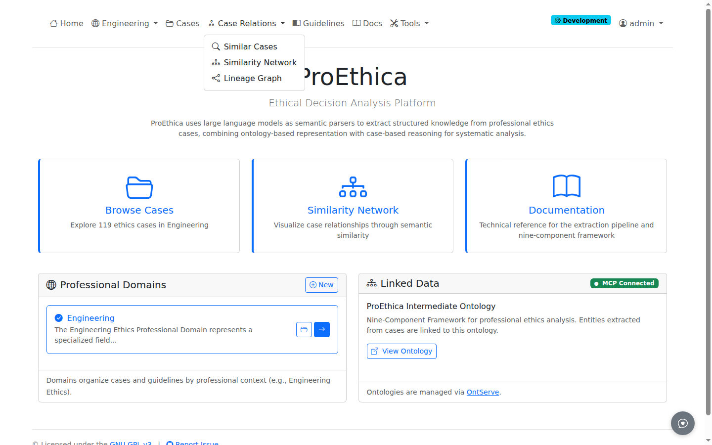
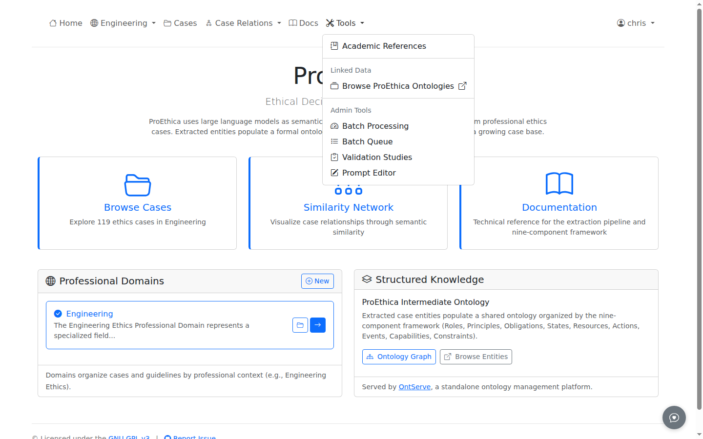
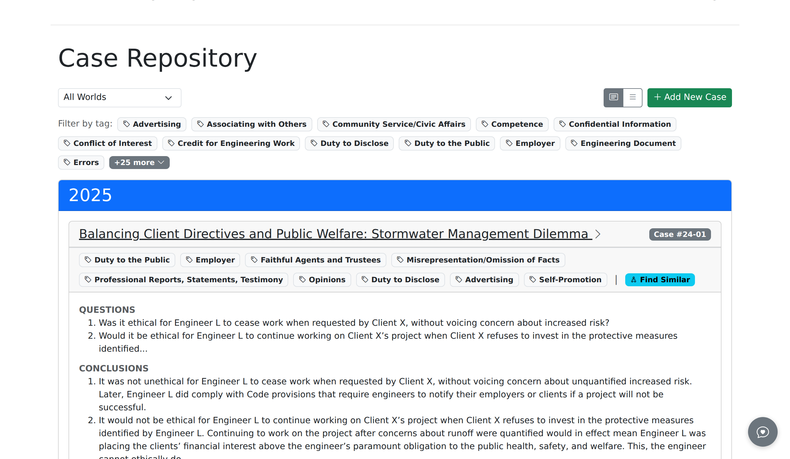
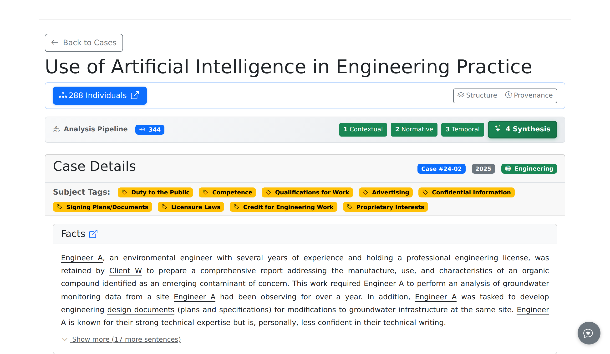
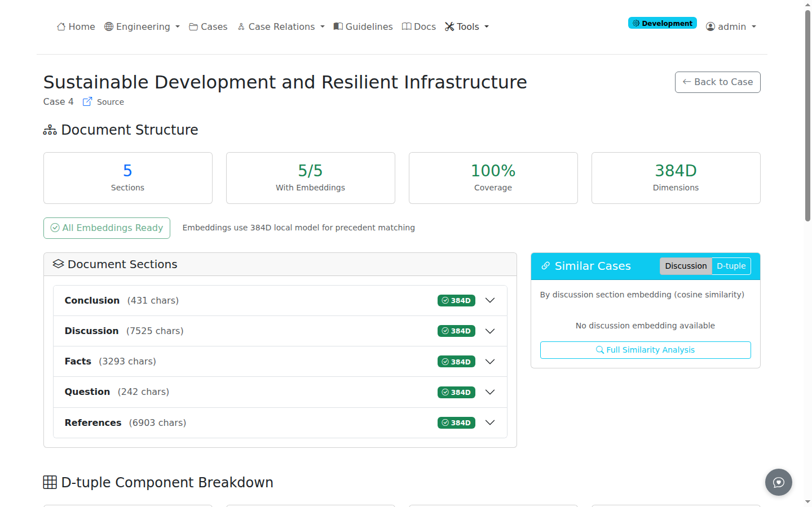
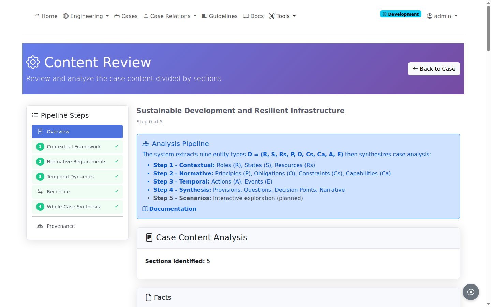
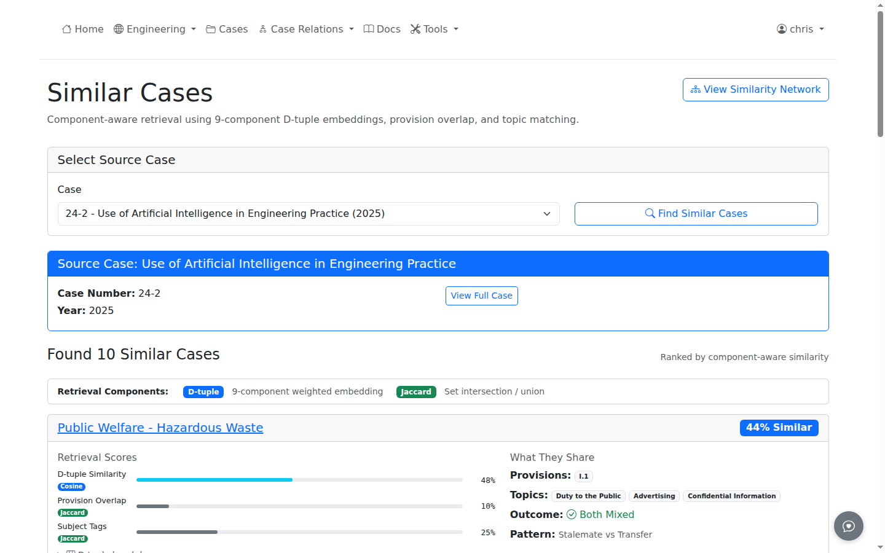
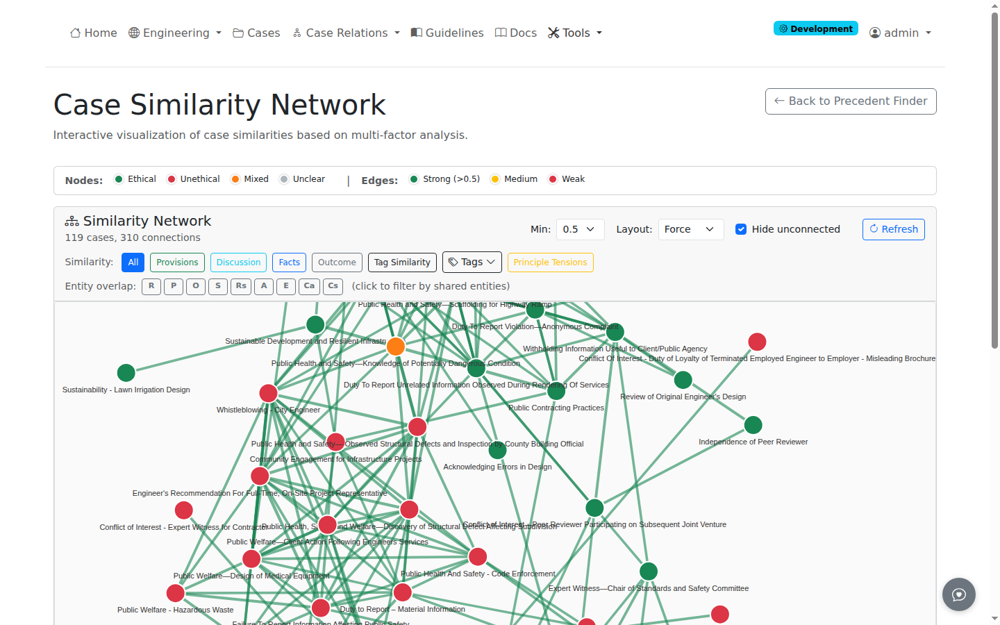
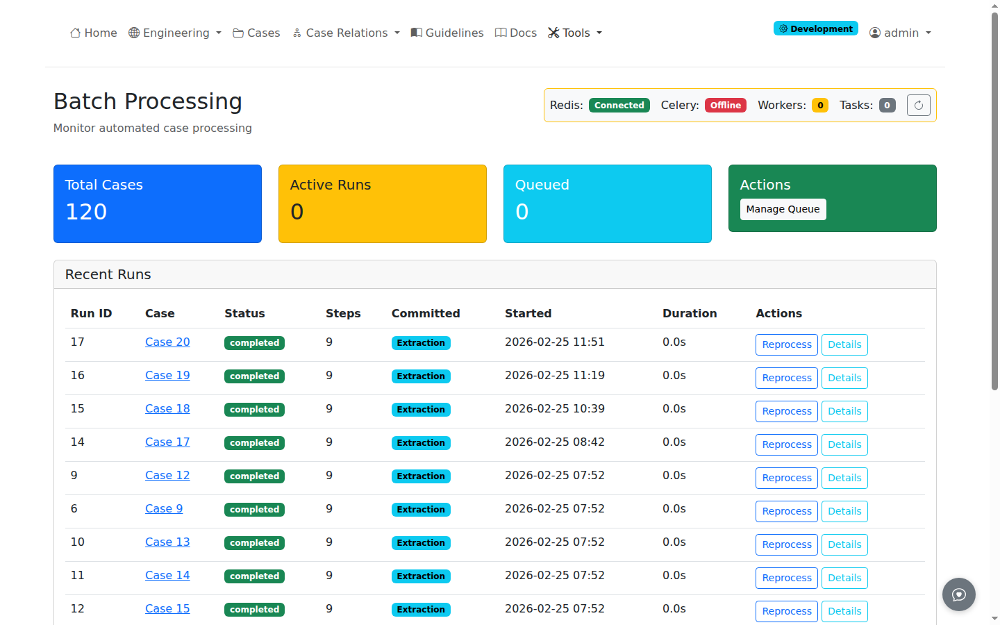

# Interface Overview

This guide covers the main interface elements and navigation patterns in ProEthica.

## Access Levels

ProEthica operates in demo mode by default, allowing exploration of cases and extracted entities without authentication. The interface adapts based on access level:

| Level | Access | Available Features |
|-------|--------|-------------------|
| Anonymous (Demo) | No login required | Browse cases, view extractions, explore precedent network, read guidelines |
| Authenticated | Login required | Run extractions, edit entities, manage pipeline queue |
| Admin | Admin account | User management, domain configuration, system settings |

Users exploring the demo will see view-only interfaces. Buttons for extraction, editing, and pipeline operations appear only for authenticated users. This documentation describes the full interface as seen by authenticated users.

## Navigation Bar

The top navigation provides access to main features:

| Menu Item | Type | Contents |
|-----------|------|----------|
| **Home** | Link | Return to home page |
| **[Domain]** | Dropdown | Current domain (e.g., Engineering) |
| **Cases** | Link | Case repository |
| **Case Relations** | Dropdown | Similar Cases, Similarity Network, Lineage Graph |
| **Guidelines** | Link | Browse ethical guidelines and codes of ethics |
| **Docs** | Link | This documentation |
| **Tools** | Dropdown | Academic References; Linked Data (OntServe Web, Browse ProEthica Ontologies); Admin Tools (Batch Processing, Batch Queue, Validation Studies, Prompt Editor) |
| **[User]** | Dropdown | User menu with Logout |

The domain dropdown (e.g., "Engineering") reflects the currently active professional domain. A "Development" badge appears in development mode with full access enabled without authentication.

## Cases Section

### Case Repository

The Cases page (`/cases/`) displays all uploaded cases with:

- Year grouping for chronological organization
- Subject tags for filtering by topic
- Question and conclusion previews (expandable/collapsible via view toggle)
- Compact and expanded view modes (persisted in browser storage)

### Case Detail

Each case has a detail page showing:

- Case title, reference number, and metadata
- Context bar with OntServe entity link, transformation badge, and utility buttons (**Structure**, **Provenance**)
- Full narrative with Facts and Discussion sections
- Interactive RDF triple labels linking to related cases
- Pipeline status bar and step buttons (visible to authenticated users only in production)

### Document Structure

The Structure view (`/cases/<id>/structure`) provides:

- Section breakdown with character counts
- Embedding status and regeneration controls
- Similar cases based on semantic matching

## Extraction Pipeline

The pipeline provides step-by-step case analysis (requires authentication). Access it from the case detail page via the **Pipeline** button or the per-case pipeline dashboard at `/cases/<id>/pipeline`.

| Step | Name | Description | Entity Types |
|------|------|-------------|-------------|
| 1 | Contextual Framework | Extract from Facts and Discussion sections | Roles (R), States (S), Resources (Rs) |
| 2 | Normative Requirements | Extract from Facts and Discussion sections | Principles (P), Obligations (O), Constraints (Cs), Capabilities (Ca) |
| 3 | Temporal Dynamics | Unified extraction via LangGraph | Actions (A), Events (E), causal chains, Allen relations |
| Reconcile | Entity Deduplication | Merge overlapping entities across passes | -- |
| 4 | Whole-Case Synthesis | Multi-phase analysis (2A-2E, Phase 3, Phase 4) | Provisions, Precedents, Questions, Conclusions, Decision Points, Resolution Patterns, Causal-Normative Links, Question Emergence |

### Pipeline Sidebar

The sidebar shows all pipeline steps with checkmarks for completed steps. Step 4 has sub-views: Extraction, Review, and Full View.

### Step Views

Each step displays extracted entities organized by concept type with:

- **Facts/Discussion toggle** (Steps 1-2) for section-specific extraction
- **Entity counts** showing classes and individuals per concept
- **Re-run Extraction** button to re-extract
- **Provenance** link to view extraction history
- **Draft/Committed** status badge

### Step 4 Full View

The Full View provides a tabbed interface with 8 tabs: Entities (interactive graph), Flow, Provisions, Precedents, Q&C, Analysis, Decisions, and Narrative.

## Precedent Discovery

### Similarity Search

The Precedents page (`/cases/precedents/`) provides:

- Similarity scores based on document embeddings
- Breakdown by section (Facts, Discussion)
- Filter by specific case or view all pairs

### Similarity Network

The network view (`/cases/precedents/network`) visualizes case relationships:

- Node color indicates case outcome (green: ethical, red: unethical, orange: mixed)
- Edge color indicates similarity strength
- Click nodes for case details
- Click edges for similarity breakdown

## Pipeline Automation

For batch processing, **Tools** > **Batch Processing** (`/pipeline/dashboard`) shows:

- Service status (Redis, Celery, queue depth)
- Active pipeline runs with progress bars
- Queue management controls

## Status Indicators

### Service Status

The header shows service connectivity:

- **Green** - All services operational
- **Yellow** - Some services unavailable
- **Red** - Critical services offline

### Entity Status

Entities in review display their state:

- **New** - Extracted this session
- **Existing** - Matches ontology class
- **Modified** - User-edited entity

## Keyboard Shortcuts

| Shortcut | Action |
|----------|--------|
| `Ctrl+Enter` | Submit current form |
| `Esc` | Close modal dialogs |

## Related Documentation

- [Upload Cases](../analysis/uploading-cases.md) - Adding cases for analysis
- [Running Extractions](../analysis/running-extractions.md) - Extraction process
- [Precedent Network](../viewing/precedent-network.md) - Similarity search
