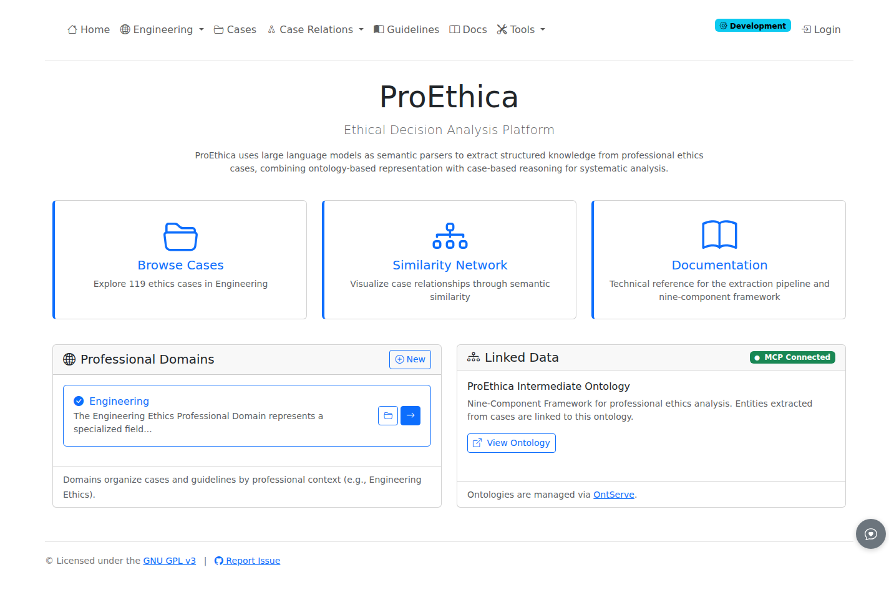

# Welcome to ProEthica

ProEthica is an ethical decision analysis platform that uses large language models to extract structured knowledge from professional ethics cases.

## What ProEthica Does

ProEthica analyzes ethics cases from professional boards (such as the NSPE Board of Ethical Review) using a formal nine-concept framework. The system:

- Extracts [structured entities](../concepts/nine-concepts.md) from case narratives (Roles, States, Resources, Principles, Obligations, Constraints, Capabilities, Actions, Events)
- Maps relationships between ethical concepts using ontology-based representation
- Discovers precedents by finding semantically similar cases
- Generates scenarios for understanding case dynamics and transformation patterns (coming soon)

## Two Processing Modes

ProEthica supports two ways to analyze cases:

### Manual Mode (Step-by-Step)

Progress through each extraction step individually with full visibility into LLM interactions:

- **View prompts and responses** - See exactly what the LLM receives and produces at each step
- **Review before committing** - Examine extracted entities before saving to the ontology
- **Review and remove** - Remove incorrect entities during the review phase (editing after commit coming soon)

Manual mode is recommended for understanding the extraction process and validating results.

### Pipeline Mode (Automated)

Queue cases for batch processing through all extraction steps:

- **Background execution** - Cases process automatically while you work on other tasks
- **Queue management** - Add multiple cases and monitor progress from the dashboard
- **Consistent processing** - Same extraction steps applied uniformly across cases

Pipeline mode is efficient for processing multiple cases after you are familiar with manual extraction.

Manual mode is accessed from the numbered step buttons at the top of any case page. Steps must be processed in sequence; completed steps display as green. See [Phase 1 Extraction](../how-to/phase1-extraction.md) for details. Pipeline mode is accessed from **Tools > Pipeline Dashboard** (requires admin login).

## Quick Start

The home page provides three main entry points:

| Card | Purpose |
|------|---------|
| [Browse Cases](../how-to/view-cases.md) | View and analyze ethics cases in the repository |
| [Similarity Network](../how-to/precedent-discovery.md) | Discover similar cases using semantic similarity |
| Documentation | Access this user manual |

## Main Features

### Professional Domains

The left panel shows available professional domains. The current implementation includes Engineering Ethics; additional domains can be configured. Each domain contains:

- Ethics cases from professional review boards
- Domain-specific ontologies and guidelines
- Precedent relationships between cases

Use the folder icon to browse cases within a domain.

### Linked Data

The right panel provides access to the underlying ontologies:

- **ProEthica Core** - The nine-concept framework for ethical analysis
- **ProEthica Intermediate** - Professional role definitions and relationships
- **Engineering Ethics** - Domain-specific codes and precedents

These ontologies are managed by OntServe and provide the semantic foundation for case analysis.

## Typical Workflow

1. **Select a domain** from the Professional Domains panel
2. **Browse cases** or upload new cases for analysis
3. **Run the extraction pipeline** to extract structured entities
4. **Review and validate** extracted concepts
5. **Discover precedents** using similarity matching
6. **Explore scenarios** to understand case dynamics (coming soon)

## Next Steps

- [Interface Overview](first-login.md) - Learn the navigation and UI elements
- [Upload Cases](../how-to/upload-cases.md) - Add new cases for analysis
- [Nine-Concept Framework](../concepts/nine-concepts.md) - Understand the methodology
