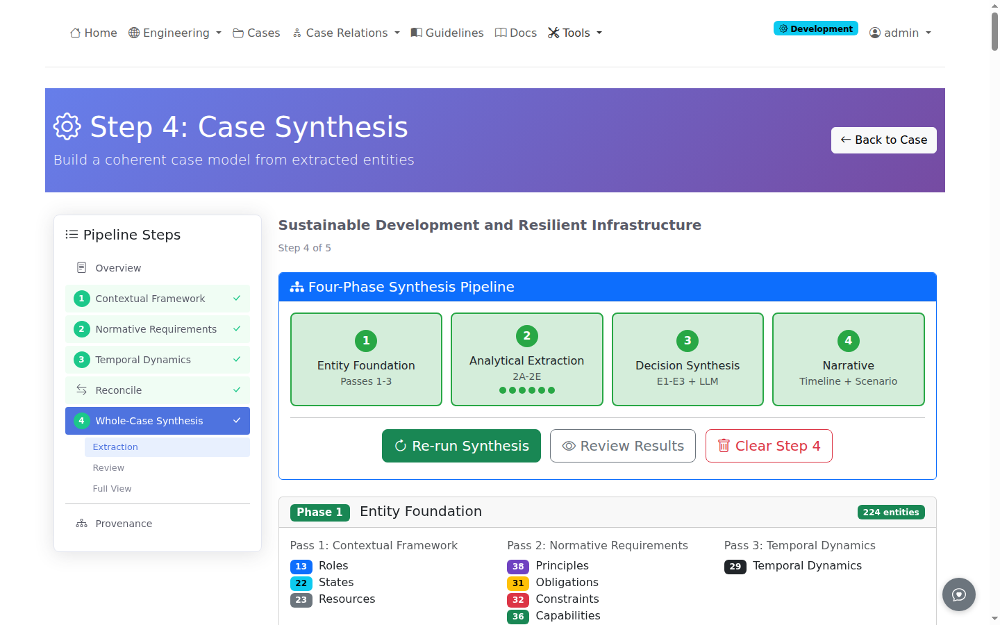
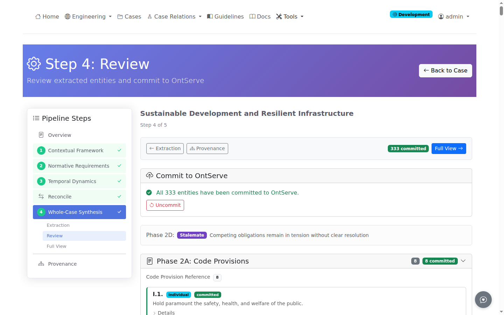
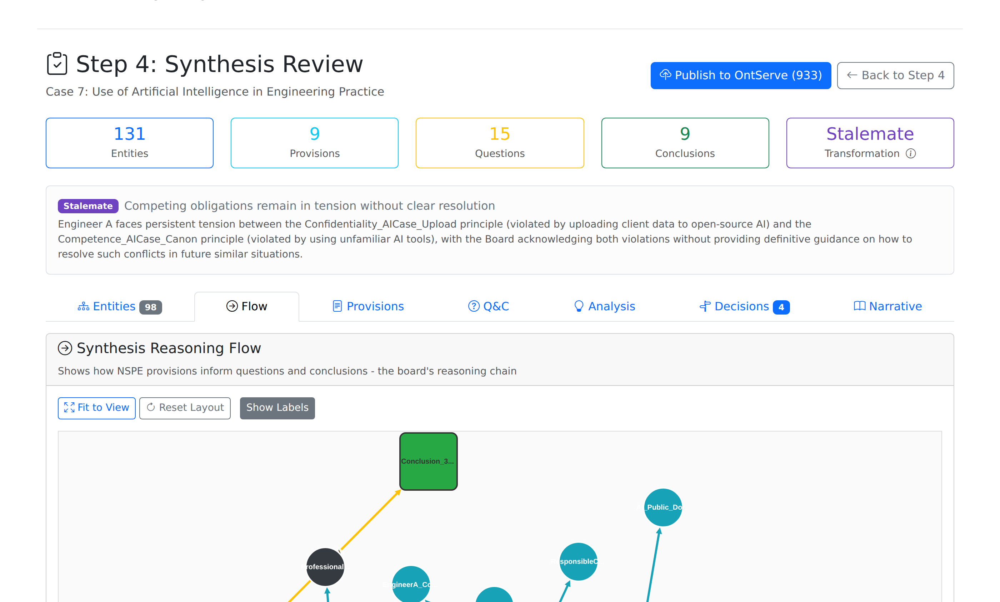
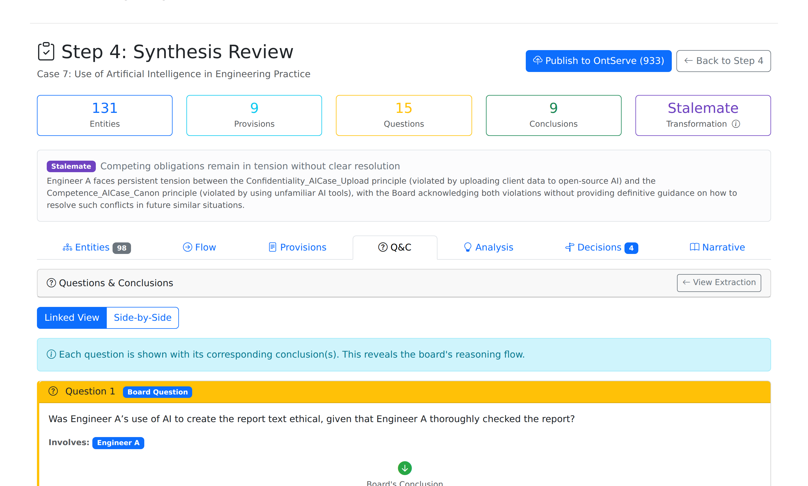

# Phase 2: Case Synthesis

This guide covers Step 4 case synthesis, which analyzes extracted entities to produce structured case analysis with decision points, arguments, and narrative structures.

## Overview

Step 4 performs four-phase synthesis on the entities extracted during Phase 1 (Steps 1-3). The synthesis pipeline transforms the nine extracted entity types (Roles, Principles, Obligations, States, Resources, Actions, Events, Capabilities, Constraints) into actionable analysis.

| Phase | Name | Output |
|-------|------|--------|
| 1 | Entity Foundation | Prepared entity data for analysis |
| 2 | Analytical Extraction | Provisions, questions, conclusions, rich analysis |
| 3 | Decision Point Synthesis | Entity-grounded decision points with alignment scores |
| 4 | Narrative Construction | Characters, timeline, moral intensity assessment |

## Prerequisites

Before running Step 4:

- Step 1 (Contextual Framework) must be complete with Roles, States, Resources
- Step 2 (Normative Requirements) must be complete with Principles, Obligations, Constraints, Capabilities
- Step 3 (Temporal Dynamics) must be complete with Actions, Events

## Starting Step 4

Navigate to the case detail page and click the **Step 4** button. The button appears green if prerequisites are met.

Click **Run Complete Synthesis** to execute all phases sequentially. The process takes approximately 7-8 minutes per case.

## Review Interface

After Step 4 completes, the review page displays seven tabs:

---

## Tab 1: Entities

The Entities tab displays an interactive D3.js graph showing all extracted entities from Passes 1-3 and Step 4 synthesis results.

**Features:**

- Filter by pass number (1, 2, 3, 4) using the button group
- Search entities by label
- Click nodes to view entity details and relationships
- Color-coded by entity type

**Pass Assignment:**

| Pass | Entity Types |
|------|--------------|
| 1 | Roles, States, Resources |
| 2 | Principles, Obligations, Constraints, Capabilities |
| 3 | Actions, Events |
| 4 | Provisions, Questions, Conclusions, Decision Points |

---

## Tab 2: Flow

The Flow tab shows the Provision to Question to Conclusion chain using a Cytoscape.js graph.

**Edge Types:**

| Edge | Meaning | Color |
|------|---------|-------|
| **informs** | Provision informs Question | Gray |
| **answered by** | Question answered by Conclusion | Yellow |
| **applies to** | Provision applies to Entity | Cyan |

**Node Shapes:**

- Rectangle: Provisions
- Diamond: Questions
- Rounded rectangle: Conclusions
- Ellipse: Entities

---

## Tab 3: Provisions (Stage 2A)

The Provisions tab displays NSPE code provisions extracted from the case References section.

**Extraction Pipeline:**

1. HTML parsing extracts provision codes and text
2. Pattern detection finds provision mentions in case text
3. LLM validates each mention and assigns confidence score (0.0-1.0)
4. LLM links provisions to extracted entities

**Content Types:**

| Type | Meaning |
|------|---------|
| compliance | Discusses how provision is followed |
| violation | Discusses breach of provision |
| interpretation | Discusses meaning of provision |
| Board_reasoning | Board reasoning about provision |

**Confidence Threshold:** Mentions below 0.5 confidence are filtered out.

---

## Tab 4: Questions & Conclusions (Stage 2B)

The Q&C tab displays extracted ethical questions and board conclusions.

**Question Types:**

| Type | Source | Description |
|------|--------|-------------|
| Board Explicit | Parsed from Questions section | Board's actual questions |
| Implicit | LLM-generated | Questions the case raises but were not explicitly asked |
| Principle Tension | LLM-generated | Where ethical principles conflict |
| Theoretical | LLM-generated | Deontological, consequentialist, or virtue ethics framings |
| Counterfactual | LLM-generated | What-if scenarios |

**Theoretical Frameworks:**

- Deontological: Duty-based ethics (Kant)
- Consequentialist: Outcome-based ethics (Mill)
- Virtue: Character-based ethics (Aristotle)

**Q-C Linking:** Each conclusion shows which questions it answers via the `answersQuestions` field.

---

## Tab 5: Analysis (Stage 2D)

The Analysis tab displays rich analysis results using the Toulmin argumentation framework.

**Three Analysis Types:**

| Analysis | Purpose |
|----------|---------|
| Causal-Normative Links | Maps actions to obligations fulfilled or violated |
| Question Emergence | Explains why each question emerged using Toulmin structure |
| Resolution Patterns | Analyzes how the board weighed competing obligations |

**Toulmin Structure (for Question Emergence):**

| Component | Meaning |
|-----------|---------|
| DATA | Events and actions that created the ethical situation |
| WARRANT | Competing obligations that could apply |
| Data-Warrant Tension | How facts trigger multiple obligations |
| Rebuttal Conditions | Circumstances creating uncertainty |

---

## Tab 6: Decisions (Stage 3)

The Decisions tab displays canonical decision points synthesized from extracted entities.

**Synthesis Method:**

The system first attempts algorithmic composition (E1-E3), then falls back to LLM generation if no candidates are found.

1. **E1: Obligation Coverage** - Identifies decision-relevant obligations with conflicts
2. **E2: Action-Option Mapping** - Scores actions using Jones's Moral Intensity model
3. **E3: Decision Point Composition** - Matches obligations to action sets

**Q&C Alignment Score (0.0-1.0):**

Each decision point shows alignment with the board's actual questions and conclusions:

| Component | Max Score |
|-----------|-----------|
| Obligation in competing warrants | 0.30 |
| Actions in data events/actions | 0.30 |
| Role in question contexts | 0.20 |
| Actions match conclusion citations | 0.20 |

---

## Tab 7: Narrative (Stage 4)

The Narrative tab displays the constructed case narrative for scenario generation.

**Components:**

| Component | Source |
|-----------|--------|
| Characters | Generated from extracted Roles with obligations and principles |
| Opening Context | First-person framing for scenario |
| Timeline | Events classified by phase (Initial, Rising, Conflict, Decision, Resolution) |
| Moral Intensity | Jones's (1991) five-factor assessment |
| Scenario Seeds | Branching points for interactive scenarios |

**Event Types:**

| Type | Phase | Description |
|------|-------|-------------|
| state | Initial (T=0) | Initial situation from States |
| action | Rising | Deliberate agent actions |
| automatic | Conflict | Emerging tensions |
| decision | Decision | Decision points |
| outcome | Resolution | Final conclusions |

**Moral Intensity Factors:**

- Magnitude of consequences (high/medium/low)
- Probability of effect (high/medium/low)
- Temporal immediacy (immediate/near-term/long-term)
- Proximity (direct/indirect/remote)
- Concentration of effect (concentrated/diffuse)

---

## Transformation Types

Step 4 classifies the case transformation pattern based on Marchais-Roubelat and Roubelat (2015):

| Type | Description |
|------|-------------|
| **Transfer** | Obligation shifts to another party with stable resolution |
| **Stalemate** | Competing obligations remain unresolved |
| **Oscillation** | Position alternates between competing duties |
| **Phase Lag** | Delayed recognition of ethical issue |

See [Transformation Types](../reference/transformation-types.md) for detailed definitions.

---

## Related Guides

- [Phase 1 Extraction](phase1-extraction.md) - Steps 1-3 extraction
- [Entity Review](entity-review.md) - Validating extracted entities
- [Transformation Types](../reference/transformation-types.md) - Classification reference
