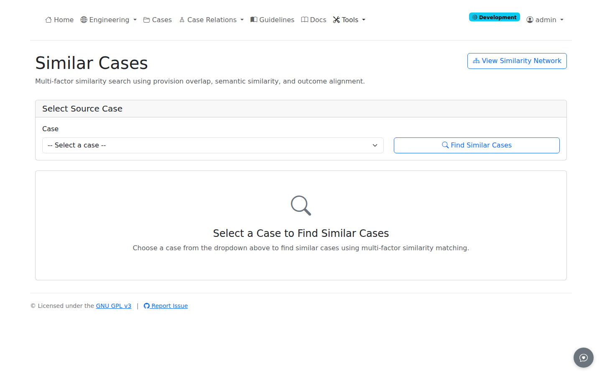
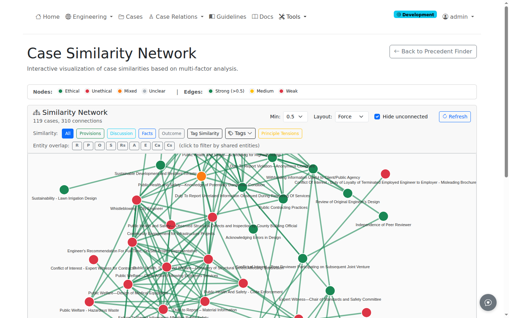
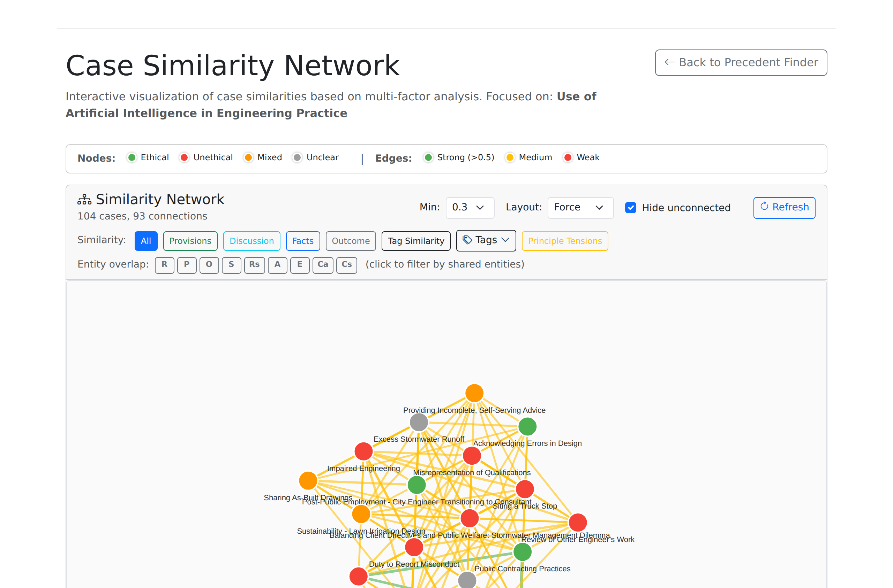

# Precedent Discovery

This guide covers finding similar precedent cases using semantic similarity matching.

## Overview

Precedent discovery identifies cases with similar ethical situations through embedding-based similarity matching. This enables:

- Finding relevant prior board decisions
- Comparing outcomes across similar cases
- Building case-based reasoning for new scenarios

## Accessing Precedent Discovery

There are multiple ways to access precedent discovery:

### From Navigation

Navigate to: **Cases** > **Find Precedents** in the navigation bar

Or direct URL: `/cases/precedents/`

### From Cases List

On the [Cases List](view-cases.md) page, each case card includes a **Find Similar** link:

- Located in the tags row alongside subject tags
- Styled as a blue badge for visual distinction
- Click to open precedent discovery with that case pre-selected

### From Case Structure

On any case's Structure page:

1. Scroll to the Similar Cases sidebar
2. Click **Find More Precedents**


*Precedent discovery page showing similar cases ranked by combined similarity score*

## How It Works

### Embedding Generation

Each case generates two 384-dimensional embeddings:

| Embedding | Source | Purpose |
|-----------|--------|---------|
| **Facts Embedding** | Facts section text | Match situational similarity |
| **Discussion Embedding** | Discussion section text | Match reasoning similarity |

### Similarity Calculation

Similarity uses cosine distance between embeddings:

- **1.0** = Identical
- **0.8+** = Very similar
- **0.5-0.8** = Moderately similar
- **< 0.5** = Dissimilar

### Ranking

Cases ranked by combined similarity:

```
Combined Score = (Facts Score + Discussion Score) / 2
```

## Using Precedent Discovery

### Step 1: Select Source Case

1. Open Precedents page
2. Select a case from dropdown
3. Or use "Find More Precedents" from case Structure page

### Step 2: View Matches

The system displays similar cases:

| Column | Description |
|--------|-------------|
| **Case** | Case title with link |
| **Facts Score** | Facts embedding similarity |
| **Discussion Score** | Discussion embedding similarity |
| **Combined** | Average similarity score |

### Step 3: Explore Matches

Click any match to:

- View case details
- Compare side-by-side
- Access case analysis

## Similarity Filters

### Minimum Threshold

Filter results by minimum similarity:

| Threshold | Typical Results |
|-----------|-----------------|
| **0.9** | Nearly identical cases |
| **0.7** | Similar situations |
| **0.5** | Related topics |
| **0.3** | Broadly relevant |

### Section Focus

Filter by which section to match:

- **Both** - Requires similarity in both sections
- **Facts Only** - Match situational similarity
- **Discussion Only** - Match reasoning similarity

## Structure Page Integration

### Find More Precedents

From case detail page:

1. Click **Structure** button
2. View document sections
3. Click **Find More Precedents**
4. Redirects to Precedents page with case pre-selected

### Similar Cases Preview

The Structure page shows top 3 matches:

- Quick preview without full search
- Discussion similarity prioritized
- Click to expand search

## Generating Embeddings

### Manual Generation

If embeddings missing:

1. Go to case Structure page
2. Click **Generate Embeddings**
3. Wait for generation (10-30 seconds)
4. Embeddings now available for matching

### Automatic Generation

Embeddings auto-generate when:

- Case uploaded (if configured)
- Pipeline automation runs
- Explicit generation requested

### Sync to Precedent Features

After generating in Structure page:

- Embeddings sync to `case_precedent_features` table
- Required for Precedent Discovery matching
- Happens automatically

## Embedding Details

### Model

Default embedding model: `all-MiniLM-L6-v2` (sentence-transformers)

- 384 dimensions
- Optimized for semantic similarity
- Fast generation

### Storage

Embeddings stored in:

| Table | Column | Type |
|-------|--------|------|
| `document_sections` | `embedding` | vector(384) |
| `case_precedent_features` | `facts_embedding` | vector(384) |
| `case_precedent_features` | `discussion_embedding` | vector(384) |

### Vector Operations

Similarity via pgvector:

```sql
SELECT 1 - (facts_embedding <=> target_embedding) as similarity
FROM case_precedent_features
ORDER BY similarity DESC;
```

## Interpreting Results

### High Similarity (0.8+)

Cases with very similar:

- Fact patterns
- Ethical issues
- Professional contexts

Use for direct precedent comparison.

### Moderate Similarity (0.5-0.8)

Cases sharing:

- Related ethical concepts
- Similar role structures
- Comparable dilemmas

Use for broader context.

### Low Similarity (< 0.5)

Cases with limited connection:

- Different domains
- Unrelated issues
- Minimal overlap

May still offer insights.

## Example: Case 24-2 Precedents

For NSPE Case 24-2 (AI in Engineering):

| Match | Facts | Discussion | Combined |
|-------|-------|------------|----------|
| Case 17-4 (Technology Use) | 0.82 | 0.79 | 0.81 |
| Case 19-1 (Competence) | 0.75 | 0.84 | 0.80 |
| Case 21-3 (Certification) | 0.71 | 0.76 | 0.74 |

## Bulk Precedent Analysis

### Pipeline Dashboard

For batch precedent analysis:

1. Go to Pipeline Dashboard
2. Select cases with embeddings
3. Run precedent matching
4. Export results

### API Access

Programmatic access via:

```python
from app.services.embedding_service import EmbeddingService

service = EmbeddingService()
matches = service.find_similar_cases(case_id, top_k=10)
```

## Troubleshooting

### Zero Similarity Scores

If all scores show 0%:

1. Check embeddings generated in Structure page
2. Verify sync to `case_precedent_features`
3. Re-generate embeddings if needed

### Missing Cases in Results

If expected cases missing:

1. Verify target case has embeddings
2. Check minimum threshold setting
3. Ensure case is in database

### Slow Results

If search slow:

1. Check database indexes
2. Verify pgvector extension
3. Consider result limit

## Database Verification

Check embedding status:

```sql
SELECT
    case_id,
    facts_embedding IS NOT NULL as has_facts,
    discussion_embedding IS NOT NULL as has_disc
FROM case_precedent_features;
```

Sync embeddings if needed:

```sql
UPDATE case_precedent_features cpf
SET facts_embedding = (
    SELECT embedding
    FROM document_sections ds
    WHERE ds.document_id = cpf.case_id
    AND ds.section_type = 'facts'
)
WHERE facts_embedding IS NULL;
```

## Case Similarity Network

The Similarity Network provides a visual overview of all cases and their relationships based on computed similarity scores.


*Force-directed graph showing case relationships with color-coded outcomes and similarity edges*

### Accessing the Network

Navigate to: **Cases** > **Similarity Network** in the navigation bar

Or direct URL: `/cases/precedents/network`

Alternative access:
- From Precedent Discovery page, click **View Similarity Network** button

### Understanding the Visualization

The network displays cases as nodes connected by edges representing similarity relationships.

#### Node Colors (by Outcome)

| Color | Outcome |
|-------|---------|
| Green | Ethical |
| Red | Unethical |
| Orange | Mixed |
| Gray | Unknown/Unclear |

#### Edge Colors (by Similarity Score)

| Color | Score Range | Meaning |
|-------|-------------|---------|
| Green | > 0.5 | High similarity |
| Yellow | 0.3 - 0.5 | Moderate similarity |
| Red | < 0.3 | Low similarity |

Edge thickness also indicates similarity strength.

### Interacting with the Network

#### Click a Node

Displays case details panel showing:
- Case title and ID
- Outcome type
- NSPE Code provisions cited
- Entity count from extraction
- Number of connections to other cases

#### Click an Edge

Displays similarity breakdown panel showing:
- Overall similarity score
- Component scores:
  - Facts Similarity (cosine)
  - Discussion Similarity (cosine)
  - Provision Overlap (Jaccard)
  - Outcome Alignment
  - Tag Overlap (Jaccard)
  - Principle Overlap (Jaccard)
- Matching NSPE Code provisions
- Shared entities (when using entity filters)

#### Navigation Controls

- **Drag nodes** to reposition
- **Scroll** to zoom in/out
- **Click background** to pan
- **Zoom buttons** (bottom-left) for precise control
- **Full Screen button** to expand visualization

### Filtering Options

#### Minimum Score Threshold

Use the **Min** dropdown to filter edges by overall similarity:

| Threshold | Typical Result |
|-----------|----------------|
| 0.2 | Show most relationships |
| 0.3 | Default - balanced view |
| 0.4 | Higher similarity only |
| 0.5 | Strong relationships only |

#### Similarity Component Filters

Filter by specific similarity types using the button row:

| Filter | Description |
|--------|-------------|
| **All** | Default weighted combination of all factors |
| **Provisions** | Cases sharing NSPE Code sections |
| **Discussion** | Semantic similarity in ethical analysis |
| **Facts** | Semantic similarity in case situations |
| **Outcome** | Same ethical/unethical verdict |
| **Tag Similarity** | Shared subject tags |
| **Principle Tensions** | Similar ethical principle conflicts |

#### Entity Overlap Filters

Filter by shared entities from the ProEthica 9-concept formalism:

| Button | Entity Type | Description |
|--------|-------------|-------------|
| **R** | Roles | Shared actors and stakeholders |
| **P** | Principles | Common ethical principles |
| **O** | Obligations | Similar duties and requirements |
| **S** | States | Comparable conditions |
| **Rs** | Resources | Shared assets and materials |
| **A** | Actions | Similar agent actions |
| **E** | Events | Common occurrences |
| **Ca** | Capabilities | Shared abilities and skills |
| **Cs** | Constraints | Similar limitations |

Entity edges show Jaccard similarity based on shared entity labels. Click an edge to see the specific matching entities.

#### Subject Tag Filtering

Click the **Tags** button to expand the subject tag filter:

1. Click **Tags** to show available tags (32 total)
2. Click any tag to filter network to cases with that tag
3. Active tag appears as a yellow badge
4. Click the X on the badge to clear the filter

#### Hide Unconnected Toggle

Enable **Hide unconnected** (default: on) to:
- Remove nodes with no edges at current threshold
- Reduce visual clutter
- Focus on connected clusters

### Layout Options

Select different graph layouts from the **Layout** dropdown:

| Layout | Description | Best For |
|--------|-------------|----------|
| **Force** | Physics-based simulation | Discovering clusters |
| **Circular** | All cases in a circle | Seeing all connections |
| **Grid** | Regular grid pattern | Dense networks |
| **Radial** | Grouped by outcome | Comparing outcomes |

### Full Screen Mode

For detailed analysis:

1. Click the **blue fullscreen button** in zoom controls
2. Network expands to fill the viewport
3. Header, legend, and help sections hidden
4. Exit via **yellow button** or press **ESC**

The graph re-renders to fit the new dimensions.

### Similarity Components

The network uses six similarity factors:

| Component | Method | Description |
|-----------|--------|-------------|
| Facts Similarity | Cosine | Semantic similarity of case facts |
| Discussion Similarity | Cosine | Semantic similarity of ethical analysis |
| Provision Overlap | Jaccard | NSPE Code section overlap |
| Outcome Alignment | Categorical | Ethical/unethical match |
| Tag Overlap | Jaccard | Subject tag overlap |
| Principle Overlap | Jaccard | Ethical principle conflicts |

### Focus Mode

To highlight a specific case:

1. Go to Precedents page
2. Select a case
3. Click **View Similarity Network**

The focused case appears larger with a highlight ring.


*Network with Case 7 focused, showing its connections highlighted*

Or use URL parameter: `/cases/precedents/network?case_id=7`

### Network Statistics

The info panel shows:
- Total cases in network
- Total edges (similarity relationships)
- Outcome distribution across cases

### API Access

For programmatic access:

```
GET /cases/precedents/api/similarity_network?min_score=0.3
```

Returns JSON with nodes and edges for custom visualization.

#### API Parameters

| Parameter | Type | Description |
|-----------|------|-------------|
| `min_score` | float | Minimum similarity threshold (default: 0.3) |
| `case_id` | int | Focus on specific case |
| `component` | string | Filter by component (provision_overlap, discussion_similarity, facts_similarity, outcome_alignment, tag_overlap, principle_overlap) |
| `component_min` | float | Minimum threshold for component filter |
| `entity_type` | string | Filter by entity type (Roles, Principles, Obligations, States, Resources, actions, events, Capabilities, Constraints) |
| `tag` | string | Filter by subject tag |

Example - filter by provisions:
```
GET /cases/precedents/api/similarity_network?component=provision_overlap&component_min=0.3
```

Example - filter by entity type:
```
GET /cases/precedents/api/similarity_network?entity_type=Roles
```

Matrix format available:

```
GET /cases/precedents/api/similarity_matrix?component=overall
```

Returns NxN similarity matrix for heatmap visualization.

### References

The similarity network implementation draws on:

- **CBR-RAG** (Wiratunga et al., 2024) - Case-based reasoning for retrieval-augmented generation
- **NS-LCR** (Sun et al., 2024) - Logic rules for legal case retrieval
- **Richter & Weber** (2013) - Case-based reasoning foundations

See [Citations](../reference/citations.md) for full references.

## Related Guides

- [Upload Cases](upload-cases.md) - Adding cases
- [Phase 1 Extraction](phase1-extraction.md) - Extraction process
- [Pipeline Automation](pipeline-automation.md) - Batch processing
- [Settings](settings.md) - Configuration options
