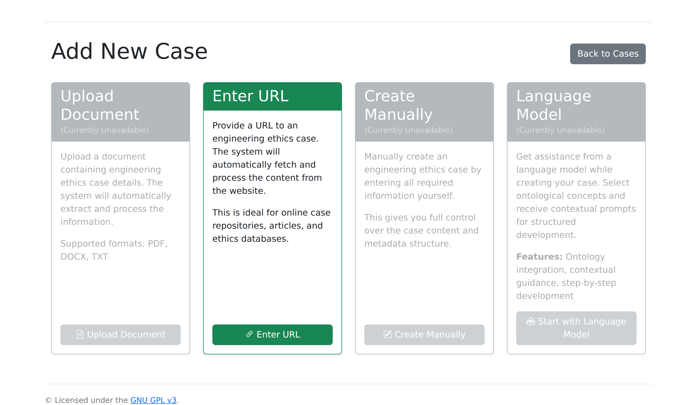

# Upload Cases

This guide covers adding ethics cases to ProEthica for analysis.

## Import Methods

ProEthica provides four methods for adding cases:



| Method | Status | Description |
|--------|--------|-------------|
| **Enter URL** | Available | Import from NSPE website URLs |
| Upload Document | Coming Soon | PDF, DOCX, TXT file upload |
| Create Manually | Coming Soon | Manual entry of case details |
| Language Model | Coming Soon | LLM-assisted case creation |

Currently, the **Enter URL** method is the primary way to add cases, optimized for importing NSPE Board of Ethical Review cases directly from the NSPE website.

## Case Structure

ProEthica processes ethics cases with structured sections. The expected format includes:

| Section | Purpose |
|---------|---------|
| **Title** | Case identifier and subject |
| **Facts** | Narrative description of the situation |
| **Discussion** | Board's ethical analysis and reasoning |
| **Questions** | Specific ethical questions addressed |
| **Conclusions** | Board's determinations |

## Importing via URL

The URL import method fetches case content directly from the NSPE website.

### Step 1: Navigate to Add Case

1. Click **Cases** in the navigation bar
2. Click **Add Case** button
3. Select **Enter URL** (the active green option)

### Step 2: Enter NSPE Case URL

Provide the URL to an NSPE Board of Ethical Review case:

```
https://www.nspe.org/resources/ethics/ethics-resources/board-ethical-review-cases/case-XX-X
```

The system will:

1. Fetch the page content
2. Extract the case title
3. Parse Facts, Discussion, Questions, and Conclusions sections
4. Create the case record

### Step 3: Review Imported Content

After import, verify:

- Title extracted correctly
- All sections identified
- Content complete

### Step 4: Generate Structure

Click **Structure** on the case detail page to:

- View parsed sections
- Generate embeddings for similarity matching
- Verify section boundaries

## Generating Embeddings

After upload, generate embeddings for similarity matching:

### Step 1: Access Structure View

From the case detail page, click **Structure**.

### Step 2: Generate Embeddings

Click **Generate Embeddings** to create vector representations:

- Facts embedding (384 dimensions)
- Discussion embedding (384 dimensions)

### Step 3: Verify Generation

The Structure view shows embedding status:

| Status | Meaning |
|--------|---------|
| **Generated** | Embeddings available |
| **Pending** | Generation not started |
| **Error** | Generation failed |

## Case Sources

ProEthica supports cases from various sources:

### NSPE Board of Ethical Review

The National Society of Professional Engineers publishes Board of Ethical Review (BER) cases with standardized format including facts, questions, and conclusions.

**Access**: [NSPE Ethics Resources](https://www.nspe.org/resources/ethics)

### Other Engineering Boards

Similar cases from state licensing boards and professional organizations follow comparable formats.

### Custom Scenarios

User-created scenarios for analysis should follow the Facts/Discussion structure even if not from official board proceedings.

## Batch Upload

For multiple cases, use the Pipeline Dashboard:

1. Navigate to **Pipeline Dashboard** (`/pipeline/dashboard`)
2. Use **Queue** tab for batch operations
3. Upload cases through batch interface

## Case Metadata

Each case stores:

| Field | Type | Description |
|-------|------|-------------|
| id | Integer | Database identifier |
| title | Text | Case title |
| content | Text | Full case text |
| source | Text | Case origin |
| doc_metadata | JSON | Section structure |
| created_at | Timestamp | Upload time |

## Preparing Case Text

For best extraction results:

### Format Guidelines

- Preserve original paragraph structure
- Include all sections (Facts, Discussion, Questions, Conclusions)
- Remove headers/footers from PDFs
- Clean up OCR artifacts if present

### Section Markers

ProEthica recognizes section headers like:

- "Facts:" or "FACTS"
- "Discussion:" or "DISCUSSION"
- "Questions:" or "QUESTIONS"
- "Conclusions:" or "CONCLUSIONS"

### Code References

Include code of ethics citations as they appear:

- "NSPE Code II.1.a"
- "Code Section 2"
- "Canon 4"

## Troubleshooting

### Section Detection Failed

If sections aren't detected:

1. Check for standard section headers
2. Edit case to add explicit headers
3. Use Structure view to manually set sections

### Embedding Generation Slow

Embedding generation depends on:

- Case length (longer cases take more time)
- Server load
- Model availability

Allow up to 30 seconds for typical cases.

### Duplicate Case

The system allows duplicate uploads. Check existing cases before adding:

1. Use Cases search
2. Check Precedents page for similar titles

## Related Guides

- [View Cases](view-cases.md) - Browsing and viewing cases
- [Phase 1 Extraction](phase1-extraction.md) - Begin concept extraction
- [Precedent Discovery](precedent-discovery.md) - Find similar cases
