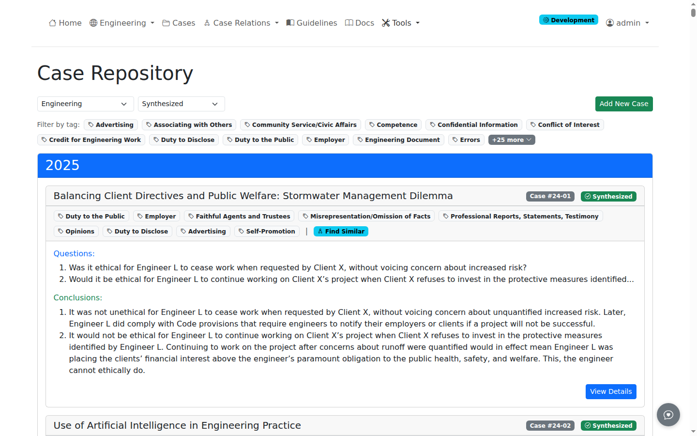
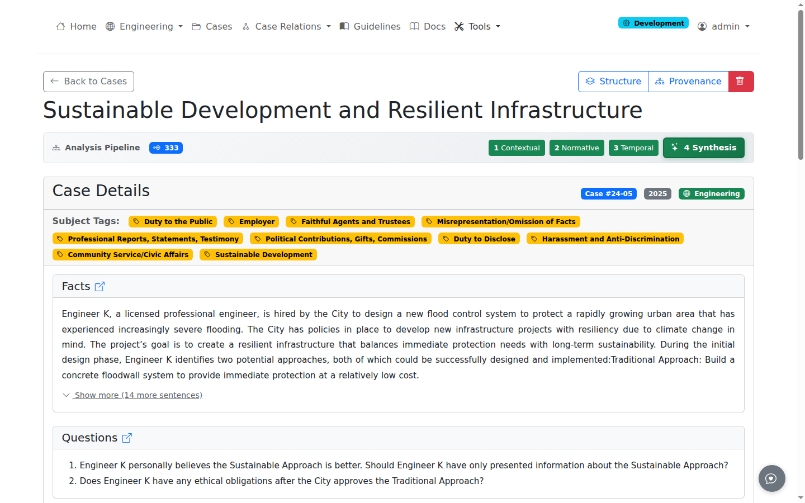
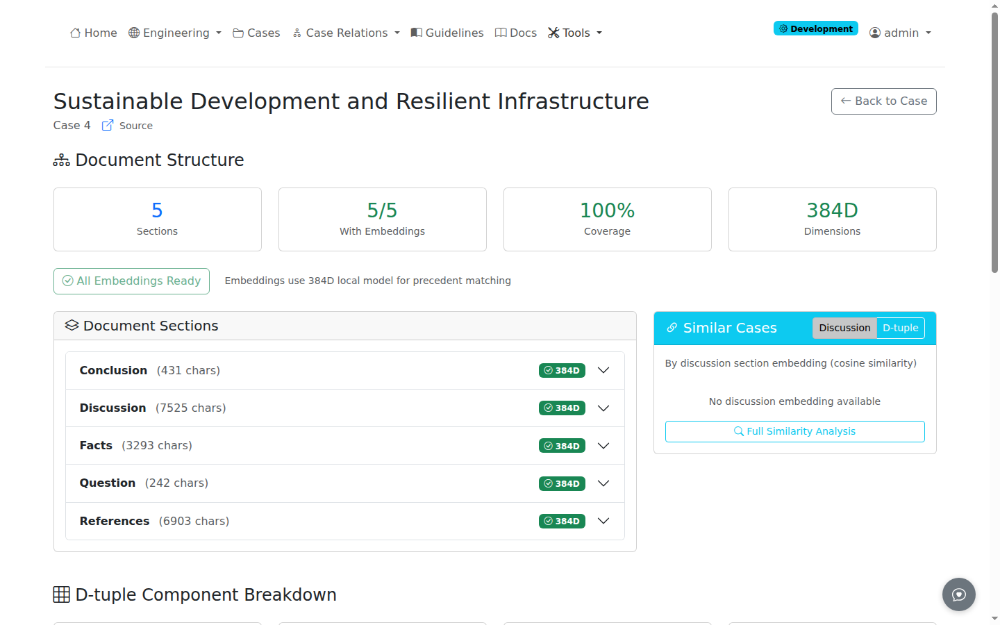

# View Cases

This guide covers browsing and viewing ethics cases in ProEthica.

## Cases List Page

Navigate to: **Cases** in the navigation bar

Or direct URL: `/cases/`


*Case repository showing cases grouped by year with subject tags and analysis status*

### List Layout

Cases are organized by year with expandable cards showing:

| Element | Description |
|---------|-------------|
| **Title** | Case name with robot icon if agent-generated |
| **Case Number** | Badge showing case identifier (e.g., "Case #24-02") |
| **Analyzed Badge** | Green "Analyzed" or gray "Not Analyzed" |
| **Subject Tags** | Yellow badges from source classification |
| **Questions** | Up to 3 ethical questions posed to the board |
| **Conclusions** | Board determinations |

### Subject Tags

Subject tags provide topical classification of cases. For NSPE cases, these come from the NSPE Board of Ethical Review's subject categorization system.

Common engineering ethics subject tags include:

| Tag Category | Examples |
|--------------|----------|
| Professional Conduct | Conflict of Interest, Competence, Integrity |
| Public Safety | Health and Safety, Public Welfare |
| Practice Areas | Design, Construction, Consulting |
| Relationships | Client Relations, Employer Relations |

Tags appear on both the list view and individual case pages.

### Filtering Cases

The filter bar provides two options:

| Filter | Description |
|--------|-------------|
| **World Filter** | Filter by domain/world (e.g., Engineering Ethics) |
| **Show Analyzed Only** | Show only cases with Step 4 synthesis complete |

The "Analyzed" status indicates whether Step 4 whole-case synthesis has been completed for a case.

## Case Detail Page

Click **View Details** on any case card to access the full case page.

Direct URL: `/cases/<id>`


*Individual case page showing sections, tags, and action buttons*

### Action Buttons

The header provides quick access to case functions:

| Button | Function |
|--------|----------|
| **Back to Cases** | Return to case list |
| **Edit** | Edit case content (currently disabled) |
| **Structure** | View document sections and embeddings |
| **Source** | Link to original source (if available) |
| **Delete** | Remove case (authenticated users only) |
| **Overview** | Go to scenario pipeline for analysis |

### Case Sections

For NSPE engineering ethics cases, the standard sections are:

| Section | Content |
|---------|---------|
| **Facts** | Background circumstances and situation description |
| **Question(s)** | Specific ethical questions posed to the board |
| **NSPE Code References** | Relevant code of ethics provisions |
| **Discussion** | Board's ethical analysis and reasoning |
| **Conclusion(s)** | Board's formal determinations |
| **Dissenting Opinion** | Minority view (if present) |

These sections are domain-specific. ProEthica currently uses NSPE engineering ethics as the canonical example. Other professional domains would have corresponding section structures matching their respective boards' case formats.

### Case Metadata

The card header displays:

- **Case Number**: Official case identifier
- **Year**: Year of board decision
- **World**: Domain classification (e.g., "Engineering Ethics")

## Structure Page

The Structure page provides detailed document analysis and embedding management.

Access: Click **Structure** button on case detail page

Direct URL: `/cases/<id>/structure`


*Structure page showing document sections, embedding status, and similar cases*

### Summary Cards

The top row shows document statistics:

| Metric | Description |
|--------|-------------|
| **Sections** | Total number of document sections |
| **With Embeddings** | Sections that have vector embeddings |
| **Coverage** | Percentage of sections with embeddings |
| **Dimensions** | Embedding vector size (384D for local model) |

### Document Sections

The accordion shows each section with:

- **Section Type**: Facts, Discussion, Question, Conclusion, etc.
- **Content Length**: Character count
- **Embedding Status**: Green badge if embedding exists

Click any section to expand and view:

- Content length statistics
- Embedding dimension and creation timestamp
- Content preview (first 2000 characters)

### Similar Cases Sidebar

When embeddings are generated, the sidebar shows cases with similar discussion sections:

- Similarity percentage based on embedding cosine distance
- Direct links to similar cases
- **Find More Precedents** button for full precedent discovery

### Generate Embeddings

Click **Generate Embeddings** to create vector representations for similarity matching:

- Uses all-MiniLM-L6-v2 local model
- Creates 384-dimensional vectors
- Stores in PostgreSQL with pgvector
- Required for precedent discovery

The button changes to **All Embeddings Ready** when complete.

## Domain-Specific Structure

ProEthica's section parsing is configurable by domain. The current implementation focuses on engineering ethics with NSPE case format.

### Engineering Ethics (NSPE)

Standard NSPE Board of Ethical Review cases follow this format:

```
CASE NO. XX-X

[Title]

Facts:
[Situation description]

Question(s):
[Ethical questions]

References:
[Code provisions]

Discussion:
[Board's analysis]

Conclusion(s):
[Board's determinations]
```

### Extending to Other Domains

Other professional domains can be supported by:

1. Defining section detection patterns
2. Creating domain-specific parsers
3. Mapping to corresponding codes of ethics

Examples of potential domains:

| Domain | Source | Section Format |
|--------|--------|----------------|
| Medical Ethics | AMA Ethics Opinions | Opinion, Background, Analysis |
| Legal Ethics | State Bar Opinions | Facts, Issues, Discussion, Conclusion |
| Accounting Ethics | AICPA Ethics Rulings | Situation, Ruling, References |

## Related Guides

- [Upload Cases](upload-cases.md) - Adding new cases
- [Phase 1 Extraction](phase1-extraction.md) - Beginning analysis
- [Precedent Discovery](precedent-discovery.md) - Finding similar cases
