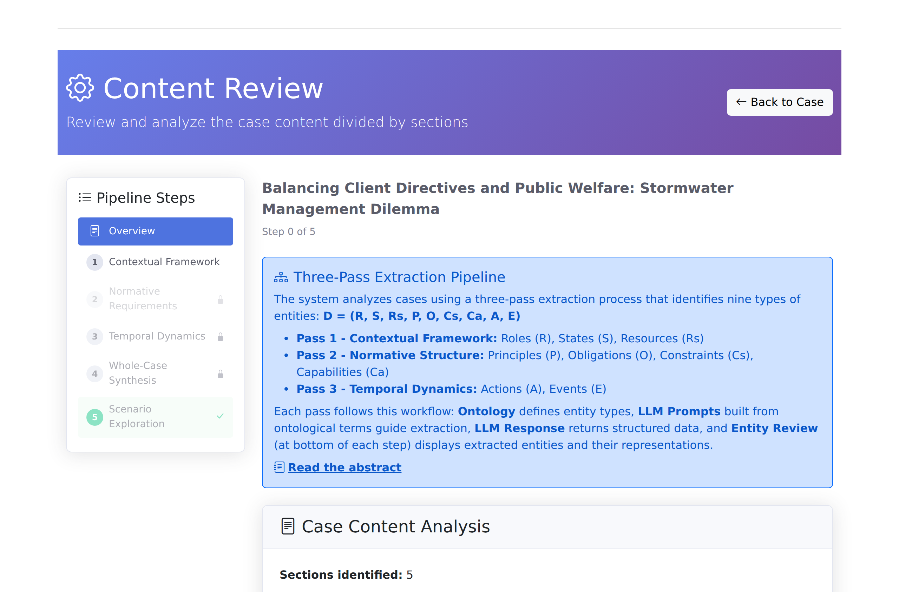
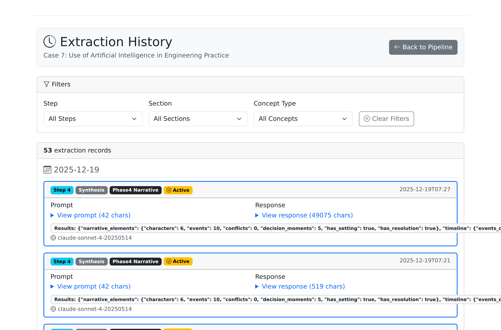
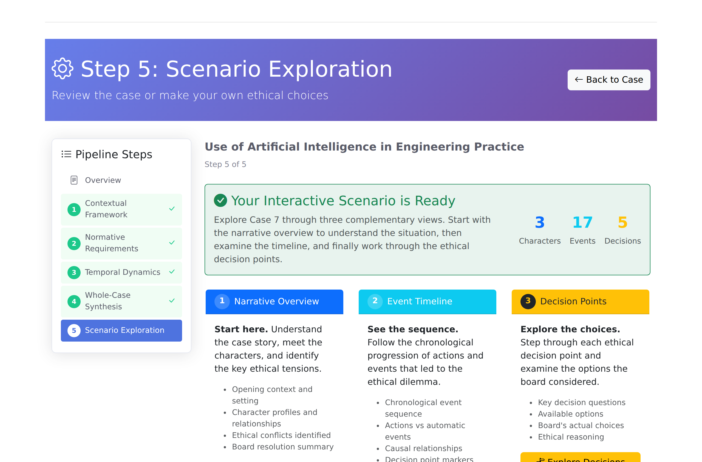

# ProEthica Documentation

ProEthica is a professional role-based ethical analysis tool that combines case-based reasoning with ontology-supported validation, orchestrated by large language models (LLMs), to help professional ethics committees analyze ethical scenarios against established standards and precedents.

## About ProEthica

ProEthica analyzes professional ethical scenarios against established codes and precedent cases. The system extracts nine types of components from case text and scenario descriptions:

| Component | Symbol | Description |
|-----------|--------|-------------|
| Roles | R | Professional positions that generate obligations |
| Principles | P | Abstract ethical standards |
| Obligations | O | Concrete duties derived from principles |
| States | S | Situational context and conditions |
| Resources | Rs | Available knowledge and references |
| Actions | A | What professionals do or could do |
| Events | E | Precipitating occurrences |
| Capabilities | Ca | What professionals can do |
| Constraints | Cs | Limitations on professional conduct |

Domain-specific ontologies provide precise definitions that constrain LLM output to match formal concept specifications, ensuring consistency across extraction and validation.

## Quick Links

- [Getting Started](getting-started/installation.md) - Installation and configuration
- [First Login](getting-started/first-login.md) - Interface overview
- [Nine-Concept Framework](concepts/nine-concepts.md) - Understanding the formal methodology
- [FAQ](faq.md) - Frequently asked questions

## Five-Step Analysis Workflow

ProEthica guides you through a structured workflow for ethical case analysis:

| Step | Name | Task | Guide |
|------|------|------|-------|
| 1 | Contextual Framework | Extract Roles, States, Resources from Facts and Discussion sections | [Step 1 Guide](how-to/phase1-extraction.md#pass-1-contextual-framework) |
| 2 | Normative Requirements | Extract Principles, Obligations, Constraints, Capabilities | [Step 2 Guide](how-to/phase1-extraction.md#pass-2-normative-requirements) |
| 3 | Temporal Dynamics | Extract Actions, Events, Causal Chains, Timeline | [Step 3 Guide](how-to/phase1-extraction.md#pass-3-temporal-dynamics) |
| 4 | Case Synthesis | Code provisions, Questions/Conclusions, Decision Points, Arguments | [Step 4 Guide](how-to/phase2-analysis.md) |
| 5 | Scenario Exploration | Interactive decision-making, consequences, comparison to board | [Step 5 Guide](how-to/phase3-scenario.md) |

### Pipeline States

The sidebar navigation shows step completion status:

*New case: Steps locked until prerequisites complete*

*Extracted case: Checkmarks show completed steps, navigation goes to review pages*

### Navigation Behavior

- **Incomplete steps**: Link to extraction page
- **Complete steps**: Link to entity review page
- **Facts/Discussion toggle**: Switch between section reviews
- **History button**: View all extraction prompts and responses
- **Re-run button**: Return to extraction page for re-processing

## Core Features

### Multi-Pass Extraction (Steps 1-3)
Three extraction passes systematically identify concepts from case narratives:

- **Step 1 (Contextual)**: Roles, States, Resources - from Facts and Discussion sections
- **Step 2 (Normative)**: Principles, Obligations, Constraints, Capabilities
- **Step 3 (Temporal)**: Events, Actions, Causal Chains, Timeline

Each step extracts from both Facts and Discussion sections of the case, with Discussion unlocking after Facts is complete.

### Entity Review
After extraction, review pages allow validation of extracted entities:

*Entity review with Facts/Discussion toggle, History, and Re-run buttons*

- **Facts/Discussion toggle**: Switch between section reviews
- **Match status**: See which entities match existing ontology classes
- **Edit/Delete**: Modify entities before committing to ontology

### Extraction History
Track all extraction prompts and responses:

*Timeline view of all extractions with filters by step, section, and concept type*

### Case Synthesis (Step 4)
Step 4 analyzes extracted entities to identify:

- Code of ethics provisions referenced in the case
- Ethical questions and board conclusions with linking
- Transformation classification (transfer, stalemate, oscillation, phase lag)
- Decision points where ethical choices must be made
- Toulmin-structured arguments for each decision option

### Interactive Scenarios (Step 5)
Step 5 enables exploration of ethical decisions:

- **Interactive mode**: Make your own choices, see LLM-generated consequences
- **Decision analysis**: View board reasoning with Toulmin argument structure
- Timeline construction with decision points
- Participant mapping with LLM-enhanced profiles

### Precedent Discovery
Case-based reasoning identifies precedent cases through semantic similarity matching, enabling comparison against prior board decisions.

### Pipeline Automation
Batch processing capabilities allow automated extraction across multiple cases with progress tracking and result management.

## Current Implementation

ProEthica currently processes engineering ethics cases from the National Society of Professional Engineers (NSPE) Board of Ethical Review. The framework supports extension to other professional domains with established codes and precedent systems.

## Getting Help

- Check the [FAQ](faq.md) for common questions
- Report issues at [GitHub](https://github.com/cr625/proethica/issues)
- Production demo: [https://proethica.org](https://proethica.org)

## Academic Citation

If you use ProEthica in your research, please cite:

> Rauch, C. B., & Weber, R. O. (2026). ProEthica: A Professional Role-Based Ethical Analysis Tool Using LLM-Orchestrated, Ontology Supported Case-Based Reasoning. In *Proceedings of the AAAI Conference on Artificial Intelligence*. Singapore: AAAI Press.

## About This Documentation

This manual covers installation, configuration, and usage of ProEthica features. Pages are organized by task and feature area with step-by-step guides and reference material.
