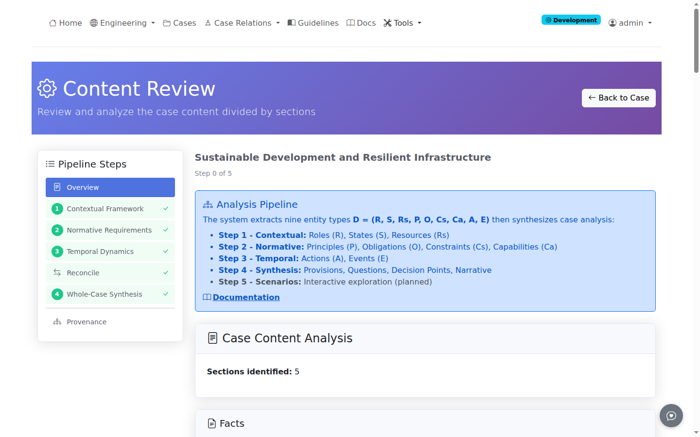
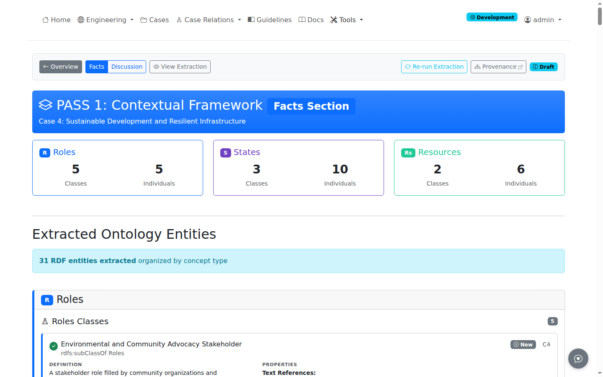

# ProEthica Documentation

ProEthica is a research prototype demonstrating how case-based reasoning, ontology-supported validation, and large language models might be combined to support professional ethics review. The system provides a reference implementation for analyzing ethical scenarios against established standards and precedents.

## About ProEthica

ProEthica demonstrates a methodology for computational support of professional ethics review. In regulated professions, designated authorities assess whether practitioner actions align with established standards. These evaluations apply codes and precedents developed through practice over time, using standards specific to professional roles and specialized knowledge.

Many technical specialists who serve on ethics review boards lack formal training in ethical analysis, yet their domain expertise is essential for evaluating professional conduct. ProEthica explores whether computational tools could augment this process by making professional resources more accessible and by exposing analytical pathways that connect specific situations to established standards. The approach follows pedagogical methods common in legal education, where examination of cases reveals how abstract principles become operationalized through accumulated precedents.

The current implementation demonstrates feasibility through engineering ethics cases from the NSPE Board of Ethical Review. Validation of the methodology and extension to operational use will require involvement of domain experts and empirical assessment against professional judgment.

## Nine-Component Framework

The system extracts nine types of components from case text and scenario descriptions, organized into three functional dimensions:

| Component | Symbol | Description | Dimension |
|-----------|--------|-------------|-----------|
| [Roles](concepts/nine-components.md#roles-r) | R | Professional positions with associated duties and decision-making authority | Contextual |
| [States](concepts/nine-components.md#states-s) | S | Situational context including facts and environmental conditions | Contextual |
| [Resources](concepts/nine-components.md#resources-rs) | Rs | Accumulated professional knowledge including codes and precedents | Contextual |
| [Principles](concepts/nine-components.md#principles-p) | P | High-level ethical guidelines that establish professional ideals | Normative |
| [Obligations](concepts/nine-components.md#obligations-o) | O | Specific requirements for action or restraint | Normative |
| [Constraints](concepts/nine-components.md#constraints-cs) | Cs | Inviolable boundaries on professional conduct | Normative |
| [Capabilities](concepts/nine-components.md#capabilities-ca) | Ca | Competencies for professional practice | Normative |
| [Actions](concepts/nine-components.md#actions-a) | A | Volitional professional interventions | Temporal |
| [Events](concepts/nine-components.md#events-e) | E | Occurrences outside agent control | Temporal |

Domain-specific ontologies provide precise definitions that constrain LLM output to match the formal component specifications shown above. See [Nine-Component Framework](concepts/nine-components.md) for detailed definitions and theoretical foundations.

## Quick Links

- [Getting Started](getting-started/welcome.md) - Introduction to ProEthica
- [Interface Overview](getting-started/first-login.md) - Navigation and UI elements
- [Nine-Component Framework](concepts/nine-components.md) - Understanding the formal methodology
- [FAQ](faq.md) - Frequently asked questions

## Analysis Workflow

ProEthica guides case analysis through a structured workflow. The current implementation provides four steps, with interactive scenario exploration planned for future development.

| Step | Name | Task | Status |
|------|------|------|--------|
| 1 | Contextual Framework | Extract Roles, States, Resources from Facts and Discussion sections | Implemented |
| 2 | Normative Requirements | Extract Principles, Obligations, Constraints, Capabilities | Implemented |
| 3 | Temporal Dynamics | Extract Actions, Events, Causal Relationships | Implemented |
| 4 | Case Synthesis | Four-phase analysis: provisions, questions, decision points, narrative | Implemented |
| 5 | Scenario Exploration | Interactive decision-making with consequence generation | Planned |

See [Phase 1 Extraction](how-to/phase1-extraction.md) for Steps 1-3 and [Phase 2 Analysis](how-to/phase2-analysis.md) for Step 4.

### Pipeline Navigation

The sidebar shows step completion status with checkmarks for completed steps and lock icons for steps with unmet prerequisites.

Step links navigate to extraction pages (for incomplete steps) or review pages (for completed steps).

## Core Features

### Multi-Pass Extraction (Steps 1-3)
Three extraction passes identify concepts from case narratives:

- **Step 1 (Contextual)**: Roles, States, Resources from Facts and Discussion sections
- **Step 2 (Normative)**: Principles, Obligations, Constraints, Capabilities
- **Step 3 (Temporal)**: Actions, Events, Causal Relationships

Each step extracts from both Facts and Discussion sections, with Discussion unlocking after Facts completes.

*Extraction page showing LLM prompt configuration and entity type selection*

See [Phase 1 Extraction](how-to/phase1-extraction.md) for details.

### Entity Review
After extraction completes, the review interface displays extracted entities organized by type:

*Review page with Facts/Discussion toggle, entity cards, and edit controls*

- **Facts/Discussion toggle**: Switch between section extractions
- **Entity cards**: View extracted entities with ontology class matching
- **Edit controls**: Modify or delete entities before committing
- **Re-run button**: Return to extraction for reprocessing
- **View Extraction**: See the original LLM prompt and response for this extraction

See [Entity Review](how-to/entity-review.md) for details.

### Case Synthesis (Step 4)
Step 4 analyzes extracted entities to identify:

- Code of ethics provisions referenced in the case
- Ethical questions and board conclusions with linking
- Transformation classification[^1] (transfer, stalemate, oscillation, phase lag)
- Decision points where ethical choices must be made
- Toulmin-structured arguments[^2] for each decision option

[^1]: [Marchais-Roubelat & Roubelat (2015)](/tools/references#transformation)
[^2]: [Toulmin (1958/2003)](/tools/references#argument-mining)

See [Phase 2 Analysis](how-to/phase2-analysis.md) for details.

### Interactive Scenarios (Planned)
Step 5 will enable exploration of ethical decisions:

- Interactive mode for making choices and viewing LLM-generated consequences
- Decision analysis with Toulmin argument structure
- Timeline construction with decision points
- Participant mapping with LLM-enhanced profiles

### Precedent Discovery
Case-based reasoning identifies precedent cases through semantic similarity matching, enabling comparison against prior board decisions. The similarity network visualizes relationships between cases.

See [Precedent Discovery](how-to/precedent-discovery.md) for details.

### Guidelines
Browse and reference professional codes of ethics. Guidelines provide the normative foundation for case analysis, with each domain (e.g., Engineering Ethics) having its governing code and provisions.

See [Guidelines](how-to/guidelines.md) for details.

### Pipeline Automation
Batch processing capabilities allow automated extraction across multiple cases with progress tracking and result management.

See [Pipeline Automation](how-to/pipeline-automation.md) for details.

## Current Implementation

ProEthica currently processes engineering ethics cases from the National Society of Professional Engineers (NSPE) Board of Ethical Review. The framework supports extension to other professional domains with established codes and precedent systems.

The production site operates in demo mode by default, allowing exploration of cases, extracted entities, and the precedent network without authentication. Extraction and editing operations require login. See [Interface Overview](getting-started/first-login.md#access-levels) for details on access levels.

## Academic Citation

If you use ProEthica in your research, please cite:

> Rauch, C. B., & Weber, R. O. (2026). ProEthica: A Professional Role-Based Ethical Analysis Tool Using LLM-Orchestrated, Ontology Supported Case-Based Reasoning. In *Proceedings of the AAAI Conference on Artificial Intelligence*. Singapore: AAAI Press.

## About This Documentation

This manual covers installation, configuration, and usage of ProEthica features. Pages are organized by task and feature area with step-by-step guides and reference material.
