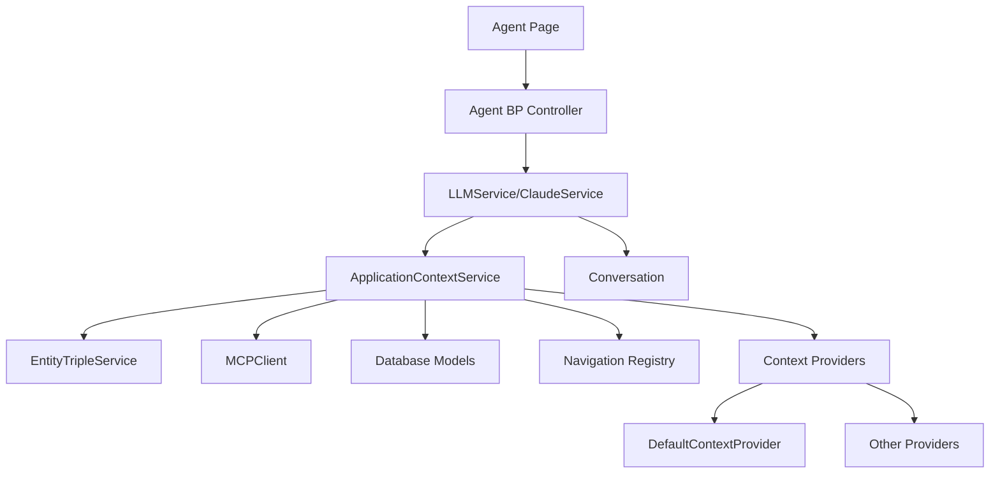

# Application Context Service

## Overview

The ApplicationContextService provides a systematic way to represent information about the application to the LLM on the agent page. It collects data about database state, available navigation paths, and contextual information relevant to the user's current scenario or world.

## Architecture



## Key Components

### ApplicationContextService

Central service that aggregates context from multiple sources and formats it for LLM consumption.

- **Singleton pattern**: Access via `ApplicationContextService.get_instance()`
- **Token-aware**: Prioritizes context to fit within LLM token limits
- **Configurable**: Settings stored in `app/config/application_context.json`
- **Extensible**: Supports plugin architecture via Context Providers

### Context Providers

Pluggable components that provide specific types of context:

- **DefaultContextProvider**: Basic application state, world and scenario context
- **Additional providers** can be added to extend functionality

## Using the Service

### In agent.py routes

```python
# Get application context
app_context_service = ApplicationContextService.get_instance()
context = app_context_service.get_full_context(
    world_id=world_id,
    scenario_id=scenario_id,
    query=message
)

# Format context for LLM
formatted_context = app_context_service.format_context_for_llm(context)

# Send message with enhanced context
response = llm_service.send_message_with_context(
    message=message,
    conversation=conversation,
    application_context=formatted_context,
    world_id=world_id
)
```

### Creating Custom Context Providers

To extend the service with new context types:

1. Create a new file in `app/services/context_providers/`
2. Implement a class that extends `ContextProvider`
3. Implement required methods: `get_context()` and `format_context()`
4. Enable in config via `context_providers` section

Example:

```python
class CustomContextProvider(ContextProvider):
    def get_context(self, request_context: Dict[str, Any]) -> Dict[str, Any]:
        # Collect custom context data
        return {"custom_data": [...]}
        
    def format_context(self, context: Dict[str, Any]) -> str:
        # Format context as a string for LLM
        return "CUSTOM DATA:\n- ..."
```

## Configuration

Edit `app/config/application_context.json` to configure:

- **max_tokens**: Maximum tokens for context
- **sections**: Priorities and token allocation
- **context_providers**: Enable/disable providers
- **caching**: Control context caching

## Implementation Notes

1. Database information is gathered dynamically
2. Navigation paths are auto-discovered where possible
3. Token estimation is approximate (4 chars ≈ 1 token)
4. Application state is tracked in the conversation metadata

## Future Enhancements

- Vector-based similarity search for relevant triples
- More specialized context providers
- Configurable UI for controlling context
- Admin panel for context management
