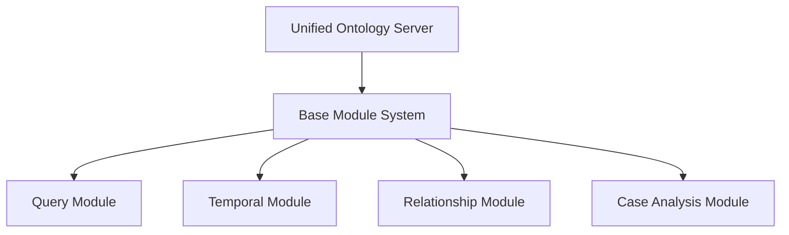

# Ontology Enhancement Plan

This document outlines the plan for enhancing the ontology functionality in ProEthica, focusing on the engineering ethics applications through a unified, modular architecture.

## Objectives

1. Create a unified ontology server architecture that consolidates multiple MCP server implementations
2. Enhance case analysis capabilities using ontology data
3. Improve the integration with LLMs for ontology-based reasoning
4. Support temporal functionality within ontology queries
5. Provide a comprehensive API for ontology access

## Technical Approach

### Unified Modular Architecture

The implementation will use a modular architecture with pluggable components:

Each module will:
- Provide specific functionality for ontology access
- Register tools that can be accessed through the MCP API
- Have its own unit tests and documentation
- Be independently maintainable and extensible

### Case Analysis Enhancements

The case analysis module will provide:

1. Entity extraction from case text
2. Analysis of case structure using ontology entities
3. Matching case elements to ontology entities
4. Generation of ontology-based case summaries

This will help users better analyze and understand engineering ethics cases using the underlying ontology.

### Temporal Functionality

The temporal module will support:

1. Tracking changes to entities over time
2. Querying the state of entities at specific points in time
3. Analyzing temporal relationships between events
4. Maintaining a history of changes to ontology entities

### Implementation Plan

1. Create the base module system and core server components
2. Implement the query module for basic ontology access
3. Add the case analysis module for enhanced case functionality
4. Implement the relationship module for navigation
5. Add the temporal module for time-based analysis
6. Create comprehensive documentation and examples
7. Write integration tests for the complete system

## Integration with Existing Systems

The unified ontology server will integrate with:

- ProEthica's Flask application
- REALM's materials science components
- Agent-based architecture
- Existing LLM integration

The focus will be on maintaining backward compatibility while enhancing functionality.
