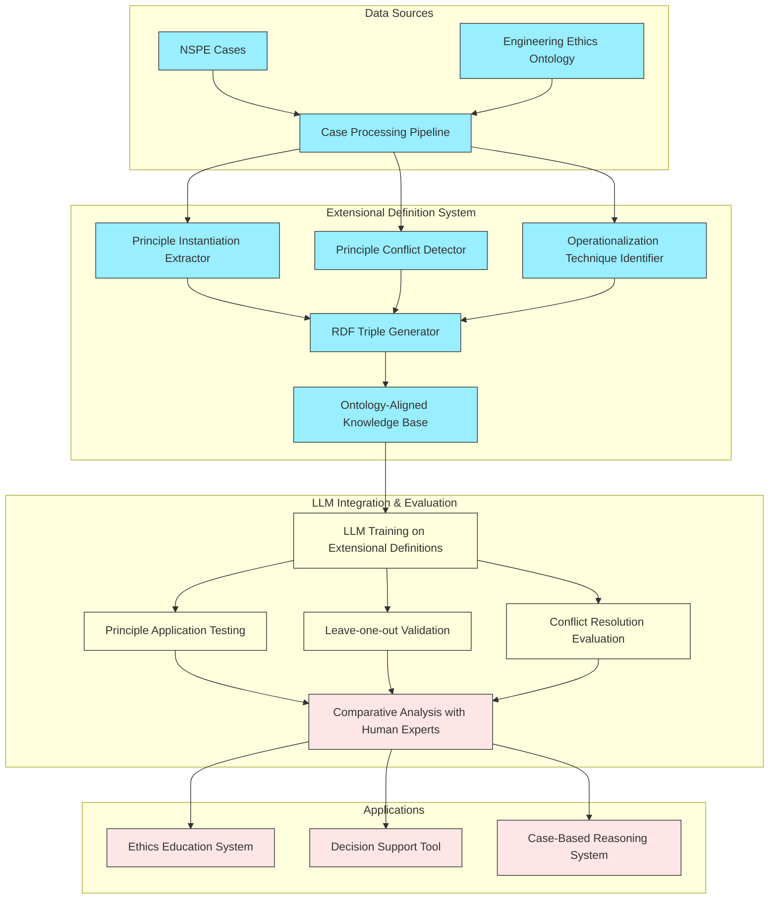

# Extensional Definition System Architecture

The following diagram illustrates the architecture of our extensional definition approach to engineering ethics case analysis:

## Legend:
- **Blue**: Implemented components
- **Yellow**: Partially implemented components
- **Red**: Planned components

## System Components:

### Data Sources
- **NSPE Cases**: Corpus of engineering ethics cases from the National Society of Professional Engineers
- **Engineering Ethics Ontology**: Formal ontology based on BFO with engineering ethics concepts

### Extensional Definition System
- **Case Processing Pipeline**: Ingest and process case text
- **Principle Instantiation Extractor**: Identify links between principles and facts
- **Principle Conflict Detector**: Detect competing principles
- **Operationalization Technique Identifier**: Recognize McLaren's techniques
- **RDF Triple Generator**: Create semantic web representations
- **Ontology-Aligned Knowledge Base**: Store structured case analyses

### LLM Integration & Evaluation
- **LLM Training**: Train on extensionally defined principles
- **Principle Application Testing**: Test on new cases
- **Leave-one-out Validation**: Withhold case results during testing
- **Conflict Resolution Evaluation**: Assess handling of competing principles

### Applications
- **Ethics Education System**: Support engineering ethics education
- **Decision Support Tool**: Assist in ethical decision-making
- **Case-Based Reasoning System**: Apply past cases to new situations
