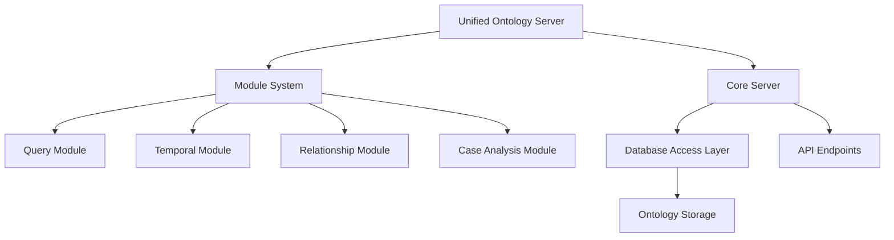

# Unified Ontology MCP Server

This document describes the architecture and usage of the Unified Ontology MCP Server, which provides a modular framework for accessing and interacting with ontology data.

## Architecture

The Unified Ontology MCP Server uses a modular architecture to organize functionality into discrete components. This design allows for easier extension, maintenance, and testing.

### Core Components



#### Server Core

The core server (`UnifiedOntologyServer` class) provides:

- Module loading and management
- Request handling
- Common utilities for ontology access
- Caching and optimization

#### Module System

Modules provide specific functionality and tools:

- **Query Module**: Entity retrieval, SPARQL queries, guideline access
- **Temporal Module**: Temporal aspects of ontology entities
- **Relationship Module**: Entity relationship navigation
- **Case Analysis Module**: Case analysis using ontology entities

Each module:
- Inherits from `BaseModule`
- Registers tools it provides
- Handles tool calls for its domain
- Can be independently tested and developed

## API

### JSON-RPC Interface

The server provides a JSON-RPC interface with two main methods:

#### `list_tools`

Lists all available tools provided by the server.

```json
{
  "jsonrpc": "2.0",
  "id": 1,
  "method": "list_tools",
  "params": {}
}
```

Response:

```json
{
  "jsonrpc": "2.0",
  "id": 1,
  "result": {
    "tools": [
      "get_entities",
      "execute_sparql",
      "get_guidelines",
      "get_entity_details",
      "..."
    ],
    "details": [
      {
        "name": "get_entities",
        "description": "Get entities of a specific type from an ontology",
        "module": "query"
      },
      // More tool details
    ]
  }
}
```

#### `call_tool`

Calls a specific tool with parameters.

```json
{
  "jsonrpc": "2.0",
  "id": 2,
  "method": "call_tool",
  "params": {
    "name": "get_entities",
    "arguments": {
      "ontology_source": "engineering",
      "entity_type": "all"
    }
  }
}
```

Response:

```json
{
  "jsonrpc": "2.0",
  "id": 2,
  "result": {
    "content": [
      {
        "text": "{\"entities\": [...], \"count\": 42, ...}"
      }
    ]
  }
}
```

### HTTP Endpoints

For convenience, some direct HTTP endpoints are also provided:

- `GET /health` - Health check
- `GET /info` - Server information
- `POST /jsonrpc` - JSON-RPC API
- `GET /api/entities/{ontology_source}` - Get ontology entities
- `GET /api/guidelines/{world_name}` - Get world guidelines

### Legacy Support

The server maintains backward compatibility with previous implementations by:

- Supporting legacy endpoint paths
- Mapping legacy tool names to new tools
- Maintaining response format compatibility

## Tools Reference

### Query Module Tools

#### `get_entities`

Get entities of a specific type from an ontology.

Parameters:
- `ontology_source`: Source identifier for ontology (name or ID)
- `entity_type`: (Optional) Type of entities to retrieve ('all', 'properties', 'individuals', or specific class)

#### `execute_sparql`

Execute a SPARQL query on an ontology.

Parameters:
- `ontology_source`: Source identifier for ontology
- `query`: SPARQL query to execute
- `include_prefixes`: (Optional) Whether to include common prefixes (default: true)

#### `get_guidelines`

Get guidelines for a specific world or ontology.

Parameters:
- `ontology_source`: Source identifier for ontology or world

#### `get_entity_details`

Get detailed information about a specific entity.

Parameters:
- `ontology_source`: Source identifier for ontology
- `entity_id`: URI or ID of the entity

## Usage Examples

### Starting the Server

```bash
./run_unified_mcp_server.py --port 5001
```

### Querying Entities

```bash
curl -X GET http://localhost:5001/api/entities/engineering
```

### Executing a Tool via JSON-RPC

```bash
curl -X POST http://localhost:5001/jsonrpc \
  -H "Content-Type: application/json" \
  -d '{
    "jsonrpc": "2.0",
    "id": 1,
    "method": "call_tool",
    "params": {
      "name": "get_entities",
      "arguments": {
        "ontology_source": "engineering",
        "entity_type": "all"
      }
    }
  }'
```

## Extending the Server

### Creating a New Module

1. Create a new file in `mcp/modules/` (e.g., `my_module.py`)
2. Define a class that inherits from `BaseModule`
3. Implement required methods (`name`, `description`, `_register_tools`)
4. Add tool handler methods
5. The server will automatically discover and load the module

Example:

```python
from mcp.modules.base_module import BaseModule

class MyCustomModule(BaseModule):
    @property
    def name(self) -> str:
        return "custom"
    
    @property
    def description(self) -> str:
        return "Custom functionality for specific tasks"
    
    def _register_tools(self) -> None:
        self.tools = {
            "my_tool": self.my_tool
        }
    
    def my_tool(self, arguments: dict) -> dict:
        # Tool implementation
        return {"result": "Success!"}
```

### Adding Tools to Existing Modules

To add a new tool to an existing module:

1. Add the tool handler method to the module class
2. Add the tool to the `self.tools` dictionary in `_register_tools()`
3. Restart the server

## Database Integration

The server can access ontology data from:

1. Database (through Flask app context)
2. Local .ttl files
3. Remote RDF sources

The `UnifiedOntologyServer` tries these sources in order, providing fallbacks if a source is unavailable.
