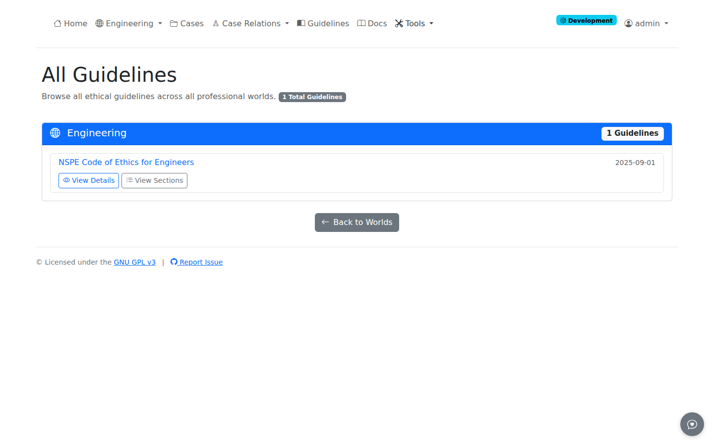

# Guidelines

Guidelines are the codes of ethics that govern professional conduct within each domain. In ProEthica, guidelines provide the normative foundation against which cases are analyzed.

## Accessing Guidelines

Navigate to **Guidelines** in the navigation bar.

Direct URL: `/guidelines/`

## Guidelines by Domain

Guidelines are organized by professional domain. Each domain contains:

| Element | Description |
|---------|-------------|
| **Code of Ethics** | The governing professional standards |
| **Sections** | Numbered provisions within the code |
| **Case References** | Cases that cite specific provisions |

### Engineering Ethics

For engineering ethics, the primary guideline is the **NSPE Code of Ethics for Engineers**:

| Section | Topic |
|---------|-------|
| I. Fundamental Canons | Core professional duties |
| II. Rules of Practice | Specific requirements |
| III. Professional Obligations | Relationship duties |

## Viewing Guideline Details

Click **View Details** on any guideline card to see:

- Full guideline text
- Section breakdown
- Cases citing this guideline

Click **View Sections** to browse individual provisions:

- Section number and title
- Full provision text
- Related cases

## Guidelines in Case Analysis

Guidelines are referenced throughout case analysis:

### Step 1: Resources Extraction

Pass 1 extracts Resources including code references:

- NSPE Code sections mentioned in case text
- Licensing requirements
- Professional standards

### Step 4: Code Provisions

The synthesis phase extracts:

- Code sections cited in the case
- How each provision applies to the situation
- Linkage between provisions and extracted entities

### Precedent Discovery

The similarity network includes provision overlap:

- Cases sharing the same code sections
- Filter by specific provisions
- Provision-based clusters

## Related Pages

- [Browsing Cases](browsing-cases.md) - Navigate the case repository
- [Viewing Extractions](viewing-extractions.md) - View extracted entities
- [Precedent Network](precedent-network.md) - Find cases by provisions
