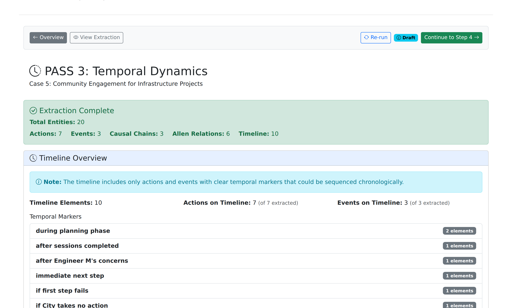

# Viewing Extractions

Completed cases display extracted entities organized by pipeline step. The extraction results show the nine concept types identified from case text.

## Accessing Extraction Results

From any case detail page, click the numbered step buttons to view extraction results:

- **Step 1** - Contextual Framework (Roles, States, Resources)
- **Step 2** - Normative Requirements (Principles, Obligations, Constraints, Capabilities)
- **Step 3** - Temporal Dynamics (Actions, Events)
- **Step 4** - Case Synthesis (Provisions, Questions, Decisions, Arguments)

Completed steps show a green filled button. Click any completed step to view its results.

## Entity Review Display

*Extraction results showing entities from the Facts section*

### Interface Layout

| Section | Description |
|---------|-------------|
| **Available Classes** | Existing ontology classes (collapsed by default) |
| **Extracted Entities** | Entities identified from case text |
| **Section Toggle** | Switch between Facts and Discussion results |

### Entity Table

The entity table displays extracted concepts with their labels, definitions, types, and status.

| Column | Description |
|--------|-------------|
| **Label** | Short entity identifier |
| **Type** | Concept type (Role, State, Principle, etc.) |
| **Definition** | Full description from extraction |
| **Status** | New, Existing, or Modified |
| **View Extraction** | See original LLM prompt and response |

### Section Toggle

Each extraction step processes two case sections:

- **Facts** - Background circumstances
- **Discussion** - Board's ethical analysis

Toggle between sections to view entities extracted from each.

*Discussion section extractions showing different entity distribution*

## Extraction Steps

### Step 1: Contextual Framework

Identifies situational elements:

| Type | Symbol | Description |
|------|--------|-------------|
| **Roles** | R | Professional positions with duties and authority |
| **States** | S | Situational context and conditions |
| **Resources** | Rs | Professional knowledge including codes and precedents |

### Step 2: Normative Requirements

Identifies ethical guidance elements:

| Type | Symbol | Description |
|------|--------|-------------|
| **Principles** | P | High-level ethical guidelines |
| **Obligations** | O | Specific requirements for action or restraint |
| **Constraints** | Cs | Inviolable boundaries on conduct |
| **Capabilities** | Ca | Competencies for professional practice |

*Normative requirements extracted from case discussion*

### Step 3: Temporal Dynamics

Identifies action and event elements:

| Type | Symbol | Description |
|------|--------|-------------|
| **Actions** | A | Volitional professional interventions |
| **Events** | E | Occurrences outside agent control |

*Temporal dynamics with actions and events*

## View Extraction Details

Click **View Extraction** on any entity to see the original LLM interaction:

- **Prompt** - The template-rendered prompt sent to the model
- **Response** - Raw JSON response from the LLM
- **Timestamp** - When extraction occurred
- **Model** - Which LLM model was used

This provides transparency into the extraction process.

## Available Classes

The "Available Classes" section shows existing ontology classes from OntServe. Expand this section to see what classes were available during extraction:

| Category | Examples |
|----------|----------|
| **Roles** | Engineer, Client, Employer |
| **States** | Competent, Conflicted, Authorized |
| **Resources** | NSPE Code, State Regulations |
| **Principles** | Public Safety, Competence |
| **Obligations** | Disclose, Verify, Report |
| **Constraints** | Cannot Certify, Must Not |
| **Capabilities** | Can Consult, May Decline |
| **Events** | Request, Discovery, Violation |
| **Actions** | Certify, Disclose, Decline |

## Status Indicators

| Status | Icon | Meaning |
|--------|------|---------|
| **New** | Star | No matching ontology class found |
| **Existing** | Check | Matched to existing ontology class |
| **Modified** | Pencil | User-edited after extraction |

## Step 4: Case Synthesis

Step 4 provides higher-level analysis beyond entity extraction:

- Code provisions identified in the case
- Ethical questions and board conclusions
- Decision points and arguments
- Narrative summary

Click the **Step 4** button on any completed case to view the synthesis results.

## Related Pages

- [Browsing Cases](browsing-cases.md) - Navigate the case repository
- [Nine-Component Framework](../concepts/nine-components.md) - Formal definitions of concept types
- [Color Scheme](../concepts/color-scheme.md) - Visual coding for entity types
