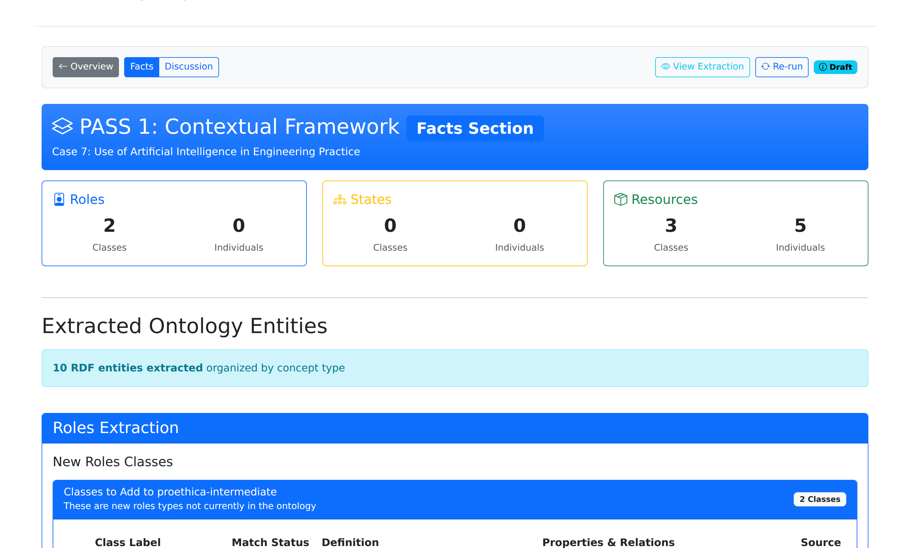
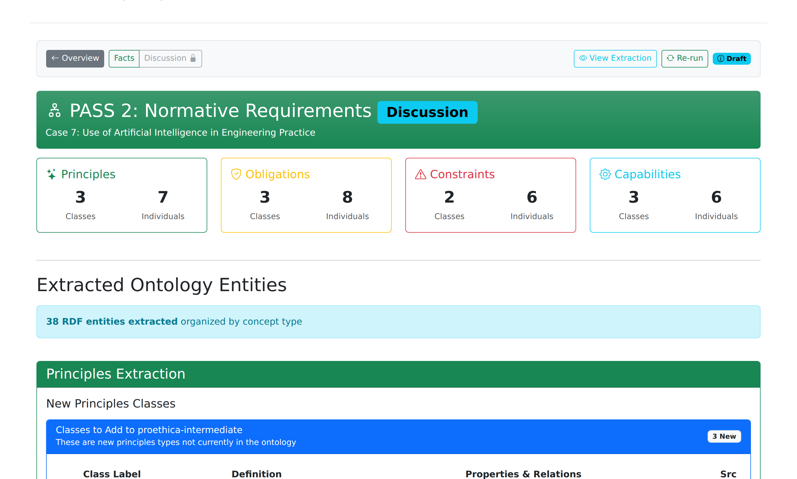
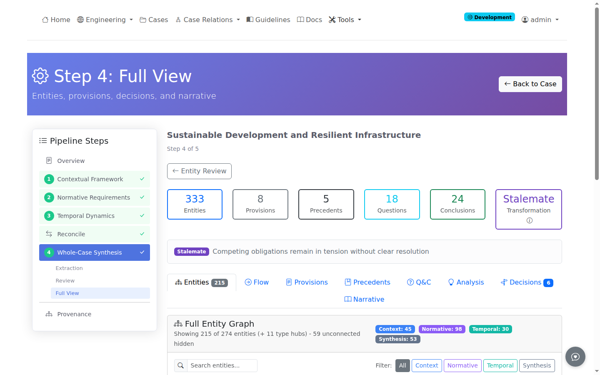

# Viewing Extractions

Completed cases display extracted entities organized by pipeline step. The extraction results show the nine concept types identified from case text.

## Accessing Extraction Results

From any case detail page, click the numbered step buttons to view extraction results:

- **Step 1** - Contextual Framework (Roles, States, Resources)
- **Step 2** - Normative Requirements (Principles, Obligations, Constraints, Capabilities)
- **Step 3** - Temporal Dynamics (Actions, Events, causal chains, temporal relations)
- **Step 4** - Whole-Case Synthesis (Code Provisions, Precedent References, Ethical Questions, Conclusions, Decision Points, Resolution Patterns, Causal-Normative Links, Question Emergence)

Completed steps show a green filled button. Click any completed step to view its results.

## Entity Review Display

*Extraction results showing entities from the Facts section*

### Interface Layout

| Section | Description |
|---------|-------------|
| **Available Classes** | Existing ontology classes (collapsed by default) |
| **Extracted Entities** | Entities identified from case text |
| **Section Toggle** | Switch between Facts and Discussion results |

### Entity Table

The entity table displays extracted concepts with their labels, definitions, types, and status.

| Column | Description |
|--------|-------------|
| **Label** | Short entity identifier |
| **Type** | Concept type (Role, State, Principle, etc.) |
| **Definition** | Full description from extraction |
| **Status** | New, Existing, or Modified |
| **View Extraction** | See original LLM prompt and response |

### Section Toggle

Steps 1-2 extract from Facts and Discussion sections separately. Toggle between sections to view entities from each pass.

Step 3 extracts from the full case text in a single unified pass and does not have a section toggle.

## Extraction Steps

### Step 1: Contextual Framework

Identifies situational elements:

| Type | Symbol | Description |
|------|--------|-------------|
| **Roles** | R | Professional positions with duties and authority |
| **States** | S | Situational context and conditions |
| **Resources** | Rs | Professional knowledge including codes and precedents |

### Step 2: Normative Requirements

Identifies ethical guidance elements:

| Type | Symbol | Description |
|------|--------|-------------|
| **Principles** | P | High-level ethical guidelines |
| **Obligations** | O | Specific requirements for action or restraint |
| **Constraints** | Cs | Inviolable boundaries on conduct |
| **Capabilities** | Ca | Competencies for professional practice |

*Normative requirements extracted from case discussion*

### Step 3: Temporal Dynamics

Identifies action and event elements via unified LangGraph extraction:

| Type | Symbol | Description |
|------|--------|-------------|
| **Actions** | A | Volitional professional interventions |
| **Events** | E | Occurrences outside agent control |
| **Causal Chains** | - | NESS test causal analysis |
| **Allen Relations** | - | OWL-Time temporal ordering |
| **Timeline** | - | Chronological sequence of actions and events |

## View Extraction Details

Click **View Extraction** on any entity to see the original LLM interaction:

- **Prompt** - The template-rendered prompt sent to the model
- **Response** - Raw JSON response from the LLM
- **Timestamp** - When extraction occurred
- **Model** - Which LLM model was used

This provides transparency into the extraction process.

## Available Classes

The "Available Classes" section shows existing ontology classes from OntServe. Expand this section to see what classes were available during extraction:

| Category | Examples |
|----------|----------|
| **Roles** | Engineer, Client, Employer |
| **States** | Competent, Conflicted, Authorized |
| **Resources** | NSPE Code, State Regulations |
| **Principles** | Public Safety, Competence |
| **Obligations** | Disclose, Verify, Report |
| **Constraints** | Cannot Certify, Must Not |
| **Capabilities** | Can Consult, May Decline |
| **Events** | Request, Discovery, Violation |
| **Actions** | Certify, Disclose, Decline |

## Status Indicators

| Status | Icon | Meaning |
|--------|------|---------|
| **New** | Star | No matching ontology class found |
| **Existing** | Check | Matched to existing ontology class |
| **Modified** | Pencil | User-edited after extraction |

## Step 4: Whole-Case Synthesis

Step 4 analyzes extracted entities and case text to produce 7 additional entity types:

| Entity Type | Phase | Description |
|-------------|-------|-------------|
| Code Provision Reference | 2A | NSPE code sections cited in the case |
| Precedent Case Reference | 2B | BER cases referenced in discussion |
| Ethical Question | 2C | Questions posed to the Board |
| Ethical Conclusion | 2C | Board's formal determinations |
| Canonical Decision Point | Phase 3 | Points where ethical choices must be made |
| Resolution Pattern | 2E | How ethical tensions are resolved |
| Causal-Normative Link | 2E | Connections between causal factors and norms |
| Question Emergence | 2E | How ethical questions arise from case facts |

Step 4 has three sub-views accessible from the pipeline sidebar:

| View | Description |
|------|-------------|
| **Extraction** | Phase overview and re-run controls |
| **Review** | Entity review and OntServe commit |
| **Full View** | Tabbed interface: Entities (graph), Flow, Provisions, Precedents, Q&C, Analysis, Decisions, Narrative |

## Related Pages

- [Browsing Cases](browsing-cases.md) - Navigate the case repository
- [Nine-Component Framework](../concepts/nine-components.md) - Formal definitions of concept types
- [Color Scheme](../concepts/color-scheme.md) - Visual coding for entity types
