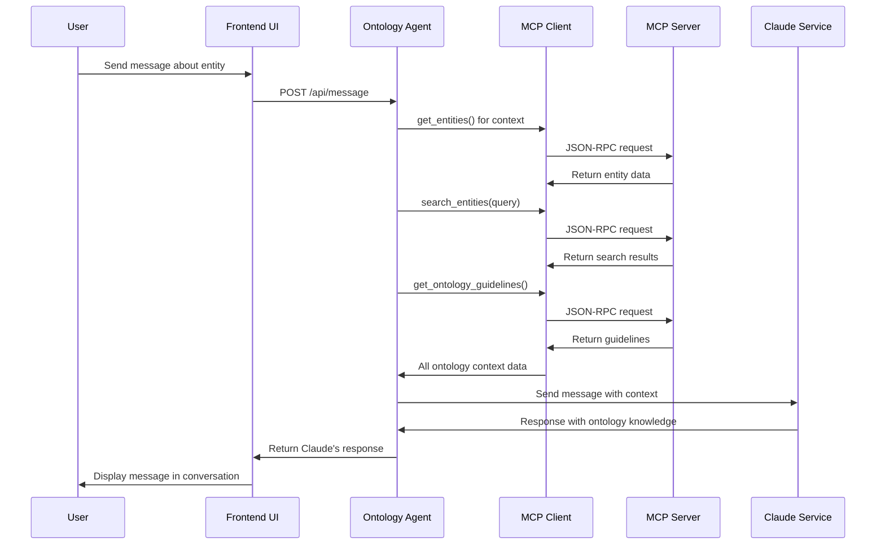

# Technical Summary: Ontology-Driven Language Model Integration in ProEthica

## 1. Introduction

ProEthica integrates ontological frameworks with large language models (LLMs) to enhance ethical decision-making in engineering contexts. This document provides a technical summary of how structured ontological knowledge informs and constrains language models to produce more accurate, contextually appropriate responses in professional ethics scenarios.

## 2. Architectural Overview

The system follows a three-layer architecture that decouples ontology management from language model integration:

```
┌─────────────────┐      ┌─────────────────┐      ┌─────────────────┐
│                 │      │                 │      │                 │
│  Ontology Layer │◄────►│ MCP Layer       │◄────►│ LLM Layer       │
│                 │      │                 │      │                 │
└─────────────────┘      └─────────────────┘      └─────────────────┘
```

### 2.1 Ontology Layer

The ontology layer is responsible for storing and managing structured knowledge:
- **Database-backed storage** for ontologies in RDF format (Turtle/TTL)
- **Version control** with complete audit trail of ontology modifications
- **Entity type hierarchy** for roles, resources, conditions, actions, events, and capabilities
- **Relationship management** for entity connections and constraints
- **Temporal extensions** for representing entities over time

### 2.2 Model Context Protocol (MCP) Layer

The MCP layer serves as the communication bridge:
- **JSON-RPC 2.0 API** for ontology data access
- **Enhanced ontology tools** for entity retrieval, relationship navigation, hierarchy traversal
- **Context generation** that formats ontology data for LLM consumption
- **Fallback mechanisms** that provide mock data when ontology access fails
- **Caching** for performance optimization

### 2.3 LLM Layer

The LLM layer integrates language models with ontological knowledge:
- **Context injection** that enriches prompts with ontology data
- **Tool-based access** that allows LLMs to query ontology data directly
- **Specialized prompting** that guides LLMs in ethical reasoning
- **Constraint enforcement** that ensures responses respect ontological rules
- **Temporal reasoning** that handles sequential events and decision points

## 3. Ontological Framework

### 3.1 Basic Formal Ontology (BFO) Foundation

ProEthica's ontological framework is built on the Basic Formal Ontology (BFO), an ISO standard (ISO/IEC 21838-2:2021) that provides:
- A domain-neutral upper-level ontology
- Clear distinction between continuants (entities that persist through time) and occurrents (processes, events)
- Philosophically rigorous categorization of reality
- Common structural framework for domain-specific extensions

### 3.2 Domain-Specific Ontologies

The system extends BFO with domain-specific ontologies for engineering ethics:
- **Engineering Ethics Concepts** mapped to BFO:role, BFO:process, BFO:function
- **Ethical Principles** as BFO:generically_dependent_continuant
- **Ethical Dilemmas** as BFO:process
- **Duties and Obligations** as BFO:role

### 3.3 Entity Types

The ontology defines several key entity types:
1. **Roles**: Persons or organizations (e.g., Engineer, Client)
2. **Resources**: Documents or reference materials (e.g., Engineering Report, Building Code)
3. **Conditions**: States or principles (e.g., Safety Principle, Conflict of Interest)
4. **Actions**: Activities that can be performed (e.g., Report Preparation, Approval)
5. **Events**: Occurrences that happen (e.g., Safety Reporting Event)
6. **Capabilities**: Abilities that roles possess (e.g., Technical Reporting Capability)

## 4. RDF Triple-Based Data Structure with Temporal Extensions

### 4.1 Core Triple Structure

The system uses RDF triples as the basic data structure:
- **Subject**: The entity (e.g., a character, event, action, or resource)
- **Predicate**: The relationship or property (e.g., hasRole, participatesIn)
- **Object**: The target entity or literal value
- **Graph**: Optional named graph for contextual organization

### 4.2 Temporal Enhancement

The RDF structure has been extended with temporal capabilities:
- **Temporal Fields**: `valid_from`, `valid_to`, `temporal_confidence`, `temporal_context`
- **Timeline Organization**: `timeline_order`, `timeline_group`
- **Temporal Relationships**: Causal relations (`causedBy`, `enabledBy`, `preventedBy`)
- **Decision Representation**: `DecisionSequence`, `DecisionOption`, `DecisionConsequence`
- **Timeline Structure**: `TimelinePhase`, `TimelineEpisode`, `TimelineMarker`

### 4.3 Causal Trace

The system constructs a causal trace that records the temporal progression of actions and decision points:
- **Sequential Recording**: Ordered sequence of events and decisions
- **Temporal Coherence**: Maintains proper ordering of related events
- **External Reasoning**: Enables LLMs to reason about decision-making processes
- **Consequence Mapping**: Links decisions to their outcomes

## 5. Model Context Protocol (MCP) Implementation

### 5.1 Enhanced MCP Server

The `EnhancedOntologyMCPServer` extends the base MCP server with sophisticated ontology capabilities:

```python
class EnhancedOntologyMCPServer(OntologyMCPServer):
    """
    Enhanced MCP server with advanced ontology capabilities.
    """
    
    def __init__(self):
        """Initialize the enhanced MCP server."""
        super().__init__()
        self.entity_triple_service = EntityTripleService()
        self.mcp_url = os.environ.get("MCP_SERVER_URL", "http://localhost:5001")
```

### 5.2 MCP Tools for Ontology Access

The server exposes several tools for ontology interaction:
1. `get_world_entities`: Retrieves entities of specific types
2. `query_ontology`: Executes SPARQL queries against ontologies
3. `get_entity_relationships`: Explores entity connections
4. `navigate_entity_hierarchy`: Traverses class/subclass relationships
5. `check_constraint`: Validates entities against ontology constraints
6. `search_entities`: Finds entities by keywords or patterns
7. `get_entity_details`: Retrieves comprehensive entity information
8. `get_ontology_guidelines`: Extracts guidelines from ontologies

### 5.3 Database vs. File-Based Storage

The MCP server implements a database-first approach with file-based fallback:
- Primarily loads ontologies from the database
- Falls back to file-based loading if database access fails
- Maintains compatibility with both storage methods

## 6. Language Model Integration

### 6.1 Context Injection Method

The primary integration method injects ontology data into the LLM's context window:

```
User Query -> Retrieve Ontology Data -> Format Context -> LLM Generation -> Response
```

#### 6.1.1 Entity Context Formatting

Entity data is formatted in a structured, readable format:

```
# [Role: Senior Engineer]
Person responsible for overseeing engineering projects and ensuring compliance with ethical standards.

Types: EngineeringRole, SupervisoryRole
Parent Classes: Engineer

Properties:
- responsibility_level: High
- autonomy: High

Capabilities:
- Project Oversight: Ability to oversee and coordinate engineering projects
- Technical Review: Ability to review and approve technical documents
- Ethical Assessment: Ability to evaluate ethical implications of engineering decisions
```

### 6.2 Tool-Based Access Method

The secondary integration method allows LLMs to make direct calls to ontology tools:

```
LLM -> Tool Call -> MCP Server -> Ontology Query -> Structured Data -> LLM
```

### 6.3 Context Window Optimization

Special attention is given to context window management:
- **Selective Context Generation**: Only include relevant portions of ontology
- **Entity Filtering**: Filter entities based on relevance to query
- **Relationship Depth Control**: Limit the depth of relationship traversal

### 6.4 Error Handling and Fallbacks

The system includes robust fallback mechanisms:
- **Mock Data Fallback**: Returns predefined mock data when ontology access fails
- **Error Reporting**: Includes clear error messages in the context
- **Graceful Degradation**: Continues functioning with limited ontology data

## 7. Communication Flow

The flow of information between components follows a specific pattern:



### 7.1 Ontology Agent Interface

The agent interface provides:
- World and ontology selection
- Entity browsing with filtering by type
- In-place entity details expansion
- Conversation interface with Claude
- Guidelines display
- Collapsible panels for better screen utilization

## 8. Benefits and Advantages

### 8.1 Enhanced Ethical Reasoning

Integrating ontologies with LLMs provides several advantages for ethical reasoning:

1. **Structured Knowledge Access**: LLMs can access precise, structured ontology data rather than relying solely on training data
2. **Consistency Enforcement**: Ontology constraints guide LLM responses to ensure adherence to ethical guidelines
3. **Domain Grounding**: Responses are grounded in domain-specific knowledge and professional standards
4. **Reasoning Transparency**: The source of information in responses is traceable to specific ontology entities
5. **Temporal Reasoning**: Ability to reason about sequences of events and decision points
6. **Multi-perspective Analysis**: Consideration of different roles and their responsibilities

### 8.2 Technical Advantages

The architecture provides several technical benefits:

1. **Extensibility**: New ontologies can be added without changing the LLM interface
2. **Interoperability**: BFO foundation ensures compatibility with other ontologies
3. **Auditability**: All knowledge used by the LLM is explicitly represented
4. **Performance**: Caching and optimization ensure efficient operation
5. **Resilience**: Fallback mechanisms ensure continued operation during failures
6. **Maintainability**: Clear separation of concerns between layers

## 9. Current Limitations and Future Enhancements

### 9.1 Current Limitations

1. **Context Window Limits**: Large ontologies may exceed LLM context windows
2. **Performance Overhead**: Multiple ontology queries can increase response time
3. **Error Handling**: LLMs may not handle ontology access errors gracefully
4. **Query Interpretation**: Mapping natural language to ontology queries requires optimization

### 9.2 Future Enhancements

1. **Semantic Reasoning**: Integration with a semantic reasoner for complex constraint checking
2. **Query Optimization**: Improved retrieval to minimize context window usage
3. **Fine-tuning Integration**: Use of ontology data to fine-tune LLMs for specific domains
4. **Cross-Ontology Mapping**: Enable reasoning across multiple ontologies
5. **User-Specific Context**: Tailoring ontology access based on user roles and permissions

## 10. Conclusion

The integration of ontologies with large language models in ProEthica demonstrates a powerful approach to enhancing AI-assisted ethical reasoning. By providing structured knowledge, enforcing constraints, and supporting temporal reasoning, the system creates a bridge between formal ethical frameworks and statistical language models. This approach enables more transparent and accountable AI-assisted ethical reasoning, particularly valuable in domains where decisions have significant societal impact.

The architecture's clear separation of concerns between the ontology layer, communication layer, and LLM integration layer ensures extensibility and maintainability. The use of the Basic Formal Ontology as a foundation provides philosophical rigor and interoperability with other ontology-based systems.

By structuring ethical knowledge in machine-readable formats and making it accessible to LLMs through the Model Context Protocol, ProEthica creates an environment where ethical reasoning can be structured, analyzed, and evaluated according to professional standards and guidelines.
