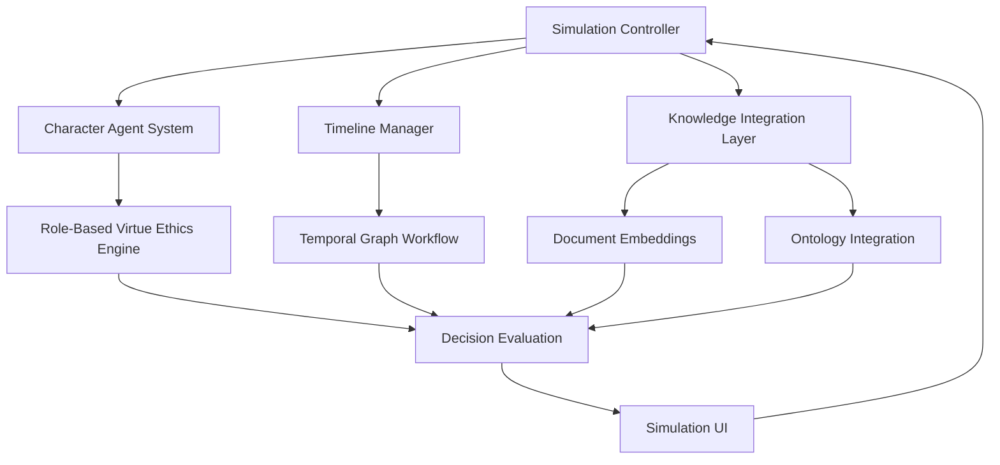

# Simulation Feature Implementation Plan

## Overview

This document outlines the plan for implementing the simulation feature in the AI Ethical Decision-Making Simulator. The simulation will allow users to interactively step through scenarios, make decisions from the perspective of characters, and receive ethical evaluations based on virtue ethics specific to professional roles.

## Architecture Overview



## Core Components

### 1. Simulation Controller

Central orchestration component that manages the simulation flow, user interactions, and state management.

```python
class SimulationController:
    def __init__(self, scenario_id, selected_character_id=None, perspective="specific"):
        self.scenario = Scenario.query.get(scenario_id)
        self.selected_character = Character.query.get(selected_character_id) if selected_character_id else None
        self.perspective = perspective  # "specific" or "all"
        self.timeline_manager = TimelineManager(self.scenario)
        self.character_agent_system = CharacterAgentSystem(self.scenario, self.selected_character)
        self.knowledge_integration = KnowledgeIntegrationLayer(self.scenario)
        self.session_recorder = SessionRecorder()
        
    def initialize_simulation(self):
        # Set up initial state
        initial_state = self.timeline_manager.get_initial_state()
        self.current_state = initial_state
        self.session_recorder.record_state(initial_state)
        return initial_state
        
    def process_decision(self, decision_data):
        # Process user decision
        next_state = self.timeline_manager.advance_timeline(self.current_state, decision_data)
        evaluation = self.character_agent_system.evaluate_decision(
            decision_data, 
            self.current_state,
            self.knowledge_integration.get_relevant_knowledge(decision_data)
        )
        self.current_state = next_state
        self.session_recorder.record_decision(decision_data, evaluation)
        self.session_recorder.record_state(next_state)
        return next_state, evaluation
```

### 2. Character Agent System

Manages character agents, each representing a role in the scenario with virtue ethics considerations.

```python
class CharacterAgentSystem:
    def __init__(self, scenario, selected_character=None):
        self.scenario = scenario
        self.selected_character = selected_character
        self.character_agents = self._initialize_character_agents()
        self.virtue_ethics_engine = RoleBasedVirtueEthicsEngine()
        
    def _initialize_character_agents(self):
        agents = {}
        for character in self.scenario.characters:
            agents[character.id] = CharacterAgent(character)
        return agents
        
    def evaluate_decision(self, decision_data, current_state, relevant_knowledge):
        # Get the character making the decision
        character_id = decision_data.get('character_id', self.selected_character.id if self.selected_character else None)
        if not character_id:
            raise ValueError("No character specified for decision evaluation")
            
        character_agent = self.character_agents[character_id]
        
        # Evaluate decision from virtue ethics perspective
        evaluation = self.virtue_ethics_engine.evaluate(
            decision_data,
            character_agent.character,
            current_state,
            relevant_knowledge
        )
        
        return evaluation
```

### 3. Timeline Manager

Handles the temporal aspects of the scenario, managing the sequence of events and decision points.

```python
class TimelineManager:
    def __init__(self, scenario):
        self.scenario = scenario
        self.workflow = self._initialize_temporal_workflow()
        
    def _initialize_temporal_workflow(self):
        # Create a LangGraph workflow for temporal processing
        workflow = TemporalGraphWorkflow(self.scenario)
        return workflow
        
    def get_initial_state(self):
        # Get the initial state of the scenario
        events = sorted(self.scenario.events, key=lambda e: e.event_time)
        initial_state = {
            'current_time': events[0].event_time if events else None,
            'current_event_index': 0,
            'events': [e.to_dict() for e in events],
            'character_states': self._initialize_character_states(),
            'resource_states': self._initialize_resource_states(),
            'decision_history': []
        }
        return initial_state
        
    def advance_timeline(self, current_state, decision_data):
        # Use the LangGraph workflow to advance the timeline
        next_state = self.workflow.process_decision(current_state, decision_data)
        return next_state
```

### 4. Role-Based Virtue Ethics Engine

Specialized component that evaluates decisions based on virtue ethics specific to professional roles.

```python
class RoleBasedVirtueEthicsEngine:
    def __init__(self, llm_service=None):
        self.llm_service = llm_service or LLMService()
        self.llm = self.llm_service.get_llm()
        
    def evaluate(self, decision_data, character, current_state, relevant_knowledge):
        # Get role information
        role_info = self._get_role_info(character)
        
        # Construct prompt for virtue ethics evaluation
        prompt = self._construct_virtue_ethics_prompt(
            decision_data,
            character,
            role_info,
            current_state,
            relevant_knowledge
        )
        
        # Get evaluation from LLM
        evaluation = self.llm(prompt)
        
        # Parse evaluation to extract structured data
        structured_evaluation = self._parse_evaluation(evaluation)
        
        return {
            'raw_evaluation': evaluation,
            'structured_evaluation': structured_evaluation
        }
```

### 5. Temporal Graph Workflow

Uses LangGraph to model the temporal aspects of the scenario.

```python
class TemporalGraphWorkflow:
    def __init__(self, scenario):
        self.scenario = scenario
        self.graph = self._build_graph()
        
    def _build_graph(self):
        # Create a StateGraph for temporal processing
        from langgraph.graph import StateGraph
        
        # Define the state schema
        class SimulationState(TypedDict):
            current_time: str
            current_event_index: int
            events: List[Dict]
            character_states: Dict
            resource_states: Dict
            decision_history: List
        
        # Create the graph
        graph = StateGraph(SimulationState)
        
        # Define nodes and edges
        # ...
        
        # Compile the graph
        return graph.compile()
```

### 6. Knowledge Integration Layer

Integrates document embeddings, ontology data, and other knowledge sources.

```python
class KnowledgeIntegrationLayer:
    def __init__(self, scenario):
        self.scenario = scenario
        self.embedding_service = EmbeddingService()
        self.mcp_client = MCPClient.get_instance()
        
    def get_relevant_knowledge(self, decision_data):
        # Construct query from decision data
        query = self._construct_query(decision_data)
        
        # Get relevant guidelines from document embeddings
        guidelines = self._get_relevant_guidelines(query)
        
        # Get relevant ontology data
        ontology_data = self._get_relevant_ontology_data(decision_data)
        
        # Get relevant cases
        cases = self._get_relevant_cases(query)
        
        return {
            'guidelines': guidelines,
            'ontology_data': ontology_data,
            'cases': cases
        }
```

### 7. Session Recording

Records the simulation session for later review.

```python
class SessionRecorder:
    def __init__(self):
        self.session_data = {
            'states': [],
            'decisions': [],
            'evaluations': [],
            'timestamps': []
        }
        
    def record_state(self, state):
        self.session_data['states'].append(state)
        self.session_data['timestamps'].append(datetime.now().isoformat())
        
    def record_decision(self, decision, evaluation):
        self.session_data['decisions'].append(decision)
        self.session_data['evaluations'].append(evaluation)
        
    def save_session(self, scenario_id, user_id=None):
        # Save the session to the database
        session = SimulationSession(
            scenario_id=scenario_id,
            user_id=user_id,
            session_data=self.session_data,
            created_at=datetime.now()
        )
        db.session.add(session)
        db.session.commit()
        return session.id
```

## Implementation Roadmap

### Phase 1: Core Framework and Basic UI
1. Create a document to save our simulation implementation plan
2. Create the `SimulationSession` model and migration script
3. Implement the basic Simulation Controller
4. Create the simulation UI template and routes
5. Implement basic session management
6. Add basic tests for the controller and routes

### Phase 2: Character Agent System
1. Implement the Character Agent System
2. Create the Role-Based Virtue Ethics Engine
3. Integrate with the Simulation Controller
4. Add tests for the agent system

### Phase 3: Timeline Manager and LangGraph Integration
1. Implement the Timeline Manager
2. Develop the Temporal Graph Workflow
3. Integrate with the Simulation Controller
4. Add tests for the timeline processing

### Phase 4: Knowledge Integration
1. Implement the Knowledge Integration Layer
2. Connect with document embeddings and ontology
3. Integrate with the Character Agent System
4. Add tests for knowledge retrieval

### Phase 5: Refinement and Comprehensive Testing
1. Optimize performance
2. Enhance the UI
3. Add comprehensive tests
4. Document the implementation

## Technical Considerations

1. **State Management**: The simulation will use a hybrid approach that stores minimal state in Flask's session and more detailed state in the database.

2. **Performance Optimization**: LLM calls can be expensive and slow. We'll implement:
   - Caching for similar ethical evaluations
   - Batching of related queries
   - Asynchronous processing where appropriate

3. **Testing Strategy**: We'll use a hybrid approach with basic tests during implementation and more comprehensive tests later.

4. **User Experience**: We'll focus on creating an intuitive and responsive UI that provides clear feedback on the simulation state and ethical evaluations.
