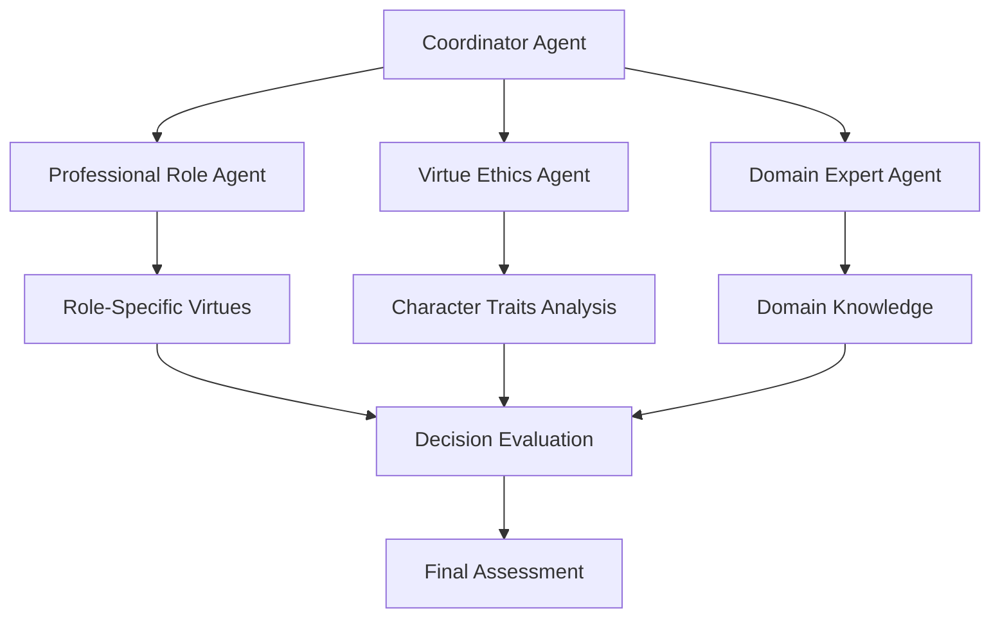
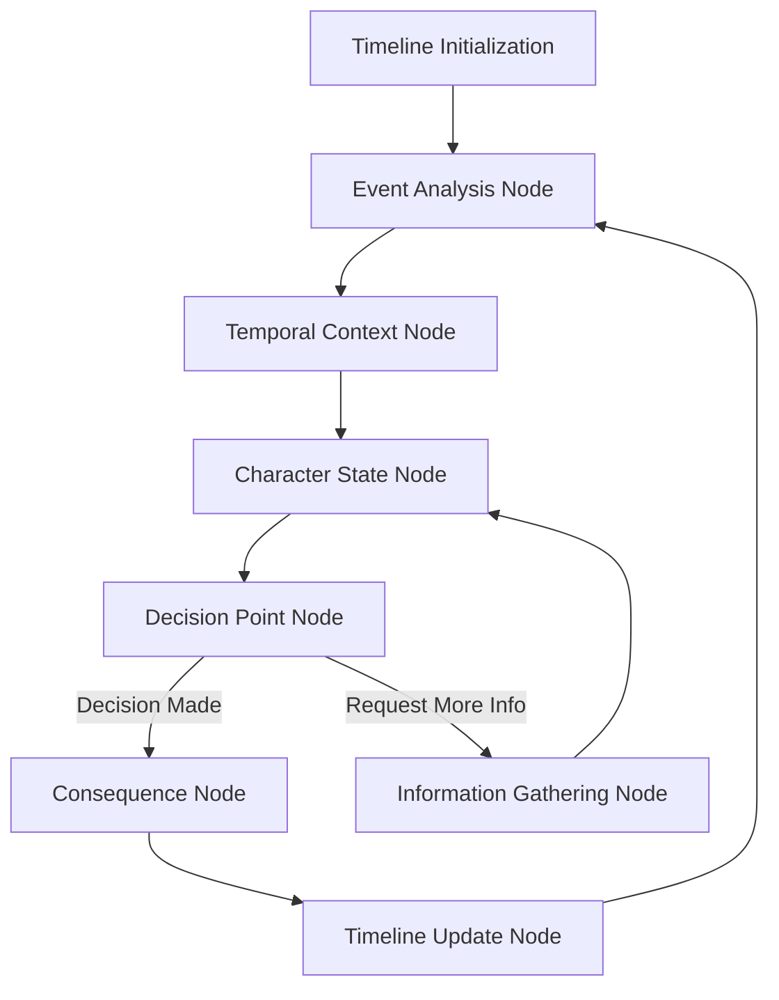

# LangChain and LangGraph Enhancement for AI Ethical Decision-Making Simulator

## Current Implementation Overview

In the AI Ethical Decision-Making Simulator, I've implemented basic LangChain and LangGraph components:

1. **DecisionEngine (LangChain)**: Evaluates decisions against ethical rules and guidelines
   - Uses LLMChain with domain-specific prompts
   - Retrieves similar cases for analogical reasoning
   - Provides rules compliance and ethical evaluation scores

2. **EventEngine (LangGraph)**: Processes events in scenarios
   - Uses a simple StateGraph with basic nodes
   - Handles scenario state transitions
   - Provides a framework for event processing

## Enhancement Focus Areas

Based on our planning discussions, we'll focus on enhancing these components with:

1. **Virtue Ethics Multi-Agent System**: A sophisticated agent architecture focused on professional roles and virtue ethics
2. **Temporal LangGraph Workflow**: An enhanced workflow that better handles the temporal aspects of scenarios
3. **API Call Optimization**: Strategies to minimize Anthropic API usage while maintaining quality

## 1. Virtue Ethics Multi-Agent System

### Agent Architecture



### Professional Role Agent

The Professional Role Agent focuses on evaluating actions against the virtues and standards associated with specific professional roles.

```python
from langchain.agents import Tool
from langchain.agents import AgentExecutor
from langchain.agents.react.base import ReActDocstoreAgent
from langchain.memory import ConversationBufferMemory

class ProfessionalRoleAgent:
    def __init__(self, llm_service, mcp_client):
        self.llm = llm_service.get_llm()
        self.mcp_client = mcp_client
        
        # Define tools for the agent
        self.tools = [
            Tool(
                name="RoleStandards",
                func=self._get_role_standards,
                description="Get professional standards for a specific role"
            ),
            Tool(
                name="RoleVirtues",
                func=self._get_role_virtues,
                description="Get virtues associated with a specific role"
            ),
            Tool(
                name="EvaluateAgainstStandards",
                func=self._evaluate_against_standards,
                description="Evaluate an action against professional standards"
            )
        ]
        
        # Create memory
        self.memory = ConversationBufferMemory(memory_key="chat_history")
        
        # Create agent
        self.agent = ReActDocstoreAgent.from_llm_and_tools(
            llm=self.llm,
            tools=self.tools,
            memory=self.memory,
            verbose=True
        )
        
        self.agent_executor = AgentExecutor.from_agent_and_tools(
            agent=self.agent,
            tools=self.tools,
            memory=self.memory,
            verbose=True
        )
    
    def _get_role_standards(self, role_id):
        """Get professional standards for a role from the ontology."""
        return self.mcp_client.get_role_standards(role_id)
    
    def _get_role_virtues(self, role_id):
        """Get virtues associated with a role from the ontology."""
        return self.mcp_client.get_role_virtues(role_id)
    
    def _evaluate_against_standards(self, action, role_id, standards):
        """Evaluate an action against professional standards."""
        prompt = f"""
        Evaluate the following action against the professional standards for the role:
        
        Action: {action}
        
        Professional Standards:
        {standards}
        
        Provide an analysis of how well the action aligns with these standards.
        Focus on the virtues demonstrated or violated by this action.
        """
        
        return self.llm(prompt)
    
    def evaluate_action(self, action, character, scenario):
        """Evaluate an action from a professional role perspective."""
        role_id = character.role_id
        
        return self.agent_executor.run(
            f"""
            Evaluate the following action from the perspective of professional role ethics:
            
            Action: {action.description}
            Character Role: {character.role}
            Scenario: {scenario.description}
            
            Consider the professional standards and virtues associated with the role.
            Analyze how well the action demonstrates the virtues expected of someone in this role.
            """
        )
```

### Virtue Ethics Agent

The Virtue Ethics Agent focuses on analyzing character traits and intentions behind actions.

```python
class VirtueEthicsAgent:
    def __init__(self, llm_service):
        self.llm = llm_service.get_llm()
        
        # Define tools for the agent
        self.tools = [
            Tool(
                name="AnalyzeCharacterTraits",
                func=self._analyze_character_traits,
                description="Analyze character traits demonstrated by an action"
            ),
            Tool(
                name="EvaluateIntentions",
                func=self._evaluate_intentions,
                description="Evaluate the intentions behind an action"
            ),
            Tool(
                name="AssessVirtuousCharacter",
                func=self._assess_virtuous_character,
                description="Assess whether an action demonstrates virtuous character"
            )
        ]
        
        # Create memory
        self.memory = ConversationBufferMemory(memory_key="chat_history")
        
        # Create agent
        self.agent = ReActDocstoreAgent.from_llm_and_tools(
            llm=self.llm,
            tools=self.tools,
            memory=self.memory,
            verbose=True
        )
        
        self.agent_executor = AgentExecutor.from_agent_and_tools(
            agent=self.agent,
            tools=self.tools,
            memory=self.memory,
            verbose=True
        )
    
    def _analyze_character_traits(self, action, character):
        """Analyze character traits demonstrated by an action."""
        prompt = f"""
        Analyze the character traits demonstrated by the following action:
        
        Action: {action}
        Character: {character}
        
        What virtues or vices does this action reveal about the character?
        Focus on traits like honesty, courage, justice, prudence, etc.
        """
        
        return self.llm(prompt)
    
    def _evaluate_intentions(self, action, context):
        """Evaluate the intentions behind an action."""
        prompt = f"""
        Evaluate the intentions behind the following action:
        
        Action: {action}
        Context: {context}
        
        What was the likely motivation for this action?
        Was the intention virtuous or vicious?
        """
        
        return self.llm(prompt)
    
    def _assess_virtuous_character(self, action, traits, intentions):
        """Assess whether an action demonstrates virtuous character."""
        prompt = f"""
        Assess whether the following action demonstrates virtuous character:
        
        Action: {action}
        Character Traits: {traits}
        Intentions: {intentions}
        
        Would a person of virtuous character take this action in this situation?
        Explain your reasoning.
        """
        
        return self.llm(prompt)
    
    def evaluate_action(self, action, character, scenario):
        """Evaluate an action from a virtue ethics perspective."""
        return self.agent_executor.run(
            f"""
            Evaluate the following action from the perspective of virtue ethics:
            
            Action: {action.description}
            Character: {character.name} ({character.role})
            Scenario: {scenario.description}
            
            Consider the character traits and intentions revealed by this action.
            Analyze whether this action demonstrates virtuous character.
            """
        )
```

### Domain Expert Agent

The Domain Expert Agent provides domain-specific knowledge and contextualizes decisions within domain practices.

```python
class DomainExpertAgent:
    def __init__(self, llm_service, mcp_client, zotero_client):
        self.llm = llm_service.get_llm()
        self.mcp_client = mcp_client
        self.zotero_client = zotero_client
        
        # Define tools for the agent
        self.tools = [
            Tool(
                name="GetDomainKnowledge",
                func=self._get_domain_knowledge,
                description="Get domain-specific knowledge from the ontology"
            ),
            Tool(
                name="FindSimilarCases",
                func=self._find_similar_cases,
                description="Find similar cases from the case database"
            ),
            Tool(
                name="GetAcademicReferences",
                func=self._get_academic_references,
                description="Get relevant academic references from Zotero"
            )
        ]
        
        # Create memory
        self.memory = ConversationBufferMemory(memory_key="chat_history")
        
        # Create agent
        self.agent = ReActDocstoreAgent.from_llm_and_tools(
            llm=self.llm,
            tools=self.tools,
            memory=self.memory,
            verbose=True
        )
        
        self.agent_executor = AgentExecutor.from_agent_and_tools(
            agent=self.agent,
            tools=self.tools,
            memory=self.memory,
            verbose=True
        )
    
    def _get_domain_knowledge(self, domain, topic):
        """Get domain-specific knowledge from the ontology."""
        return self.mcp_client.get_domain_knowledge(domain, topic)
    
    def _find_similar_cases(self, scenario_description):
        """Find similar cases from the case database."""
        # This would use the embedding system to find similar cases
        # For now, we'll return a placeholder
        return "Similar cases would be retrieved here using the embedding system."
    
    def _get_academic_references(self, topic):
        """Get relevant academic references from Zotero."""
        return self.zotero_client.search_items(topic)
    
    def evaluate_action(self, action, character, scenario):
        """Evaluate an action from a domain expert perspective."""
        return self.agent_executor.run(
            f"""
            Evaluate the following action from the perspective of a domain expert:
            
            Action: {action.description}
            Character: {character.name} ({character.role})
            Scenario: {scenario.description}
            Domain: {scenario.world.domain}
            
            Consider domain-specific knowledge, similar cases, and academic literature.
            Analyze how this action aligns with best practices in this domain.
            """
        )
```

### Coordinator Agent

The Coordinator Agent synthesizes perspectives from other agents and generates a final assessment.

```python
class CoordinatorAgent:
    def __init__(self, llm_service, professional_role_agent, virtue_ethics_agent, domain_expert_agent):
        self.llm = llm_service.get_llm()
        self.professional_role_agent = professional_role_agent
        self.virtue_ethics_agent = virtue_ethics_agent
        self.domain_expert_agent = domain_expert_agent
        
        # Define tools for the agent
        self.tools = [
            Tool(
                name="GetProfessionalRolePerspective",
                func=self._get_professional_role_perspective,
                description="Get evaluation from professional role perspective"
            ),
            Tool(
                name="GetVirtueEthicsPerspective",
                func=self._get_virtue_ethics_perspective,
                description="Get evaluation from virtue ethics perspective"
            ),
            Tool(
                name="GetDomainExpertPerspective",
                func=self._get_domain_expert_perspective,
                description="Get evaluation from domain expert perspective"
            ),
            Tool(
                name="SynthesizePerspectives",
                func=self._synthesize_perspectives,
                description="Synthesize different ethical perspectives"
            )
        ]
        
        # Create memory
        self.memory = ConversationBufferMemory(memory_key="chat_history")
        
        # Create agent
        self.agent = ReActDocstoreAgent.from_llm_and_tools(
            llm=self.llm,
            tools=self.tools,
            memory=self.memory,
            verbose=True
        )
        
        self.agent_executor = AgentExecutor.from_agent_and_tools(
            agent=self.agent,
            tools=self.tools,
            memory=self.memory,
            verbose=True
        )
    
    def _get_professional_role_perspective(self, action, character, scenario):
        """Get evaluation from professional role perspective."""
        return self.professional_role_agent.evaluate_action(action, character, scenario)
    
    def _get_virtue_ethics_perspective(self, action, character, scenario):
        """Get evaluation from virtue ethics perspective."""
        return self.virtue_ethics_agent.evaluate_action(action, character, scenario)
    
    def _get_domain_expert_perspective(self, action, character, scenario):
        """Get evaluation from domain expert perspective."""
        return self.domain_expert_agent.evaluate_action(action, character, scenario)
    
    def _synthesize_perspectives(self, role_perspective, virtue_perspective, domain_perspective):
        """Synthesize different ethical perspectives."""
        prompt = f"""
        Synthesize the following ethical perspectives into a comprehensive evaluation:
        
        Professional Role Perspective:
        {role_perspective}
        
        Virtue Ethics Perspective:
        {virtue_perspective}
        
        Domain Expert Perspective:
        {domain_perspective}
        
        Provide a balanced assessment that considers all perspectives.
        Highlight areas of agreement and disagreement.
        Conclude with an overall ethical evaluation.
        """
        
        return self.llm(prompt)
    
    def evaluate_action(self, action, character, scenario):
        """Evaluate an action by coordinating multiple ethical perspectives."""
        return self.agent_executor.run(
            f"""
            Evaluate the following action by coordinating multiple ethical perspectives:
            
            Action: {action.description}
            Character: {character.name} ({character.role})
            Scenario: {scenario.description}
            
            1. Get the professional role perspective
            2. Get the virtue ethics perspective
            3. Get the domain expert perspective
            4. Synthesize these perspectives into a comprehensive evaluation
            
            Provide a final assessment that balances these different ethical viewpoints.
            """
        )
```

### Enhanced Decision Engine

The Enhanced Decision Engine integrates the multi-agent system with the existing decision evaluation framework.

```python
from app.services.decision_engine import DecisionEngine

class EnhancedDecisionEngine(DecisionEngine):
    def __init__(self, llm_service, mcp_client, zotero_client):
        super().__init__(llm_service)
        
        # Initialize agents
        self.professional_role_agent = ProfessionalRoleAgent(llm_service, mcp_client)
        self.virtue_ethics_agent = VirtueEthicsAgent(llm_service)
        self.domain_expert_agent = DomainExpertAgent(llm_service, mcp_client, zotero_client)
        
        # Initialize coordinator agent
        self.coordinator_agent = CoordinatorAgent(
            llm_service,
            self.professional_role_agent,
            self.virtue_ethics_agent,
            self.domain_expert_agent
        )
    
    def evaluate_decision(self, decision, scenario, character, guidelines=None):
        """Evaluate a decision using the multi-agent ethical reasoning system."""
        # Get basic evaluation from parent class
        basic_evaluation = super().evaluate_decision(decision, scenario, character, guidelines)
        
        # Get enhanced evaluation from coordinator agent
        enhanced_evaluation = self.coordinator_agent.evaluate_action(decision, character, scenario)
        
        # Combine evaluations
        combined_evaluation = {
            "basic_evaluation": basic_evaluation,
            "enhanced_evaluation": enhanced_evaluation,
            "score": basic_evaluation.get("score", 0),  # Keep the score from basic evaluation for now
            "reasoning": enhanced_evaluation  # Use the enhanced reasoning
        }
        
        return combined_evaluation
```

## 2. Temporal LangGraph Workflow

### Enhanced Timeline Processing



### Implementation

```python
from langchain.graphs import StateGraph
from langchain.schema import Document
from typing import Dict, List, Any

class EnhancedEventEngine:
    def __init__(self, llm_service, decision_engine):
        self.llm = llm_service.get_llm()
        self.decision_engine = decision_engine
        
        # Create the state graph
        self.workflow = StateGraph(name="Temporal Scenario Workflow")
        
        # Define nodes
        self._define_nodes()
        
        # Define edges
        self._define_edges()
        
        # Compile the graph
        self.compiled_workflow = self.workflow.compile()
    
    def _define_nodes(self):
        """Define the nodes in the state graph."""
        # Timeline Initialization Node
        self.workflow.add_node("timeline_initialization", self._initialize_timeline)
        
        # Event Analysis Node
        self.workflow.add_node("event_analysis", self._analyze_event)
        
        # Temporal Context Node
        self.workflow.add_node("temporal_context", self._process_temporal_context)
        
        # Character State Node
        self.workflow.add_node("character_state", self._update_character_state)
        
        # Decision Point Node
        self.workflow.add_node("decision_point", self._process_decision_point)
        
        # Consequence Node
        self.workflow.add_node("consequence", self._process_consequences)
        
        # Timeline Update Node
        self.workflow.add_node("timeline_update", self._update_timeline)
        
        # Information Gathering Node
        self.workflow.add_node("information_gathering", self._gather_information)
    
    def _define_edges(self):
        """Define the edges in the state graph."""
        # Main flow
        self.workflow.add_edge("timeline_initialization", "event_analysis")
        self.workflow.add_edge("event_analysis", "temporal_context")
        self.workflow.add_edge("temporal_context", "character_state")
        self.workflow.add_edge("character_state", "decision_point")
        
        # Conditional edges from decision point
        self.workflow.add_conditional_edges(
            "decision_point",
            self._route_from_decision_point,
            {
                "decision_made": "consequence",
                "need_more_info": "information_gathering"
            }
        )
        
        # Continue main flow
        self.workflow.add_edge("consequence", "timeline_update")
        self.workflow.add_edge("timeline_update", "event_analysis")
        
        # From information gathering back to character state
        self.workflow.add_edge("information_gathering", "character_state")
    
    def _initialize_timeline(self, state: Dict[str, Any]) -> Dict[str, Any]:
        """Initialize the timeline state."""
        scenario = state.get("scenario")
        
        # Initialize timeline with events sorted by time
        events = sorted(scenario.events, key=lambda e: e.event_time)
        
        # Initialize character states
        character_states = {}
        for character in scenario.characters:
            character_states[character.id] = {
                "character": character,
                "knowledge": [],
                "emotional_state": "neutral",
                "conditions": [c.name for c in character.conditions]
            }
        
        # Initialize timeline state
        timeline_state = {
            "scenario": scenario,
            "events": events,
            "current_event_index": 0,
            "character_states": character_states,
            "past_decisions": [],
            "current_time": events[0].event_time if events else None
        }
        
        state["timeline_state"] = timeline_state
        return state
    
    def _analyze_event(self, state: Dict[str, Any]) -> Dict[str, Any]:
        """Analyze the current event in the timeline."""
        timeline_state = state.get("timeline_state")
        
        # Get current event
        current_event_index = timeline_state.get("current_event_index")
        events = timeline_state.get("events")
        
        if current_event_index >= len(events):
            # No more events
            state["status"] = "completed"
            return state
        
        current_event = events[current_event_index]
        
        # Analyze event
        event_analysis = self._get_event_analysis(current_event, timeline_state)
        
        # Update state
        state["current_event"] = current_event
        state["event_analysis"] = event_analysis
        
        return state
    
    def _get_event_analysis(self, event, timeline_state):
        """Get analysis of an event using LLM."""
        scenario = timeline_state.get("scenario")
        past_decisions = timeline_state.get("past_decisions")
        
        prompt = f"""
        Analyze the following event in the scenario:
        
        Scenario: {scenario.description}
        
        Event: {event.description}
        Time: {event.event_time}
        Character: {event.character.name if event.character else 'N/A'}
        
        Past Decisions:
        {self._format_past_decisions(past_decisions)}
        
        Provide an analysis of this event:
        1. What is happening in this event?
        2. What ethical issues are raised by this event?
        3. How does this event relate to previous events and decisions?
        4. What potential consequences might follow from this event?
        """
        
        return self.llm(prompt)
    
    def _format_past_decisions(self, past_decisions):
        """Format past decisions for inclusion in prompts."""
        if not past_decisions:
            return "No past decisions."
        
        formatted = []
        for decision in past_decisions:
            formatted.append(f"- {decision.get('character_name')}: {decision.get('description')}")
        
        return "\n".join(formatted)
    
    def _process_temporal_context(self, state: Dict[str, Any]) -> Dict[str, Any]:
        """Process the temporal context of the current event."""
        timeline_state = state.get("timeline_state")
        current_event = state.get("current_event")
        
        # Update current time
        timeline_state["current_time"] = current_event.event_time
        
        # Get temporal context
        temporal_context = self._get_temporal_context(current_event, timeline_state)
        
        # Update state
        state["temporal_context"] = temporal_context
        
        return state
    
    def _get_temporal_context(self, event, timeline_state):
        """Get temporal context of an event using LLM."""
        events = timeline_state.get("events")
        current_event_index = timeline_state.get("current_event_index")
        
        # Get past events
        past_events = events[:current_event_index]
        
        # Get future events (if any)
        future_events = events[current_event_index+1:]
        
        prompt = f"""
        Analyze the temporal context of the following event:
        
        Current Event: {event.description}
        Time: {event.event_time}
        
        Past Events:
        {self._format_events(past_events)}
        
        Provide a temporal analysis:
        1. How does this event relate to past events?
        2. What causal relationships exist between events?
        3. What temporal patterns are emerging in the scenario?
        4. How has the situation evolved over time?
        """
        
        return self.llm(prompt)
    
    def _format_events(self, events):
        """Format events for inclusion in prompts."""
        if not events:
            return "No events."
        
        formatted = []
        for event in events:
            formatted.append(f"- {event.event_time}: {event.description}")
        
        return "\n".join(formatted)
    
    def _update_character_state(self, state: Dict[str, Any]) -> Dict[str, Any]:
        """Update character states based on the current event."""
        timeline_state = state.get("timeline_state")
        current_event = state.get("current_event")
        
        # Get character involved in the event
        character = current_event.character
        
        if character:
            # Update character state
            character_state = timeline_state["character_states"].get(character.id)
            
            if character_state:
                # Update character knowledge
                character_state["knowledge"].append({
                    "event": current_event.description,
                    "time": current_event.event_time
                })
                
                # Update emotional state
                character_state["emotional_state"] = self._get_emotional_state(
                    character, current_event, timeline_state
                )
        
        # Update state
        state["updated_character_states"] = timeline_state["character_states"]
        
        return state
    
    def _get_emotional_state(self, character, event, timeline_state):
        """Get emotional state of a character after an event using LLM."""
        prompt = f"""
        Analyze how the following event affects the emotional state of the character:
        
        Character: {character.name} ({character.role})
        Current Conditions: {', '.join(timeline_state["character_states"][character.id]["conditions"])}
        Current Emotional State: {timeline_state["character_states"][character.id]["emotional_state"]}
        
        Event: {event.description}
        
        How would this event affect the character's emotional state?
        Provide a single word or short phrase describing the new emotional state.
        """
        
        return self.llm(prompt)
    
    def _process_decision_point(self, state: Dict[str, Any]) -> Dict[str, Any]:
        """Process a decision point in the scenario."""
        timeline_state = state.get("timeline_state")
        current_event = state.get("current_event")
        
        # Check if this event requires a decision
        is_decision_point = self._is_decision_point(current_event, timeline_state)
        
        if is_decision_point:
            # Generate decision options
            decision_options = self._generate_decision_options(current_event, timeline_state)
            
            # Update state
            state["is_decision_point"] = True
            state["decision_options"] = decision_options
            state["decision_made"] = False
            
            # If we have a character action already defined, use it as the decision
            if hasattr(current_event, 'action') and current_event.action:
                state["selected_decision"] = current_event.action
                state["decision_made"] = True
        else:
            # Not a decision point
            state["is_decision_point"] = False
            state["decision_made"] = True
        
        return state
    
    def _is_decision_point(self, event, timeline_state):
        """Determine if an event is a decision point using LLM."""
        prompt = f"""
        Determine if the following event represents a decision point in the scenario:
        
        Event: {event.description}
        
        A decision point is a moment where a character must make an ethical choice
        that will affect the course of events. It typically involves:
        - A dilemma or conflict
        - Multiple possible actions
        - Ethical considerations
        - Potential consequences
        
        Is this event a decision point? Answer with Yes or No.
        """
        
        response = self.llm(prompt)
        return "yes" in response.lower()
    
    def _generate_decision_options(self, event, timeline_state):
        """Generate decision options for a decision point using LLM."""
        character = event.character
        scenario = timeline_state.get("scenario")
        
        prompt = f"""
        Generate decision options for the following decision point:
        
        Scenario: {scenario.description}
        Event: {event.description}
        Character: {character.name if character else 'Unknown'} ({character.role if character else 'Unknown'})
        
        Generate 3-5 possible decisions the character could make in this situation.
        Each decision should:
        - Be ethically distinct
        - Have different potential consequences
        - Be realistic given the character's role and the scenario
        
        Format each option as a brief description of the action.
        """
        
        response = self.llm(prompt)
        
        # Parse options (assuming they're numbered or bulleted)
        import re
        options = re.findall(r'(?:^|\n)[•\-\d]+\.\s*(.*?)(?=(?:\n[•\-\d]+\.)|$)', response, re.DOTALL)
        
        return [option.strip() for option in options if option.strip()]
    
    def _route_from_decision_point(self, state: Dict[str, Any]) -> str:
        """Route from decision point based on whether a decision was made."""
        if state.get("decision_made"):
            return "decision_made"
        else:
            return "need_more_info"
    
    def _process_consequences(self, state: Dict[str, Any]) -> Dict[str, Any]:
        """Process the consequences of a decision."""
        timeline_state = state.get("timeline_state")
        current_event = state.get("current_event")
        
        # If this was a decision point, evaluate the decision
        if state.get("is_decision_point") and state.get("selected_decision"):
            selected_decision = state.get("selected_decision")
            character = current_event.character
            scenario = timeline_state.get("scenario")
            
            # Evaluate decision
            evaluation = self.decision_engine.evaluate_decision(
                selected_decision, scenario, character
            )
            
            # Generate consequences
            consequences = self._generate_consequences(
                selected_decision, evaluation, current_event, timeline_state
            )
            
            # Add decision to past decisions
            timeline_state["past_decisions"].append({
                "description": selected_decision.description,
                "character_name": character.name if character else "Unknown",
                "evaluation": evaluation,
                "consequences": consequences
            })
            
            # Update state
            state["decision_evaluation"] = evaluation
            state["consequences"] = consequences
        
        return state
    
    def _generate_consequences(self, decision, evaluation, event, timeline_state):
        """Generate consequences of a decision using LLM."""
        scenario = timeline_state.get("scenario")
        
        prompt = f"""
        Generate the consequences of the following decision:
        
        Scenario: {scenario.description}
        Event: {event.description}
        Decision: {decision.description}
        Ethical Evaluation: {evaluation.get('reasoning', 'No evaluation available.')}
        
        Describe the immediate and potential long-term consequences of this decision.
        Consider:
        - How it affects the character who made the decision
        - How it affects other characters
        - How it changes the scenario situation
        - What new ethical issues it might raise
        """
        
        return self.llm(prompt)
    
    def _update_timeline(self, state: Dict[str, Any]) -> Dict[str, Any]:
        """Update the timeline state after processing an event."""
        timeline_state = state.get("timeline_state")
        
        # Move to next event
        timeline_state["current_event_index"] += 1
        
        # Check if we've reached the end of the timeline
        if timeline_state["current_event_index"] >= len(timeline_state["events"]):
            state["status"] = "completed"
        else:
            state["status"] = "in_progress"
        
        return state
    
    def _gather_information(self, state: Dict[
